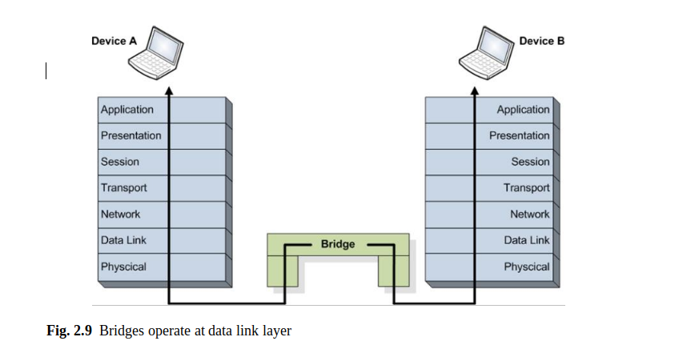

[toc]

```

```

### **Chapter 2**

#### **Network Architectures**

Tóm tắt Cách mạng đã phát triển đáng kể kể từ khi kiến trúc mạng đầu tiên được đề xuất. Gần đây, **kiến trúc** được xem như **một khuôn khổ** không chỉ xác định cấu trúc liên kết mạng, loại mạng, các thành phần mạng, và chức năng của chúng, mà còn trình bày các giao thức truyền thông dữ liệu, định dạng dữ liệu được sử dụng và các dịch vụ được hỗ trợ. **Chương này** giới thiệu c**ấu trúc liên kết mạng, kiểu mạng và thành phần mạng**, đồng thời thảo luận về **một số công nghệ truyền thông mạng.**

#### **2.1 Introduction**

|                                                              |                                                              |
| ------------------------------------------------------------ | ------------------------------------------------------------ |
| Designing network architectures and proposing or improving various data communication protocols were at the center of extensive research and development interest. Various network architectures have been proposed since 1950s when the first architecture involving several communication links only used to connect central processors to remote peripherals (e.g., printers). The networks have evolved significantly since, and currently a network architecture is seen as a framework which specifies not only network topology, network type, network components, and their functionality, but also presents data communication protocols available, data formats employed, and a set of services supported. Often billing aspects are also considered. | Thiết kế kiến trúc mạng và đề xuất hoặc cải tiến **các giao thức truyền thông dữ liệu khác nhau** là trung tâm của mối quan tâm nghiên cứu và phát triển rộng rãi. Nhiều **kiến trúc mạng khác** nhau đã được đề xuất từ những năm **1950** khi kiến trúc đầu tiên liên quan đến một số liên kết giao tiếp chỉ được sử dụng để kết nối bộ xử lý trung tâm với thiết bị ngoại vi từ xa (ví dụ: máy in). Kể từ đó, các mạng đã phát triển đáng kể và hiện tại, một kiến trúc mạng được coi là một khuôn khổ không chỉ xác định cấu trúc liên kết mạng, loại mạng, các thành phần mạng và chức năng của chúng mà còn trình bày các giao thức truyền thông dữ liệu có sẵn, các định dạng dữ liệu được sử dụng và một tập hợp dịch vụ được hỗ trợ. Thường thì khía cạnh thanh toán cũng được xem xét. |
| The first two chapters of this book discuss network architectures and data communication protocols focusing on two directions. This chapter details network topologies, types, components, and communications technologies, and the next chapter presents communication protocols and services, respectively. | **Hai chương đầu** của cuốn sách này thảo luận về **kiến trúc mạng và các giao thức truyền thông dữ liệu tập trung vào hai hướng**. Chương này trình bày chi tiết về cấu trúc liên kết mạng, kiểu, thành phần và công nghệ truyền thông, và chương tiếp theo trình bày các giao thức và dịch vụ truyền thông tương ứng. |
| Network components include many network devices which enable data exchange between different network parts alongside end-user devices. Network topologies indicate how network devices are interconnected by links and how all these are arranged to form a functional communication network. When discussing network types, one refers to the classification of networks based on various aspects, including size, communication technology, etc., and when mentioning network components, the focus is on both network links and network devices. Communication technologies are concerned with the mechanisms employed to exchange data between interconnected network or user devices via the communication links, whereas protocols are seen as formal mechanisms to exchange messages between network components. A protocol architecture includes all the protocols used to transport messages over a certain network infrastructure and indicates the way these protocols interact with each other. Although there is a thin line separating services from protocols, the latter are seen mostly application-linked and related to the network interface with end-users or devices. | Các **thành phần mạng** bao gồm nhiều thiết bị mạng cho phép trao đổi dữ liệu giữa các phần mạng khác nhau cùng với các thiết bị của người dùng cuối. **Cấu trúc liên kết mạng** chỉ ra **cách các thiết bị mạng được kết nối với nhau bằng các liên kết và cách tất cả những thứ này được sắp xếp để tạo thành một mạng truyền thông chức năng**. Khi thảo luận về các **loại mạng**, người ta đề cập đến việc phân loại mạng dựa trên nhiều khía cạnh khác nhau, bao gồm kích thước, công nghệ truyền thông, v.v. và khi đề cập đến các thành phần mạng, trọng tâm là cả liên kết mạng và thiết bị mạng. Công nghệ truyền thông liên quan đến các cơ chế được sử dụng để trao đổi dữ liệu giữa các thiết bị mạng hoặc người dùng được kết nối thông qua các liên kết truyền thông, trong khi các giao thức được coi là cơ chế chính thức để trao đổi thông điệp giữa các thành phần mạng. Kiến trúc giao thức bao gồm tất cả các giao thức được sử dụng để truyền thông điệp qua một cơ sở hạ tầng mạng nhất định và chỉ ra cách các giao thức này tương tác với nhau. Mặc dù có một ranh giới mỏng tách biệt các dịch vụ khỏi các giao thức, các giao thức sau được nhìn thấy chủ yếu là liên kết ứng dụng và liên quan đến giao diện mạng với người dùng cuối hoặc thiết bị. |
| All these aspects are of extreme importance for application developers, especially when performance constraints are involved. This chapter introduces network architectures’ major aspects with the focus on existing and future network technologies. | Tất cả những khía cạnh này đều cực kỳ quan trọng đối với các nhà phát triển ứng dụng, đặc biệt khi có liên quan đến các hạn chế về hiệu suất. Chương này giới thiệu các khía cạnh chính của kiến trúc mạng với trọng tâm là các công nghệ mạng hiện tại và tương lai. |
|                                                              |                                                              |
|                                                              |                                                              |

#### **2.2 Network Topologies** **Cấu trúc liên kết mạng **


```

```

|                                                              |                                                              |
| ------------------------------------------------------------ | ------------------------------------------------------------ |
| A network topology refers to the arrangement of nodes (i.e., network devices, servers, and host machines) and links between them to form a computer network. Nowadays, various types of topologies have been proposed and are in use. Among these topologies, most known are ring, star, bus, tree, mesh, and ad-hoc. These will be discussed in detail next. | Cấu trúc liên kết mạng đề cập đến **sự sắp xếp của các nút** (tức là **thiết bị mạng, máy chủ và máy chủ)** và các **liên kết giữa chúng** để tạo thành một **mạng máy tính**. Ngày nay, nhiều loại cấu trúc liên kết khác nhau đã được đề xuất và đang được sử dụng. Trong số các cấu trúc liên kết này, được biết đến **nhiều nhất là vòng, sao, xe buýt, cây, lưới và đặc biệt**. Những điều này sẽ được thảo luận chi tiết tiếp theo. |

**2.2.1 Ring Topology**


|                                                              |                                                              |
| ------------------------------------------------------------ | ------------------------------------------------------------ |
| In a ring topology, each node is connected with exactly two other nodes forming a single data path in a form of a ring. Such a network arrangement is presented in Fig. 2.1. | Trong cấu trúc liên kết vòng, **mỗi nút** được kết **nối** với chính xác **hai nút khác** tạo thành một đường dẫn dữ liệu duy nhất ở dạng một vòng. Sự sắp xếp mạng như vậy được trình bày trong Hình 2.1. |
| In the basic ring network topology, the messages (data bits) travel in one direction only. Each node has a dual role, as a host and as a relay. As a host, each node will send data messages to other nodes and will receive messages addressed to it. As a relay, each node forwards messages addressed to other nodes to the next node on the ring. | Trong cấu trúc liên kết mạng vòng cơ bản, các thông báo (bit dữ liệu) chỉ truyền theo một hướng. Mỗi nút có một vai trò kép, như một máy chủ và như một rơle. Với tư cách là một máy chủ, mỗi nút sẽ gửi các thông điệp dữ liệu đến các nút khác và sẽ nhận được các thông điệp được gửi đến nó. Như một sự chuyển tiếp, mỗi nút chuyển tiếp các thông điệp được gửi đến các nút khác đến nút tiếp theo trên vòng. |
| The main issue concerning ring networks is their reliability. If a single link is broken, the communication between certain nodes is impeded. Dual ring solutions, where communication is possible both clockwise and anticlockwise, have been proposed to improve reliability through redundancy. The increase in redundancy comes with higher deployment and maintenance costs. | Vấn đề chính liên quan đến mạng vòng là độ tin cậy của chúng. Nếu một liên kết đơn bị hỏng, việc liên lạc giữa các nút nhất định sẽ bị cản trở. Giải pháp vòng kép, nơi có thể giao tiếp theo cả chiều kim đồng hồ và ngược chiều kim đồng hồ, đã được đề xuất để cải thiện độ tin cậy thông qua dự phòng. Sự gia tăng dự phòng đi kèm với chi phí triển khai và bảo trì cao hơn. |
| Standardization related to the ring topology includes the Token Ring protocol (IEEE 802.5), initially proposed by IBM. Apart from the specifications of the protocol, IEEE 802.5 also includes details on the data formats. | Tiêu chuẩn hóa liên quan đến cấu trúc liên kết vòng bao gồm giao thức Vòng mã thông báo (IEEE 802.5), do IBM đề xuất ban đầu. Ngoài các thông số kỹ thuật của giao thức, IEEE 802.5 cũng bao gồm chi tiết về các định dạng dữ liệu. |

**2.2.2 Star Topology**


|                                                              |                                                              |
| ------------------------------------------------------------ | ------------------------------------------------------------ |
| In a star topology, every host is connected to a central network component (denoted as hub), which may be a network hub, a switch, or a router, as illustrated in Fig. 2.2. | Trong cấu trúc liên kết hình sao, mọi máy chủ được kết nối với một thành phần mạng trung tâm (được ký hiệu là hub), có thể là một trung tâm mạng, một bộ chuyển mạch hoặc một bộ định tuyến, như được minh họa trong Hình 2.2. |
| This topology is very popular for home networks where various devices such as desktop PCs, laptops, and mobile devices are connected to a local router, which is further connected to the broadband modem. | Cấu trúc liên kết này rất phổ biến cho các mạng gia đình nơi các thiết bị khác nhau như máy tính để bàn, máy tính xách tay và thiết bị di động được kết nối với bộ định tuyến cục bộ, được kết nối thêm với modem băng thông rộng. |
| In terms of link failure, star topologies are more robust. If a certain link fails, only the hosts using those links will be disconnected from the network, while all the other hosts will not experience any disruptions in communications. The negative aspects of a star topology include the existence of a single point of failure and increased deployment costs. The latter has been mitigated with the latest advancements in wireless networking. | Về lỗi liên kết, cấu trúc liên kết hình sao mạnh mẽ hơn. Nếu một liên kết nhất định không thành công, chỉ những máy chủ sử dụng các liên kết đó sẽ bị ngắt kết nối khỏi mạng, trong khi tất cả các máy chủ khác sẽ không gặp bất kỳ gián đoạn nào trong liên lạc. Các khía cạnh tiêu cực của cấu trúc liên kết hình sao bao gồm sự tồn tại của một điểm lỗi duy nhất và tăng chi phí triển khai. Lỗi thứ hai đã được giảm thiểu với những tiến bộ mới nhất trong mạng không dây. |
|                                                              |                                                              |

**2.2.3 Bus Topology**


|                                                              |                                                              |
| ------------------------------------------------------------ | ------------------------------------------------------------ |
| In a bus topology, a common backbone link is used to connect all the devices in the network with each other, as presented in Fig. 2.3. The hosts compete for ac- cessing the backbone (a single cable) for data transmissions, which is a common communication medium. | Trong cấu trúc liên kết bus, một liên kết đường trục chung được sử dụng để kết nối tất cả các thiết bị trong mạng với nhau, như được trình bày trong Hình 2.3. Các máy chủ cạnh tranh để giành được đường trục (một cáp đơn) để truyền dữ liệu, đây là một phương tiện truyền thông phổ biến. |
| When a host gains access to the medium, it sends data messages which are then received by all the hosts connected to the same backbone. However, only the host to which the messages are addressed will react to these messages, while the rest of the hosts will discard them. | Khi một máy chủ có quyền truy cập vào phương tiện, nó sẽ gửi các thông điệp dữ liệu mà sau đó tất cả các máy được kết nối với cùng một đường trục sẽ nhận được. Tuy nhiên, chỉ máy chủ lưu trữ các thư được gửi đến sẽ phản ứng với các thư này, trong khi các máy chủ còn lại sẽ loại bỏ chúng. |
| The bus-based interconnection of hosts in a local network has been highly pop- ular in the past when a small number of devices have required wired network con- nectivity. Today there are many diverse devices in need for network connectivity. However, bus networks work the best when a limited number of hosts are connected to the common bus and their efficiency is affected severely when a large number of stations require network access. This is mainly determined by the contention-based access to the common medium. As a consequence, bus topologies are less popular nowadays, in the context of the increasing demand for network connectivity and large growth of data traffic. | Sự kết nối dựa trên bus của các máy chủ trong mạng cục bộ đã rất phổ biến trong quá khứ khi một số ít thiết bị yêu cầu kết nối mạng có dây. Ngày nay có rất nhiều thiết bị đa dạng cần kết nối mạng. Tuy nhiên, mạng xe buýt hoạt động tốt nhất khi một số lượng hạn chế các máy chủ được kết nối với mạng xe buýt chung và hiệu quả của chúng bị ảnh hưởng nghiêm trọng khi một số lượng lớn các trạm yêu cầu truy cập mạng. Điều này chủ yếu được xác định bởi khả năng tiếp cận phương tiện chung dựa trên tranh chấp. Do đó, cấu trúc liên kết xe buýt ngày nay ít phổ biến hơn, trong bối cảnh nhu cầu kết nối mạng ngày càng tăng và tốc độ tăng trưởng lớn của lưu lượng dữ liệu. |
| Standardization efforts related to the bus topology include the Token Bus pro- tocol (IEEE 802.4) and the Fiber Distributed Data Interface (RFC 1188), which extends the token bus approach. | Các nỗ lực tiêu chuẩn hóa liên quan đến cấu trúc liên kết xe buýt bao gồm chương trình hỗ trợ xe buýt mã thông báo (IEEE 802.4) và Giao diện dữ liệu phân tán sợi quang (RFC 1188), mở rộng cách tiếp cận xe buýt mã thông báo. |

**2.2.4 Tree Topology**


|                                                              |                                                              |
| ------------------------------------------------------------ | ------------------------------------------------------------ |
| The tree topology consists of a combination of bus and star topologies. As it can be seen in Fig. 2.4, the hosts are connected to a network hub which is further connected to other hubs in a tree-like structure. Each hub acts as a root and router for a tree of hosts. | Cấu trúc liên kết hình cây bao gồm sự kết hợp của cấu trúc liên kết hình xe buýt và hình sao. Như có thể thấy trong Hình 2.4, các máy chủ được kết nối với một trung tâm mạng được kết nối thêm với các trung tâm khác theo cấu trúc giống như cây. Mỗi trung tâm hoạt động như một gốc và bộ định tuyến cho một cây máy chủ. |
| Routing messages in ring, bus, and star topologies is performed by broadcasting the messages to all hosts connected in the network. When tree topologies are used, messages originating at a host travel up the tree as far as necessary and then down the structure towards the destination host. Routing solutions become more important when tree topologies are involved, as efficiency is of high importance. In general, tree topologies support more scalable networks than bus and ring topologies. How- ever, their maintenance may incur higher costs | khi cần thiết và sau đó đi xuống cấu trúc về phía máy chủ đích. Các giải pháp định tuyến trở nên quan trọng hơn khi có cấu trúc liên kết cây, vì hiệu quả có tầm quan trọng cao. Nói chung, cấu trúc liên kết dạng cây hỗ trợ nhiều mạng có khả năng mở rộng hơn so với cấu trúc liên kết vòng và bus. Tuy nhiên, việc bảo trì chúng có thể phải chịu chi phí cao hơn |

**2.2.5 Mesh Topology**


|                                                              |                                                              |
| ------------------------------------------------------------ | ------------------------------------------------------------ |
| In a full mesh network topology, each host or network device is directly connected to any other device or host within that network. Although extremely robust, in general mesh topologies are very expensive, as they involve a high level of redundancy. This makes them less used for wired connectivity. <br>However, mesh topologies are most popular for wireless networks, as wire- less links can be easily and cost effectively established and maintained. Full mesh topologies are also used for backbone networks. <br>Using partial mesh topologies is a more cost effective option. In such a topology, some of the devices are connected in a full mesh manner, while others are only connected to one or two devices. <br>There are several advantages brought by mesh topologies. Mesh networks can withstand high data traffic, as multiple independent paths can be formed to connect different devices within the network. Robustness is another advantage of mesh net- works. Expansion and modification of the networks can also be done with minimum traffic disruption.</br><br>However, as already mentioned, the main disadvantage of the mesh networks is related to the high redundancy which leads to high costs of deployment and mainte- nance. <br>A full mesh topology is presented in Fig. 2.5. | Trong cấu trúc liên kết mạng lưới đầy đủ, mỗi máy chủ hoặc thiết bị mạng được kết nối trực tiếp với bất kỳ thiết bị hoặc máy chủ nào khác trong mạng đó. Mặc dù cực kỳ mạnh mẽ, nhưng nói chung cấu trúc liên kết lưới rất đắt tiền, vì chúng liên quan đến mức độ dự phòng cao. Điều này khiến chúng ít được sử dụng hơn cho kết nối có dây. <br/> Tuy nhiên, cấu trúc liên kết dạng lưới phổ biến nhất đối với mạng không dây, vì các liên kết không dây có thể được thiết lập và duy trì dễ dàng và hiệu quả về chi phí. Các cấu trúc liên kết toàn lưới cũng được sử dụng cho các mạng đường trục. <br/> Sử dụng cấu trúc liên kết lưới từng phần là một lựa chọn hiệu quả hơn về chi phí. Trong cấu trúc liên kết như vậy, một số thiết bị được kết nối theo kiểu lưới đầy đủ, trong khi những thiết bị khác chỉ được kết nối với một hoặc hai thiết bị. <br/> Có một số lợi thế do cấu trúc liên kết lưới mang lại. Mạng lưới có thể chịu được lưu lượng dữ liệu cao, vì nhiều đường dẫn độc lập có thể được hình thành để kết nối các thiết bị khác nhau trong mạng. Độ bền chắc là một ưu điểm khác của công trình lưới mắt cáo. Việc mở rộng và sửa đổi mạng cũng có thể được thực hiện với mức gián đoạn lưu lượng tối thiểu. </br> <br/> Tuy nhiên, như đã đề cập, nhược điểm chính của mạng lưới liên quan đến tính dự phòng cao dẫn đến chi phí triển khai và bảo trì cao. - nance. <br/> Một cấu trúc liên kết lưới đầy đủ được trình bày trong Hình 2.5. |

**2.2.6 Ad-Hoc Topology**


|                                                              |                                                              |
| ------------------------------------------------------------ | ------------------------------------------------------------ |
| Lately there is an increased effort put on providing support for user mobility, and wireless connectivity already enables this. A step further is performed by wireless ad-hoc networks in which each node (potentially mobile in this case) dynamically establishes a communication link with the devices in its proximity. Each mobile node has a dual role, both as a mobile host and as a mobile router.  Ad-hoc networks do not rely on any infrastructure. Remote hosts communicate over dynamically formed paths based on links established between neighboring nodes. The messages travel over multiple links in an multi-hop manner in order to reach their destination. Such a network is graphically depicted in Fig. 2.6, but its topology is dynamically changing.  The main advantage of this type of network is its ease of deployment, low cost, and flexibility. As there is no previously deployed infrastructure, the network is formed on the go, as mobile hosts come and go. As each host in the network also acts as a router, the network range is also variable, adding scalability to the list of advantages. <br>Despite the advantages, ad-hoc networks suffer from unpredictable routes and data throughput. Due to host/router mobility, each route can be broken at any time due to a mobile device on the route moving away or going off-line.<br>Furthermore, host mobility complicates paths formation, maintenance, and rout- ing messages between senders and receivers, affecting both delivery efficiency and performance. | Gần đây, đã có nhiều nỗ lực nhằm cung cấp hỗ trợ cho tính di động của người dùng và kết nối không dây đã cho phép điều này. Một bước nữa được thực hiện bởi các mạng đặc biệt không dây trong đó mỗi nút (có khả năng di động trong trường hợp này) thiết lập động một liên kết giao tiếp với các thiết bị ở gần nó. Mỗi nút di động có một vai trò kép, vừa là máy chủ di động vừa là bộ định tuyến di động. Mạng đặc biệt không dựa trên bất kỳ cơ sở hạ tầng nào. Các máy chủ từ xa giao tiếp qua các đường dẫn được tạo động dựa trên các liên kết được thiết lập giữa các nút lân cận. Các thông điệp di chuyển qua nhiều liên kết theo cách nhiều bước để đến đích của chúng. Một mạng như vậy được mô tả bằng đồ thị trong Hình 2.6, nhưng cấu trúc liên kết của nó đang thay đổi động. Ưu điểm chính của loại mạng này là dễ triển khai, chi phí thấp và linh hoạt. Vì không có cơ sở hạ tầng được triển khai trước đây, mạng được hình thành khi đang di chuyển, khi các máy chủ di động đến và đi. Vì mỗi máy chủ trong mạng cũng hoạt động như một bộ định tuyến, nên phạm vi mạng cũng có thể thay đổi, thêm khả năng mở rộng vào danh sách các lợi thế. <br/> Mặc dù có những ưu điểm, nhưng mạng đặc biệt có các tuyến và thông lượng dữ liệu không thể đoán trước. Do tính di động của máy chủ / bộ định tuyến, mỗi tuyến đường có thể bị hỏng bất cứ lúc nào do thiết bị di động trên tuyến đường di chuyển ra xa hoặc đi lệch tuyến. <br/> Hơn nữa, tính di động của máy chủ làm phức tạp việc hình thành đường dẫn, bảo trì và các thông báo định tuyến giữa người gửi và người nhận, ảnh hưởng đến cả hiệu quả chuyển phát và hiệu suất. |

#### **2.3 Network Components**


Bất kể kiến trúc mạng được sử dụng là gì, các thành phần mạng chính <br> là các nút của chúng và các liên kết liên kết.

Dựa trên phương tiện vật lý được sử dụng để truyền dữ liệu giữa các thiết bị, các l**iên kết mạng có thể sử dụng: cặp xoắn, cáp đồng trục, cáp quang, cũng như các phương tiện không dây như sóng vô tuyến, vi sóng, tia hồng ngoại và thậm chí cả ánh sáng nhìn thấy són**g. Lưu ý rằng tất cả các phương tiện này có các đặc điểm khác nhau ảnh hưởng lớn đến các đặc tính truyền thông và do đó quyết định việc sử dụng chúng. 

Cáp xoắn đôi bao gồm hai dây đồng cách điện xoắn lại với nhau theo hình thức xoắn ốc. Cáp này là cơ sở của mạng phân phối rộng rãi đầu tiên cho phép cả điện thoại và sau đó là truyền thông dữ liệu cơ bản ở tốc độ bit rất thấp. 

Cáp đồng trục bao gồm một lõi đồng cứng được bọc trong một vật liệu cách điện. Chất cách điện được bao bọc thêm bởi một dây dẫn hình trụ, thường có dạng lưới. Dây dẫn bên ngoài này được bảo vệ thêm bởi một chất cách điện bằng nhựa. Bằng cách sử dụng cáp đồng trục, tốc độ truyền dữ liệu được cải thiện, giảm nhiễu và hỗ trợ các mạng cung cấp dịch vụ phong phú hơn như truyền hình cáp. Truyền thông cáp quang rất phổ biến chủ yếu do băng thông lớn và ảnh hưởng của nhiễu thấp. Chúng được thực hiện trên cáp quang bao gồm ba phần tử: một lõi thủy tinh, một lớp phủ thủy tinh và một số vỏ nhựa.

 Lõi thủy tinh là phương tiện truyền sáng chính và nằm ở tâm của sợi cáp quang. Vỏ nhựa giống như một lớp vỏ và được sử dụng để bảo vệ sợi vải. Tấm phủ thủy tinh có chỉ số khúc xạ thấp hơn và được giới thiệu là để giữ ánh sáng bên trong lõi và lớp vỏ nhựa.


Mạng truyền thông không dây sử dụng sóng điện từ đã được điều chế để gửi
tin nhắn giữa các thiết bị được liên kết trực tiếp. Các thiết bị này có thể giao tiếp trực tiếp giữa chúng theo cách phân tán, tạo thành các mạng đặc biệt hoặc dựa vào
thiết bị mạng tập trung để xử lý giao tiếp giữa các thiết bị đầu cuối ở chế độ cơ sở hạ tầng. Trong số các mạng không dây, một số sử dụng đường truyền thẳng, những mạng khác sử dụng đường truyền không theo đường ngắm; một số sử dụng các kênh có độ trễ thấp (ví dụ: truyền thông vệ tinh), những kênh khác sử dụng các kênh truyền thông nhanh; một số sử dụng các kênh tần số thấp, mặc dù băng thông thấp (ví dụ: sử dụng trong quân sự), những người khác sử dụng băng thông tần số cao-tần số cao,Vân vân.

Về các nút mạng, dễ thấy nhất là các thiết bị của người dùng cuối, từ điện thoại thông minh, netbook và máy tính xách tay đến máy tính để bàn và thậm chí cả máy chủ. Gần đây, các thiết bị tiêu dùng di-câu cũng đã được kích hoạt để trao đổi dữ liệu qua mạng. Điều này là trong bối cảnh của các ngôi nhà thông minh, nhưng xu hướng được thiết lập để tiếp tục, hỗ trợ điều khiển thiết bị kết nối mạng.

Các nút mạng cổ điển, còn được gọi là thiết bị liên mạng, bao gồm các thiết bị ngay lập tức cung cấp hỗ trợ khác nhau cho việc trao đổi dữ liệu và cho phép hoạt động trên mạng. Mỗi loại thiết bị liên mạng được triển khai ở các tầng mạng khác nhau và cung cấp các dịch vụ khác nhau. Được biết đến nhiều nhất là bộ lặp, cầu nối, bộ định tuyến và cổng.

**Bộ lặp** là một thiết bị mạng có chức năng khuếch đại, định hình lại và / hoặc điều chỉnh lại tín hiệu đưa vào để tăng khoảng cách, cải thiện chất lượng tín hiệu và tăng hiệu quả của dữ liệu được truyền. Vì các bộ lặp không cố gắng hiểu được ổ chung của dữ liệu được truyền theo bất kỳ cách nào, chỉ thực hiện trên tín hiệu vật lý, chúng được xem như đang hoạt động ở lớp mạng vật lý, như trong Hình 2.7. Chức năng định hình lại bộ lặp được minh họa trong Hình 2.8.

**Cầu nối** là một thiết bị mạng làm giảm lưu lượng trên mạng LAN bằng cách chia nó thành hai đoạn hoặc cho phép giao tiếp giữa hai mạng LAN bằng cách kết nối chúng với nhau. Cầu lọc lưu lượng dữ liệu ở ranh giới mạng và lấy quyết định có cho phép giao thông qua lại hay không. Khi các cầu nối yêu cầu một số thông tin liên quan đến mạng, chúng hoạt động ở mức khung ở lớp mạng liên kết dữ liệu, như minh họa trong Hình 2.9. Một nhiệm vụ rất quan trọng mà các cầu nối thực hiện khi chia mạng thành các phân đoạn là giới hạn lưu lượng cục bộ đến các phân đoạn mạng khác nhau, hỗ trợ khả năng mở rộng mạng tổng thể và tăng hiệu quả truyền thông. Các cầu nối tác vụ không giống nhau thực hiện khi bật giao tiếp giữa các mạng LAN là hỗ trợ trao đổi dữ liệu mặc dù có các định dạng khung khác nhau, kích thước tải trọng, tốc độ dữ liệu, thứ tự bit của địa chỉ, việc sử dụng các bit ưu tiên, sự tồn tại của xác nhận hoặc xác nhận phủ định (ACK / NACK ), v.v. Nguyên tắc của cầu thực hiện giao thông





lọc và giảm lượng dữ liệu được trao đổi trên hai phân đoạn mạng được thể hiện trong Hình 2.10.

**Bộ định tuyến** là một thiết bị mạng kết nối giữa các mạng khác nhau và chuyển tiếp các gói từ mạng này sang mạng khác theo địa chỉ đích của chúng. Các bộ định tuyến giao tiếp với nhau và tham gia vào việc thu thập thông tin mạng mà chúng lưu trữ trong các bảng chuyển tiếp. Dựa trên thông tin này, các bộ định tuyến chạy các thuật toán định tuyến để xác định đường dẫn tốt nhất giữa hai máy chủ bất kỳ và chuyển tiếp các gói dữ liệu trên các đường dẫn đó. Các bộ định tuyến đang hoạt động ở lớp mạng như trong Hình 2.11 và được triển khai như minh họa trong Hình 2.12.


**Cổng** là một thiết bị mạng mở rộng chức năng của bộ định tuyến để bao gồm lớp ứng dụng như được minh họa trong Hình 2.13. Các sửa đổi của gói dữ liệu có thể bao gồm lọc hoặc chặn một số loại lưu lượng nhất định, thay đổi giá trị trong trường tiêu đề và / hoặc đoạn giới thiệu, điều chỉnh tốc độ dữ liệu, sửa đổi kích thước gói, áp dụng bảo mật, v.v. Một ví dụ về triển khai cổng được trình bày trong Hình 2.14.

#### **2.4 Network Types and Communication Technologies**


|                                                              |                                                              |
| ------------------------------------------------------------ | ------------------------------------------------------------ |
| Networks differ in many aspects, not only in their topology, from communication technology to range. In this context, there are many criteria which can be used to classify the networks.Based on their *transmission technology*, the networks can be classified as broad-cast or point-to-point networks. | **Các mạng khác nhau ở nhiều khía cạnh, không chỉ về cấu trúc liên kết của chúng, từ công nghệ truyền thông đến phạm vi. Trong bối cảnh này, có nhiều tiêu chí có thể được sử dụng để phân loại mạng.** Dựa trên * công nghệ truyền dẫn * của chúng, các mạng có thể được phân loại là mạng truyền rộng hoặc mạng điểm-điểm. |
| Based on their *transmission technology*, the networks can be classified as broad-cast or point-to-point networks. | Dựa trên * công nghệ truyền * của chúng, các mạng có thể được phân loại là mạng truyền rộng hoặc mạng điểm-điểm. |
| In a broadcast network, all nodes share the same communication medium. A mes-sage sent by a node is heard by all other nodes connected to the network. This con-stitutes a major advantage of the broadcast networks as it allows the possibility to send the same message to all receivers attached to the network in the most efficient manner. A well known example of a broadcast network is the television network as presented in Fig. [2.15](#page27). The same content (TV channels) is delivered to all devices attached to the network, a mechanism suitable for distribution of highly popular non-interactive services. | Trong một mạng quảng bá, tất cả các nút chia sẻ cùng một phương tiện truyền thông. Một mes-sage được gửi bởi một nút sẽ được nghe bởi tất cả các nút khác được kết nối với mạng. Điều này khẳng định một lợi thế lớn của mạng quảng bá vì nó cho phép khả năng gửi cùng một thông điệp đến tất cả các máy thu gắn với mạng theo cách hiệu quả nhất. Một ví dụ nổi tiếng về mạng quảng bá là mạng truyền hình như được trình bày trong Hình. [2.15] (# trang27). Cùng một nội dung (các kênh truyền hình) được phân phối đến tất cả các thiết bị gắn vào mạng, một cơ chế phù hợp để phân phối các dịch vụ không tương tác rất phổ biến. |
| As opposed to broadcast networks, point-to-point networks use many connec-tions to link individual pairs of devices. A message travels from the source to its destination by traversing multiple interconnected devices. All these intermediate devices and the links connecting them form a communication route. A source node may be connected to a destination node by multiple routes, as presented in Fig. [2.16](#page28). Choosing the right route for message transportation is very important in point-to-point networks. These networks are suitable for delivering differentiated content based on various requests. | Trái ngược với mạng quảng bá, mạng điểm-điểm sử dụng nhiều kết nối để liên kết các cặp thiết bị riêng lẻ. Một thông điệp truyền từ nguồn đến đích bằng cách đi qua nhiều thiết bị được kết nối với nhau. Tất cả các thiết bị trung gian này và các liên kết kết nối chúng tạo thành một tuyến liên lạc. Một nút nguồn có thể được kết nối với một nút đích bằng nhiều tuyến, như được trình bày trong Hình. [2.16] (# trang28). Việc chọn đúng tuyến đường để vận chuyển tin nhắn là rất quan trọng trong các mạng điểm - điểm. Các mạng này phù hợp để cung cấp nội dung khác biệt dựa trên các yêu cầu khác nhau. |
| However, potentially the most important criterion for classifying networks is their scale. In general, the network scale dictates the transmission technology used and often the corresponding communication protocols. | Tuy nhiên, tiêu chí quan trọng nhất để phân loại mạng là quy mô của chúng. Nói chung, quy mô mạng quyết định công nghệ truyền dẫn được sử dụng và thường là các giao thức truyền thông tương ứng. |
| Based on their scale, networks can be classified as personal area networks, local area networks, metropolitan area networks, wide area networks, and the Internet. Next these network categories are discussed in detail. | Dựa trên quy mô của chúng, các mạng có thể được phân loại thành mạng khu vực cá nhân, mạng cục bộ, mạng khu vực đô thị, mạng diện rộng và Internet. Tiếp theo, các danh mục mạng này sẽ được thảo luận chi tiết. |


***2.4.1 Personal Area Networks***

Mạng Khu vực Cá nhân, hoặc PAN, sử dụng công nghệ truyền dẫn phạm vi ngắn (1 m) và thường nhằm phục vụ một người, do đó có tên gọi của họ.

Ví dụ về PAN được trình bày trong Hình. [2.17] (# trang28). Trong trường hợp này, công nghệ truyền thông không dây được sử dụng để liên kết các thiết bị ngoại vi khác nhau, chẳng hạn như máy in, máy quét, cũng như bàn phím và chuột với máy tính. Hơn nữa, các thiết bị như điện thoại thông minh và máy quay video cũng có thể được kết nối với máy tính tạo thành PAN.

Mạng Khu vực Cá nhân Không dây (WPAN) ngày càng phổ biến và Nhóm công tác IEEE 802.15 đã được thành lập đặc biệt để tiêu chuẩn hóa các công nghệ WPAN. Công việc của họ đã dẫn đến một số tiêu chuẩn, trong đó tiêu chuẩn quan trọng nhất sẽ được giới thiệu ngắn gọn tiếp theo.

IEEE 802.15.1 (2002, 2005) chuẩn hóa các công nghệ truyền thông không dây Bluetooth nổi tiếng được nhiều thiết bị di động sử dụng để kết nối hoặc kết nối với các thiết bị ngoại vi hoặc máy tính cá nhân.

IEEE 802.15.2 (2003) giải quyết vấn đề cùng tồn tại của WPAN với các mạng không dây khác như mạng cục bộ không dây.

IEEE 802.15.3 (2003), IEEE 802.15.3b (2005), IEEE 802.15.3c (2009) giải quyết các lớp vật lý và MAC cho các WPAN tốc độ cao.

IEEE 802.15.4 (2011) chỉ định lớp MAC và PHY cho các giao tiếp mạng không dây tốc độ thấp, phạm vi thấp và công suất thấp. Dựa trên tiêu chuẩn này, các giao thức như Zigbee và 6LoWPAN xác định lớp mạng chuyên về làm việc mạng đặc biệt và lớp ứng dụng nhắm mục tiêu mạng WPAN.

IEEE 802.15.5 (2009) cung cấp một khung kiến trúc cho các mạng lưới được triển khai trên công nghệ truyền thông không dây công suất thấp

IEEE 802.15.6 (2012) tập trung vào công nghệ không dây công suất thấp và tầm ngắn được sử dụng xung quanh cơ thể người hoặc thậm chí trong cơ thể người cho các ứng dụng y tế cụ thể.

IEEE 802.15.7 (2011) nhắm mục tiêu tiêu chuẩn hóa truyền thông quang học không dây tầm ngắn dựa trên ánh sáng khả kiến.

**2.4.2 Local Area Networks Mạng cục bộ**

|                                                              |                                                              |
| ------------------------------------------------------------ | ------------------------------------------------------------ |
| Local area networks (LANs) are usually contained within a single building, campus or geographical area, up to a few kilometers in size. LANs are usually privately owned and their main purpose is to interconnect computers and resources such as printers and data storage units belonging to a single functional unit such as an office building, factory, school or university. | Mạng cục bộ (LAN) thường được chứa trong một tòa nhà, khuôn viên hoặc khu vực địa lý, có kích thước lên đến vài km. Mạng LAN thường thuộc sở hữu tư nhân và mục đích chính của chúng là kết nối các máy tính và tài nguyên như máy in và bộ lưu trữ dữ liệu thuộc một đơn vị chức năng duy nhất như tòa nhà văn phòng, nhà máy, trường học hoặc trường đại học. |
| LANs are usually small in size, and LAN communications benefit from short delays and reduced error rates. Typical data transmission rates range between 10 and 100 Mbps with newer technologies reaching transmission speeds of up to 10 Gbps. The most popular technology for LANs is Ethernet, standardized as IEEE 802.3.Other technologies such as token ring, token bus, and FDDI can also be used. | Các mạng LAN thường có kích thước nhỏ và truyền thông mạng LAN được hưởng lợi từ độ trễ ngắn và tỷ lệ lỗi giảm. Tốc độ truyền dữ liệu điển hình nằm trong khoảng từ 10 đến 100 Mbps với các công nghệ mới hơn đạt tốc độ truyền lên đến 10 Gbps. Công nghệ phổ biến nhất cho mạng LAN là Ethernet, được tiêu chuẩn hóa là IEEE 802.3. Các công nghệ khác như vòng mã thông báo, xe buýt mã thông báo và FDDI cũng có thể được sử dụng. |
| Often Ethernet uses a star topology, where multiple computers are interconnected using wires (usually twisted pairs) or fiber optics to a central active network device. | Thường thì Ethernet sử dụng cấu trúc liên kết hình sao, trong đó nhiều máy tính được kết nối với nhau bằng dây (thường là các cặp xoắn) hoặc sợi quang đến một thiết bị mạng hoạt động trung tâm. |
| Fast, Gigabit, and 10 Gigabit Ethernet refer to Ethernet networks capable of reaching transmission speeds of up to 100 Mbps, 1 Gbps, and 10 Gbps, respectively, over twisted wired cables or fiber optics. | Fast, Gigabit và 10 Gigabit Ethernet đề cập đến các mạng Ethernet có khả năng đạt tốc độ truyền lên đến 100 Mbps, 1 Gbps và 10 Gbps, tương ứng qua cáp có dây xoắn hoặc sợi quang. |
| Figure [2.18 ](#page30)illustrates three typical LAN topologies. | Hình 2.18 minh họa ba cấu trúc liên kết mạng LAN điển hình.  |
| Wireless Local Area Networks (WLANs) are increasingly popular, mostly due to the reduced cost of deployment and maintenance and their support for mobility. | Mạng cục bộ không dây (WLAN) ngày càng phổ biến, chủ yếu là do chi phí triển khai và bảo trì giảm và hỗ trợ tính di động của chúng. |


|                                                              |                                                              |
| ------------------------------------------------------------ | ------------------------------------------------------------ |
| Currently, the IEEE 802.11 family of standards has been widely adopted and is being heavily used worldwide for WLANs. This family (also known as WiFi) includes the original standard and various extensions which address different issues including higher bit rates, QoS support, security, etc. | Hiện tại, họ chuẩn IEEE 802.11 đã được chấp nhận rộng rãi và đang được sử dụng rộng rãi trên toàn thế giới cho mạng WLAN. Họ này (còn được gọi là WiFi) bao gồm tiêu chuẩn gốc và các phần mở rộng khác nhau giải quyết các vấn đề khác nhau bao gồm tốc độ bit cao hơn, hỗ trợ QoS, bảo mật, v.v. |
| The standards for wireless access networks usually cover the physical layer and the medium access control protocol (MAC) sub-layer. The original IEEE 802.11 standard first released in 1997 [[1](#page40)] supports data rates up to 2 Mbps and was initially developed for best effort traffic only. | Các tiêu chuẩn cho mạng truy cập không dây thường bao gồm lớp vật lý và giao thức kiểm soát truy cập phương tiện (MAC ) lớp con. Chuẩn IEEE 802.11 ban đầu được phát hành lần đầu tiên vào năm 1997 [[1] (# page40)] hỗ trợ tốc độ dữ liệu lên đến 2 Mbps và ban đầu được phát triển chỉ dành cho lưu lượng cố gắng nhất. |
| Each host connected to a certain IEEE 802.11 access point shares the wireless medium with the other mobile hosts associated with the same access point. This leads to race conditions for medium access which determine high collision rates and consequently low data rates, especially when the number of mobile hosts involved in simultaneous data communications increases. | Mỗi máy chủ được kết nối với một điểm truy cập IEEE 802.11 nhất định chia sẻ phương tiện không dây với các máy chủ di động khác được liên kết với cùng một điểm truy cập. Điều này dẫn đến các điều kiện chạy đua đối với quyền truy cập trung bình, xác định tỷ lệ va chạm cao và do đó tốc độ dữ liệu thấp, đặc biệt khi số lượng máy chủ di động tham gia vào truyền thông dữ liệu đồng thời tăng lên. |
| The IEEE 802.11 MAC layer provides mechanisms for medium access coor-dination, including the Distributed Coordination Function (DCF) and the partially centralized Point Coordination Function (PCF). | Lớp MAC IEEE 802.11 cung cấp cơ chế cho việc phân chia truy cập trung bình, bao gồm cả Phân tán Chức năng Điều phối (DCF) và Chức năng Điều phối Điểm tập trung một phần (PCF). |
| A group of mobile stations connected to a single Access Point (AP) form the basic building block defined by this standard as a Basic Service Set (BSS). The geographical area covered by a BSS is called a Basic Service Area (BSA). | Một nhóm các trạm di động được kết nối với một Điểm truy cập (AP) duy nhất tạo thành khối xây dựng cơ bản được tiêu chuẩn này xác định là Bộ dịch vụ cơ bản (BSS). Khu vực địa lý được bao phủ bởi BSS được gọi là Khu vực Dịch vụ Cơ bản (BSA). |
| Connecting several BSSs through a Distribution System (DS) determines the creation of an Extended Service Set (ESS).<br/><br/>The first IEEE 802.11 extension, IEEE 802.11b [2] increased the maximum data rate to 11 Mbps, which was a huge step forward. Following additional efforts, the data rate was further increased to 54 Mbps in the IEEE 802.11a and IEEE 802.11g standard extensions [3, 4].<br/><br/>Maintaining high QoS levels by using the two coordination methods, DCF and PCF, is difficult, thus novel QoS enhancements for IEEE 802.11 MAC layer were standardized by IEEE 802.11e [5].<br/><br/>Consequently, two new mechanisms are described by the new standard, namely the Hybrid Coordination Function (HCF) and the Enhanced Distributed Coordina-tion Function (EDCF). HCF is based on PCF, and EDCF relies on its implementa-tion on DCF. Further enhancements brought by this standard extension are block ac-knowledgments which allows acknowledging more then one MAC frame by sending only one acknowledgment packet and No Ack which allows time critical data frames not to be acknowledged. To enhance QoS provisioning for time sensitive and band-width hungry applications, traffic prioritization was proposed for IEEE 802.11 [6]. Four traffic categories are defined: voice, video, best effort, and background, and in this order, IEEE 802.11e offers prioritization support.<br/><br/>The emerging IEEE 802.11n standard [7] aims at providing even higher bitrates, of up to 600 Mbps. The data rate enhancement approach of IEEE 802.11n is ori-ented on improving MAC layer techniques, unlike other IEEE 802.11 which aim at increasing the data rates at the physical layer. IEEE 802.11n uses the same QoS support techniques proposed for IEEE 802.11e.<br/><br/>The currently under study IEEE 802.11 VHT (Very High Throughput) [8] aims at offering data rates of up to 1 Gbps for low velocity mobile hosts.<br/><br/>The IEEE 802.11 family supports limited host mobility except for the IEEE 802.11s standard [9, 10] which specifies support for wireless mesh networks and which addresses host mobility within the wider range mesh network.<br/><br/>IEEE 802.11p standardizes wireless access in vehicular environments which rep-resents a short to medium range communication service providing high data transfer rates for roadside-to-vehicle or vehicle-to-vehicle data communications.<br/><br/>The IEEE 802.11 family groups several other standards addressing various as-pects of wireless data networks, including security, management, and compatibility. A more detailed overview of IEEE 802.11 family of standards can be found in [11].<br/><br/>Tables 2.1 and 2.2 summarize the characteristics of the most important IEEE 802.11 standards and extensions, including maximum data rates and frequencies. | Kết nối-việc nhập một số BSS thông qua Hệ thống phân phối (DS) xác định việc tạo Nhóm dịch vụ mở rộng (ESS).<br/><br/>Phần mở rộng IEEE 802.11 đầu tiên, IEEE 802.11b [2] đã tăng tốc độ dữ liệu tối đa lên 11 Mbps, đây là một bước tiến vượt bậc. Sau những nỗ lực bổ sung, tốc độ dữ liệu đã được tăng thêm lên 54 Mbps trong các phần mở rộng chuẩn IEEE 802.11a và IEEE 802.11g [3, 4].<br/><br/>Việc duy trì các mức QoS cao bằng cách sử dụng hai phương pháp phối hợp, DCF và PCF, là rất khó, do đó, các cải tiến QoS mới cho lớp MAC của IEEE 802.11 đã được chuẩn hóa bởi IEEE 802.11e [5].<br/><br/>Do đó, hai cơ chế mới được mô tả bởi tiêu chuẩn mới, đó là Chức năng Điều phối Kết hợp (HCF) và Chức năng Phối hợp Phân tán Nâng cao (EDCF). HCF dựa trên PCF, và EDCF dựa trên triển khai của nó trên DCF. Những cải tiến hơn nữa do phần mở rộng tiêu chuẩn này mang lại là khối ac-knowledgment cho phép xác nhận nhiều hơn một khung MAC bằng cách chỉ gửi một gói thông báo và No Ack cho phép các khung dữ liệu quan trọng về thời gian không được thừa nhận. Để tăng cường khả năng cung cấp QoS cho các ứng dụng đói về thời gian và độ rộng băng tần, ưu tiên lưu lượng đã được đề xuất cho IEEE 802.11 [6]. Bốn loại lưu lượng được xác định: thoại, video, nỗ lực cao nhất và nền và theo thứ tự này, IEEE 802.11e cung cấp hỗ trợ ưu tiên.<br/><br/>Chuẩn IEEE 802.11n mới nổi [7] nhằm cung cấp tốc độ bit cao hơn, lên đến 600 Mbps. Cách tiếp cận nâng cao tốc độ dữ liệu của IEEE 802.11n bắt đầu dựa trên việc cải thiện các kỹ thuật lớp MAC, không giống như các IEEE 802.11 khác nhằm mục đích tăng tốc độ dữ liệu ở lớp vật lý. IEEE 802.11n sử dụng các kỹ thuật hỗ trợ QoS tương tự được đề xuất cho IEEE 802.11e.<br/><br/>IEEE 802.11 VHT (Thông lượng rất cao) [8] hiện đang được nghiên cứu nhằm cung cấp tốc độ dữ liệu lên tới 1 Gbps cho các máy chủ di động tốc độ thấp.<br/><br/>Dòng IEEE 802.11 hỗ trợ tính di động máy chủ hạn chế ngoại trừ tiêu chuẩn IEEE 802.11s [9, 10] chỉ định hỗ trợ cho mạng lưới không dây và giải quyết tính di động của máy chủ trong mạng lưới phạm vi rộng hơn.<br/><br/>IEEE 802.11p chuẩn hóa khả năng truy cập không dây trong môi trường xe cộ, chống lại dịch vụ liên lạc tầm ngắn đến trung bình, cung cấp tốc độ truyền dữ liệu cao cho việc liên lạc dữ liệu giữa đường với xe hoặc xe với xe.<br/><br/>Họ IEEE 802.11 nhóm một số tiêu chuẩn khác giải quyết các tùy chọn khác nhau của mạng dữ liệu không dây, bao gồm bảo mật, quản lý và khả năng tương thích. Có thể tìm thấy tổng quan chi tiết hơn về họ chuẩn IEEE 802.11 trong [11].<br/><br/>Bảng 2.1 và 2.2 tóm tắt các đặc điểm của các tiêu chuẩn và phần mở rộng IEEE 802.11 quan trọng nhất, bao gồm tần số và tốc độ dữ liệu tối đa. |

***2.4.3 Metropolitan Area Networks***


|                                                              |                                                              |
| ------------------------------------------------------------ | ------------------------------------------------------------ |
| Metropolitan Area Networks (MANs) usually cover an area the size of a city. Fig-ure 2.19 graphically depicts a MAN interconnecting various areas of a city. Origi-nally, MANs have been developed to distribute television services over the cable TV network. The development and increased popularity of the Internet has determined the operators to adapt the cable TV network for the delivery of Internet services.<br/>Several technologies have been used for implementing MANs. These technolo-gies include Asynchronous Transfer Mode (ATM), Fiber Distributed Data Interface (FDDI), and Switched Multi-megabit Data Service (SMDS). These technologies are currently in the process of being replaced by Ethernet-based solutions.<br/><br/>Wireless MAN links interconnecting local area networks have been built based on either microwave, radio, or infra-red laser communication technologies.<br/><br/>Distributed Queue Dual Bus (DQDB), standardized as IEEE 802.6, has been developed specifically for MANs. This technology offers communication infras-tructure over long distances, up to 160 km. The operating speed ranges from 34 to 155 Mbps.<br/><br/>Wireless Metropolitan Area Networks (WMANs) were developed to cover whole cities and to interconnect LANs or WLANs as well as individual users, both static and mobile. WMANs use two types of connectivity: line of sight, when there is a requirement for communication success such as no obstacles between senders and receivers can exist, and non-line of sight, when senders and receivers are not required to see each other in a straight line for communications.<br/><br/>Companies producing equipment for WMANs have formed the Worldwide Inter-operability for Microwave Access (WiMAX) forum concerned with the standardiza-tion and technology development in this area of wireless communications. | Mạng Khu vực Đô thị (MAN) thường bao phủ một khu vực có kích thước bằng một thành phố. Hình-ure 2.19 mô tả một cách đồ họa một MAN kết nối các khu vực khác nhau của thành phố. Origi-nally, MAN đã được phát triển để phân phối các dịch vụ truyền hình qua mạng truyền hình cáp. Sự phát triển và ngày càng phổ biến của Internet đã xác định các nhà khai thác phải thích ứng mạng truyền hình cáp để cung cấp các dịch vụ Internet.<br/>Một số công nghệ đã được sử dụng để triển khai MAN. Những công nghệ này bao gồm Chế độ truyền không đồng bộ (ATM), Giao diện dữ liệu phân tán bằng sợi quang (FDDI) và Dịch vụ dữ liệu đa megabit được chuyển mạch (SMDS). Những công nghệ này hiện đang trong quá trình được thay thế bằng các giải pháp dựa trên Ethernet.<br/><br/>Các liên kết MAN không dây kết nối các mạng cục bộ với nhau đã được xây dựng dựa trên công nghệ truyền thông vi ba, vô tuyến hoặc laser hồng ngoại.<br/><br/>Bus kép hàng đợi phân tán (DQDB), được tiêu chuẩn hóa như IEEE 802.6, đã được phát triển đặc biệt cho MAN. Công nghệ này cung cấp cơ sở hạ tầng truyền thông trên khoảng cách xa, lên đến 160 km. Tốc độ hoạt động từ 34 đến 155 Mbps.<br/><br/>Mạng Khu vực Đô thị Không dây (WMAN) được phát triển để phủ sóng toàn thành phố và để kết nối các mạng LAN hoặc WLAN cũng như người dùng cá nhân, cả tĩnh và di động. WMAN sử dụng hai loại kết nối: đường ngắm, khi có yêu cầu về sự thành công trong giao tiếp chẳng hạn như không có chướng ngại vật nào giữa người gửi và người nhận có thể tồn tại và không có đường nhìn, khi người gửi và người nhận không cần phải nhìn thấy nhau trong một đường thẳng cho thông tin liên lạc.<br/><br/>Các công ty sản xuất thiết bị cho mạng WMAN đã hình thành diễn đàn Khả năng truy cập vi sóng trên toàn thế giới (WiMAX) liên quan đến tiêu chuẩn và phát triển công nghệ trong lĩnh vực truyền thông không dây này. |
| Specific to WMANs is the IEEE 802.16 family of standards. The IEEE 802.16 is based on two systems: the Multichannel Multipoint Distribution System (MMDS) and Local Multipoint Distribution System (LMDS) [12].<br/><br/>The MMDS system offers better coverage (i.e., typical cell radius is 50 km), but the throughput is quite low, between 0.5 and 30 Mbps. LMDS has lower coverage (e.g., 3 to 5 km radius), but provides higher bandwidth (e.g., 34 to 38 Mbps with an increase to 36 Gbps for the newer versions).<br/><br/>IEEE 802.16 provides QoS provisioning support. This is achieved mainly trough connections, service flows, and service scheduling. QoS provisioning is negotiated at the initiation of the session, and QoS requirements are mapped on the QoS param-eters in the IEEE 802.16 MAC layer. Mobility is supported in the new IEEE 802.16e standard which permits mobile hosts to change their base station while the data con-nection is still active. Both soft and hard handover mechanisms are supported, while several enhancement solutions are being proposed [13].<br/><br/>WiMAx is relatively popular as a wireless broadband solution, with several types of mobile devices already having WiMAX interfaces. However, new technologies are already threatening WiMAX.<br/><br/>High Performance Radio Access (HiperACCESS) standardized by ETSI offers non-line of sight broadband wireless access using frequencies between 11 and 43.5 GHz. The typical cell radius is 5 km, and the data rates per cell ranges be-tween 25 and 100 Mbps [14].<br/><br/>High Performance Radio Metropolitan Access Network (HiperMAN), also stan-dardized by ETSI, offers broadband connectivity targeting residential and small of-<br/>fice areas. HiperMAN works in the frequency bands below 11 GHz and offers non-line of sight connectivity with aggregated data rates of up to 25 Mbps [15].<br/><br/>WiBro is another WMAN solution developed in Korea which offers broadband connectivity to both stationary and mobile users. WiBro operates in the 2.3–2.4 GHz frequency band offering data rates of up to 50 Mbps [16]. The major advantage of WiBro over the other WMAN technologies is the mobility feature which is very well developed.<br/><br/>High Altitude Platforms (HAP) [17] use a quasi-stationary aerial platform equipped with wireless transceivers offering broadband wireless access with data rates of 120 Mbps or up to 10 Gbps in some configurations. This type of wireless technology offers good coverage with better line of sight connections.<br/><br/>IEEE 802.22 Wireless Regional Area Network (WRAN) offers data rates up to 18 Mbps for rural and remote areas using the unoccupied TV channels between 54 and 862 MHz [18].<br/><br/>Cellular networks which initially offered only voice services are already offering broadband Internet access through the current third generation (3G) and the future fourth generation (4G) networks.<br/><br/>The first to provide mobile communication services were the first generation (1G) cellular networks which supported only analog voice calls and very limited data applications. This technology was replaced by the second generation cellular networks (2G) which is entirely digital and apart from voice communication also supports low bit rate data communication in the form of Short Message Service, Multimedia Message Service.<br/><br/>The current cellular network technologies can be grouped in two main families: Global System for Mobile Communications (GSM) based on time division, multiple access (TDMA), and code division multiple access (CDMA) [19].<br/><br/>The maximum bit rate in GSM was 9.6 kbps; however, throughput enhancement solutions have been developed for this standard including the 2.5G General Packet Radio Service (GPRS) and the 2.75G Enhanced Data Rates for GSM Evolution (EDGE).<br/><br/>GPRS supports theoretical data rates around 114 kbps, but in reality the through-put reaches values around 40 kbps only. EDGE is the first to open the door for multimedia applications over cellular networks. It supports theoretical throughputs around 400 kbps.<br/><br/>The third generation cellular network (3G) supports voice and continues the im-provement of the data communication rates.<br/><br/>In the GSM category, the Universal Mobile Telecommunications System (UMTS) makes use of wideband CDMA (WCDMA) and High-Speed Packet Access (HSPA) technologies in order to support bit rates of up to 2 Mbps.<br/><br/>The CDMA-based standards for 3G networks include the CDMA2000 family among which CDMA 1xRTT, supports average data rate of 40–80 kbps with peak data rate of 150 kbps. CDMA 2000 1xEV-DO supports only data communications with maximum data rates of 2.4 Mbps.<br/><br/>As the demand for higher bandwidth and QoS support is increasing with the in-creased popularity of bandwidth-hungry, real-time applications, the forth generation network (4G) is in the process of being defined and standardized.<br/><br/>The technologies which are principal candidates for 4G networks are Long-Term Evolution (LTE), Ultra Mobile Broadband (UMB), and 802.16m (WiMAX II) [19].LTE is developed based on the GSM technology with data rates around 250 Mbps. LTE will support QoS provisioning for real-time applications like multimedia streaming [[20](#page41)]. | Đặc trưng cho mạng WMAN là họ tiêu chuẩn IEEE 802.16. IEEE 802.16 dựa trên hai hệ thống: Hệ thống phân phối đa điểm đa kênh (MMDS) và Hệ thống phân phối đa điểm cục bộ (LMDS) [12].<br/><br/>Hệ thống MMDS cung cấp phạm vi phủ sóng tốt hơn (tức là bán kính ô điển hình là 50 km), nhưng thông lượng khá thấp, từ 0,5 đến 30 Mbps. LMDS có phạm vi phủ sóng thấp hơn (ví dụ: bán kính 3 đến 5 km), nhưng cung cấp băng thông cao hơn (ví dụ: 34 đến 38 Mbps với mức tăng lên 36 Gbps cho các phiên bản mới hơn).<br/><br/>IEEE 802.16 cung cấp hỗ trợ cung cấp QoS. Điều này đạt được chủ yếu là kết nối đáy, luồng dịch vụ và lập lịch dịch vụ. Việc cung cấp QoS được thương lượng khi bắt đầu phiên và các yêu cầu QoS được ánh xạ trên các tham số QoS trong lớp MAC IEEE 802.16. Tính di động được hỗ trợ trong tiêu chuẩn IEEE 802.16e mới cho phép các máy chủ di động thay đổi trạm gốc của chúng trong khi kết nối dữ liệu vẫn hoạt động. Cả hai cơ chế chuyển giao mềm và cứng đều được hỗ trợ, trong khi một số giải pháp nâng cao đang được đề xuất [13].<br/><br/>WiMAx tương đối phổ biến như một giải pháp băng thông rộng không dây, với một số loại thiết bị di động đã có giao diện WiMAX. Tuy nhiên, các công nghệ mới đã và đang đe dọa WiMAX.<br/><br/>Truy cập vô tuyến hiệu suất cao (HiperACCESS) được tiêu chuẩn hóa bởi ETSI cung cấp khả năng truy cập không dây băng thông rộng ngoài tầm nhìn sử dụng tần số từ 11 đến 43,5 GHz. Bán kính ô điển hình là 5 km và tốc độ dữ liệu trên mỗi ô nằm trong khoảng 25 và 100 Mbps [14].<br/><br/>Mạng truy cập đô thị vô tuyến hiệu suất cao (HiperMAN), cũng được ETSI tiêu chuẩn hóa, cung cấp kết nối băng thông rộng nhắm mục tiêu đến khu dân cư và nhỏ-<br/>lĩnh vực fice. HiperMAN hoạt động ở các dải tần dưới 11 GHz và cung cấp kết nối phi đường nhìn với tốc độ dữ liệu tổng hợp lên đến 25 Mbps [15].<br/><br/>WiBro là một giải pháp WMAN khác được phát triển ở Hàn Quốc, cung cấp kết nối băng thông rộng cho cả người dùng cố định và di động. WiBro hoạt động ở dải tần 2,3–2,4 GHz cung cấp tốc độ dữ liệu lên đến 50 Mbps [16]. Ưu điểm chính của WiBro so với các công nghệ WMAN khác là tính năng di động được phát triển rất tốt.<br/><br/>Nền tảng độ cao (HAP) [17] sử dụng nền tảng trên không gần như tĩnh được trang bị bộ thu phát không dây cung cấp truy cập không dây băng thông rộng với tốc độ dữ liệu 120 Mbps hoặc lên đến 10 Gbps trong một số cấu hình. Loại công nghệ không dây này cung cấp vùng phủ sóng tốt với kết nối đường ngắm tốt hơn.<br/><br/>Mạng khu vực không dây IEEE 802.22 (WRAN) cung cấp tốc độ dữ liệu lên tới 18 Mbps cho các vùng nông thôn và vùng sâu vùng xa sử dụng các kênh TV không có người sử dụng trong khoảng từ 54 đến 862 MHz [18].<br/><br/>Các mạng di động ban đầu chỉ cung cấp dịch vụ thoại đã cung cấp truy cập Internet băng thông rộng thông qua mạng thế hệ thứ ba (3G) hiện tại và thế hệ thứ tư (4G) trong tương lai.<br/><br/>Đầu tiên cung cấp dịch vụ thông tin di động là mạng di động thế hệ đầu tiên (1G) chỉ hỗ trợ các cuộc gọi thoại analog và các ứng dụng dữ liệu rất hạn chế. Công nghệ này đã được thay thế bởi mạng di động thế hệ thứ hai (2G) hoàn toàn là kỹ thuật số và ngoài giao tiếp thoại còn hỗ trợ giao tiếp dữ liệu tốc độ bit thấp dưới dạng Dịch vụ tin nhắn ngắn, Dịch vụ tin nhắn đa phương tiện.<br/><br/>Các công nghệ mạng di động hiện nay có thể được nhóm lại thành hai họ chính: Hệ thống toàn cầu cho Truyền thông di động (GSM) dựa trên phân chia thời gian, đa truy cập (TDMA) và đa truy cập phân chia theo mã (CDMA) [19].<br/><br/>Tốc độ bit tối đa trong GSM là 9,6 kbps; tuy nhiên, các giải pháp tăng cường thông lượng đã được phát triển cho tiêu chuẩn này bao gồm Dịch vụ vô tuyến gói chung 2,5G (GPRS) và Tốc độ dữ liệu nâng cao 2,75G cho GSM Evolution (EDGE).<br/><br/>GPRS hỗ trợ tốc độ dữ liệu lý thuyết khoảng 114 kbps, nhưng trên thực tế tốc độ truyền đạt chỉ đạt giá trị khoảng 40 kbps. EDGE là công ty đầu tiên mở ra cánh cửa cho các ứng dụng đa phương tiện qua mạng di động. Nó hỗ trợ thông lượng lý thuyết khoảng 400 kbps.<br/><br/>Mạng di động thế hệ thứ ba (3G) hỗ trợ thoại và tiếp tục chứng minh tốc độ truyền dữ liệu.<br/><br/>Trong loại GSM, Hệ thống Viễn thông Di động Toàn cầu (UMTS) sử dụng công nghệ CDMA băng rộng (WCDMA) và Truy cập Gói Tốc độ Cao (HSPA) để hỗ trợ tốc độ bit lên đến 2 Mbps.<br/><br/>Các tiêu chuẩn dựa trên CDMA cho mạng 3G bao gồm họ CDMA2000, trong đó CDMA 1xRTT, hỗ trợ tốc độ dữ liệu trung bình 40–80 kbps với tốc độ dữ liệu cao nhất là 150 kbps. CDMA 2000 1xEV-DO chỉ hỗ trợ truyền thông dữ liệu với tốc độ dữ liệu tối đa là 2,4 Mbps.<br/><br/>Khi nhu cầu về băng thông cao hơn và hỗ trợ QoS ngày càng tăng cùng với sự phổ biến ngày càng gia tăng của các ứng dụng thời gian thực, ngốn băng thông, mạng thế hệ thứ tư (4G) đang trong quá trình được xác định và chuẩn hóa.<br/><br/>Các công nghệ là ứng cử viên chính cho mạng 4G là Tiến hóa dài hạn (LTE), Băng thông rộng siêu di động (UMB) và 802,16m (WiMAX II) [19].LTE được phát triển dựa trên công nghệ GSM với tốc độ dữ liệu khoảng 250 Mbps. LTE sẽ hỗ trợ cung cấp QoS cho các ứng dụng thời gian thực như phát trực tuyến đa phương tiện [20]. |

***2.4.4 Wide Area Networks***


|                                                              |                                                              |
| ------------------------------------------------------------ | ------------------------------------------------------------ |
| Wide Area Networks (WANs) usually cover larger geographical areas such as a whole country or even a continent. The biggest WAN known today is the Internet, spanning the whole globe. However, a typical WAN may interconnect several LANs, MANs, or even other WANs, providing the backbone infrastructure to transport data between the interconnected networks.<br/><br/>As it can be seen in Fig. 2.20, a WAN may use several technologies for the communication subsystem.<br/><br/>Wired infrastructure, including fiber optics or telephone lines, as well as wireless technologies, including terrestrial or satellite-based communication systems, can be used for data transfer within a WAN.<br/><br/>In general, a WAN consists of two basic elements: communication lines (i.e., copper wires, optical fibers, radio links) and switching elements (i.e., routers).<br/><br/>The switching element connects two or more communications lines. Whenever data is received by the switching element on a communication line, it decides on which line the data should be forwarded and transmits the messages on that partic-ular line.<br/><br/>For long distance communications over wired links, WANs tend to use technolo-gies such as Multiprotocol Label Switching (MPLS), Asynchronous Transfer Mode (ATM), Frame Relay, and X.25.<br/><br/>Similar to the wired WANs, the Wireless Wide Area Networks have the largest coverage area among the wireless networks. WWANs can be used as separate net-works or as interconnection backbones for MANs.<br/><br/>WWANs are usually satellite networks, but terrestrial versions are also consid-ered. A terrestrial WWAN is standardized by the IEEE 802.20 [22]. This standard targets high mobility users with speeds of up to 250 km/h. QoS preservation meth-ods as well as handover management schemes are supported by this technology.<br/><br/>Satellite WWANs have the advantages of global coverage, high mobility sup-port and broadcast capabilities [12]. Initially satellite networks had only broadcast capabilities, but within the Next Generation Satellite System (NGSS) unicast and multicast is also provided. | Mạng diện rộng (WAN) thường bao phủ các khu vực địa lý lớn hơn như toàn bộ quốc gia hoặc thậm chí một lục địa. Mạng WAN lớn nhất được biết đến hiện nay là Internet, trải dài trên toàn cầu. Tuy nhiên, một mạng WAN điển hình có thể kết nối nhiều mạng LAN, MAN hoặc thậm chí các mạng WAN khác, cung cấp cơ sở hạ tầng xương sống để vận chuyển dữ liệu giữa các mạng được kết nối với nhau.<br/><br/>Như có thể thấy trong Hình 2.20, một mạng WAN có thể sử dụng một số công nghệ cho hệ thống con giao tiếp.<br/><br/>Cơ sở hạ tầng có dây, bao gồm cáp quang hoặc đường dây điện thoại, cũng như công nghệ không dây, bao gồm cả hệ thống truyền thông trên mặt đất hoặc vệ tinh, có thể được sử dụng để truyền dữ liệu trong mạng WAN.<br/><br/>Nói chung, mạng WAN bao gồm hai phần tử cơ bản: đường truyền thông (tức là dây đồng, sợi quang, liên kết vô tuyến) và phần tử chuyển mạch (tức là bộ định tuyến).<br/><br/>Phần tử chuyển mạch kết nối hai hoặc nhiều đường truyền thông. Bất cứ khi nào dữ liệu được nhận bởi phần tử chuyển mạch trên một đường truyền thông, nó sẽ quyết định đường truyền dữ liệu sẽ được chuyển tiếp và truyền các thông điệp trên đường truyền cụ thể đó.<br/><br/>Đối với truyền thông đường dài qua các liên kết có dây, mạng WAN có xu hướng sử dụng các công nghệ như Chuyển mạch nhãn đa giao thức (MPLS), Chế độ truyền không đồng bộ (ATM), Chuyển tiếp khung và X.25.<br/><br/>Tương tự như mạng WAN có dây, Mạng diện rộng không dây có vùng phủ sóng lớn nhất trong số các mạng không dây. WWAN có thể được sử dụng như các công trình mạng riêng biệt hoặc như xương sống kết nối cho các MAN.<br/><br/>WWAN thường là mạng vệ tinh, nhưng các phiên bản trên mặt đất cũng được coi là mạng. WWAN trên cạn được tiêu chuẩn hóa bởi IEEE 802.20 [22]. Tiêu chuẩn này hướng đến người dùng có khả năng di chuyển cao với tốc độ lên đến 250 km / h. Công nghệ này hỗ trợ các meth-ods bảo quản QoS cũng như các chương trình quản lý bàn giao.<br/><br/>Các WWAN vệ tinh có ưu điểm là phủ sóng toàn cầu, khả năng phát sóng và siêu cổng di động cao [12]. Ban đầu các mạng vệ tinh chỉ có khả năng phát sóng, nhưng trong Hệ thống vệ tinh thế hệ tiếp theo (NGSS) unicast và multicast cũng được cung cấp. |
| The Digital Video Broadcasting (DVB) standard family started first by support-ing digital video and data broadcasting through the satellite networks. DVB-S (satel-lite) enables down-link data transfer with rates of up to 45 Mbps only. The newer DVB-S2 increases the downlink rate to 60 Mbps. For uplink DVB-RCS (return channel satellite) standard was developed supporting rates of up to 2 Mbps.<br/><br/>Apart from the satellite versions (DVB-S) DVB has also standardized a terrestrial wireless data service through the DVB-T, and more recently DVB-T2.<br/><br/>DVB-T offers much flexibility in terms of data rates. Depending on the particular configuration of the various parameters specific to the wireless transmission it offers a wide range of bitrates starting from 3.7 up to 31 Mbps [23].<br/><br/>Although DVB-T broadcasts multimedia content to static and mobile users, in-cluding vehicular receivers, it is not optimized for highly mobile handheld devices.<br/><br/>Consequently, DVB team has developed DVB-H (handheld) [24] for multime-dia content delivery to mobile devices. DVB-H is developed based on the DVB-T (terrestrial), whose infrastructure it uses. Similar to DVB-T, DVB-H offers one way (downlink) point-to-multipoint data communication over wireless links with indoor and outdoor coverage. Considering the limited radio capabilities of a mobile hand-held device as well as the higher error rates due to device mobility, DVB-H incor-porates powerful error correction mechanisms. Time-multiplexing technologies are used to improve power consumption to cope with the energy constraints of battery powered handheld devices. Seamless handover between base stations is also sup-ported, and loss is highly reduced due to the time-slicing techniques used for power efficiency even with only one radio interface [25].<br/><br/>DVB-H supports mainly downlink communication, interactivity being achieved through separate backward point-to-point channels using other wireless data com-munication technologies like GPRS or UMTS. Supporting mainly broadcast ser-vices, DVB-H scales well offering downlink data rates between 3.3 and 31.6 Mbps. DVB-H specifies only the protocol layers below the network layer.<br/><br/>DVB-H provides an Internet Protocol (IP) interface for higher transport layers which is defined by the IP-based Data Broadcast (IP Datacast) specification. IP Dat-acast also offers the option of accessing an external cellular network for the back-ward channels and to create the so-called hybrid networks [26]. | Họ chuẩn phát sóng video kỹ thuật số (DVB) bắt đầu đầu tiên bằng cách hỗ trợ phát sóng dữ liệu và video kỹ thuật số thông qua các mạng vệ tinh. DVB-S (satel-lite) cho phép truyền dữ liệu đường xuống với tốc độ chỉ lên đến 45 Mbps. DVB-S2 mới hơn tăng tốc độ đường xuống lên 60 Mbps. Đối với đường lên, chuẩn DVB-RCS (vệ tinh kênh trả về) được phát triển hỗ trợ tốc độ lên đến 2 Mbps.<br/><br/>Ngoài các phiên bản vệ tinh (DVB-S) DVB cũng đã tiêu chuẩn hóa dịch vụ dữ liệu không dây mặt đất thông qua DVB-T và gần đây là DVB-T2.<br/><br/>DVB-T cung cấp nhiều linh hoạt về tốc độ dữ liệu. Tùy thuộc vào cấu hình cụ thể của các thông số khác nhau cụ thể cho truyền dẫn không dây, nó cung cấp một loạt các tốc độ bit bắt đầu từ 3,7 đến 31 Mbps [23].<br/><br/>Mặc dù DVB-T truyền phát nội dung đa phương tiện cho người dùng tĩnh và di động, các thiết bị thu trong xe cộ, nó không được tối ưu hóa cho các thiết bị cầm tay có tính di động cao.<br/><br/>Do đó, nhóm DVB đã phát triển DVB-H (thiết bị cầm tay) [24] để phân phối nội dung đa đường đến các thiết bị di động. DVB-H được phát triển dựa trên DVB-T (mặt đất), có cơ sở hạ tầng mà nó sử dụng. Tương tự như DVB-T, DVB-H cung cấp giao tiếp dữ liệu một chiều (đường xuống) điểm-đa điểm qua các liên kết không dây với vùng phủ sóng trong nhà và ngoài trời. Xem xét khả năng vô tuyến hạn chế của thiết bị cầm tay di động cũng như tỷ lệ lỗi cao hơn do tính di động của thiết bị, DVB-H tích hợp các cơ chế sửa lỗi mạnh mẽ. Công nghệ ghép kênh theo thời gian được sử dụng để cải thiện mức tiêu thụ điện năng nhằm đối phó với các hạn chế về năng lượng của các thiết bị cầm tay chạy bằng pin. Việc chuyển giao liền mạch giữa các trạm gốc cũng được hỗ trợ, và tổn thất được giảm thiểu do các kỹ thuật phân chia thời gian được sử dụng để tiết kiệm điện ngay cả khi chỉ có một giao diện vô tuyến [25].<br/><br/>DVB-H hỗ trợ chủ yếu giao tiếp đường xuống, tương tác đạt được thông qua các kênh điểm-điểm ngược riêng biệt bằng cách sử dụng các công nghệ truyền thông dữ liệu không dây khác như GPRS hoặc UMTS. Hỗ trợ chủ yếu các dịch vụ quảng bá, DVB-H cung cấp tốc độ dữ liệu đường xuống từ 3,3 đến 31,6 Mbps. DVB-H chỉ xác định các lớp giao thức bên dưới lớp mạng.<br/><br/>DVB-H cung cấp giao diện Giao thức Internet (IP) cho các lớp truyền tải cao hơn được xác định bởi thông số kỹ thuật Phát sóng dữ liệu dựa trên IP (IP Datacast). IP Dat-acast cũng cung cấp tùy chọn truy cập mạng di động bên ngoài cho các kênh back-ward và tạo ra cái gọi là mạng lai [26]. |
|                                                              |                                                              |
|                                                              |                                                              |

***2.4.5 The Internet***


|                                                              |                                                              |
| ------------------------------------------------------------ | ------------------------------------------------------------ |
| The Internet can be best described as a network of networks. The Internet is not a single network, but instead a collection of a vast diversity of networks in terms of topologies and communication technologies which use, however, a common set of protocols to offer certain services.<br/><br/>Figure 2.21 schematically presents an overview of the Internet structure. As it can be seen in the figure, networks such as LANs owned by universities or small communities, regional Internet Service Provider (ISP) distribution networks, cel-lular networks, offering also data services, can be interconnected via backbones allowing for the creation of a global inter-network.<br/><br/>To describe how user hosts are interconnected and are allowed to communicate over the Internet, we will start from the client location. The client PC or home LAN router will be connected to the ISP modem/router which is designed to interconnect the user’s LAN with the ISP Point of Presence (PoP) over the telephone lines or cable network. At the PoP level, the signals originating at the home are sent to the ISP’s regional network.<br/><br/>Often, the local telecommunication company or the cable TV operator is also the ISP, so the telephone or cable networks and ISP regional networks are overlapping.<br/><br/>Except for the cable and telephone lines, home users my be offered access to the ISP core network using fiber or wireless links such as WiMAX or cellular.<br/><br/>The ISP’s regional network consists of interconnected routers and links spread across the area served the ISP. The ISP regional network is further connected to the backbone network owned by a backbone operator. Backbone operators are compa-nies owning and operating large international networks consisting of thousands of routers interconnected by high-bandwidth fiber optical links. These backbone net-works can transport huge amounts of traffic and usually link countries and even continents.<br/><br/>The end user usually does not get direct access to a backbone. The ISP regional networks or distribution networks are connected to the backbones. However, large corporations may be connected directly to the backbone, especially those operating high capacity server farms capable of handling millions of service requests and high amount of data traffic.<br/><br/>Various backbones exist, interconnecting all regions of the world, and being oper-ated by various companies. In order to reach a global coverage, all these backbones are interconnect at Network Access Points (NAP). These NAPs basically consist of a high speed LAN interconnecting routers corresponding to different backbones.<br/><br/>Moreover, NAPs are not the only technique to interconnect backbones. Private peering is a well known technique where various routers belonging to distinct back-bones have direct links between them allowing data packets to be exchanged be-tween distinct backbones.<br/>Figure 2.22 describes how data is exchanged between two hosts over the Internet. As it can be observed in the figure, if two hosts communicate and are connected to the same ISP regional network then the traffic is routed within the ISP network only.<br/><br/>If, for example, a host accesses a service (e.g., a website) located on a server farm, the traffic will be routed from the ISP’s network to the corresponding backbone and then through the farm’s local network to the destination server.<br/><br/>If two hosts are connected to distinct ISP networks which are further connected to distinct backbones, the data packets will travel from the ISP regional network to the backbone, and then over the NAP to the other backbone and further to the destination ISP’s regional network. | Internet có thể được mô tả tốt nhất là một mạng lưới các mạng. Internet không phải là một mạng đơn lẻ, mà thay vào đó là một tập hợp nhiều mạng đa dạng về cấu trúc liên kết và công nghệ truyền thông, tuy nhiên, sử dụng một tập hợp các giao thức chung để cung cấp một số dịch vụ nhất định.<br/><br/>Hình 2.21 trình bày một cách sơ đồ tổng quan về cấu trúc Internet. Như có thể thấy trong hình, các mạng như mạng LAN thuộc sở hữu của các trường đại học hoặc cộng đồng nhỏ, mạng phân phối của Nhà cung cấp dịch vụ Internet (ISP) khu vực, mạng cel-lular, cung cấp các dịch vụ dữ liệu, có thể được kết nối với nhau thông qua xương sống cho phép tạo ra một mạng liên kết toàn cầu.<br/><br/>Để mô tả cách các máy chủ của người dùng được kết nối với nhau và được phép giao tiếp qua Internet, chúng tôi sẽ bắt đầu từ vị trí máy khách. Máy tính khách hoặc bộ định tuyến mạng LAN gia đình sẽ được kết nối với modem / bộ định tuyến ISP được thiết kế để kết nối mạng LAN của người dùng với Điểm hiện diện ISP (PoP) qua đường dây điện thoại hoặc mạng cáp. Ở cấp độ PoP, các tín hiệu bắt nguồn từ nhà được gửi đến mạng khu vực của ISP.<br/><br/>Thông thường, công ty viễn thông địa phương hoặc nhà điều hành truyền hình cáp cũng là ISP, do đó, mạng điện thoại hoặc mạng cáp và mạng khu vực ISP bị chồng chéo.<br/><br/>Ngoại trừ đường dây cáp và điện thoại, người dùng gia đình của tôi được cung cấp quyền truy cập vào mạng lõi ISP bằng các liên kết cáp quang hoặc không dây như WiMAX hoặc di động.<br/><br/>Mạng khu vực của ISP bao gồm các bộ định tuyến được kết nối với nhau và các liên kết trải rộng trong khu vực được phục vụ bởi ISP. Mạng khu vực ISP được kết nối sâu hơn với mạng đường trục do một nhà khai thác đường trục sở hữu. Các nhà khai thác đường trục là các compa sở hữu và vận hành các mạng quốc tế lớn bao gồm hàng nghìn bộ định tuyến được kết nối với nhau bằng các liên kết quang băng thông cao. Các công trình mạng xương sống này có thể vận chuyển một lượng lớn lưu lượng truy cập và thường liên kết các quốc gia và thậm chí các lục địa.<br/><br/>Người dùng cuối thường không có quyền truy cập trực tiếp vào đường trục. Các mạng khu vực hoặc mạng phân phối của ISP được kết nối với các mạng xương sống. Tuy nhiên, các tập đoàn lớn có thể được kết nối trực tiếp với đường trục, đặc biệt là những công ty vận hành các trang trại máy chủ công suất lớn có khả năng xử lý hàng triệu yêu cầu dịch vụ và lưu lượng dữ liệu cao.<br/><br/>Có nhiều xương sống khác nhau, kết nối tất cả các khu vực trên thế giới, và được giám sát bởi các công ty khác nhau. Để đạt được phạm vi phủ sóng toàn cầu, tất cả các xương sống này được kết nối với nhau tại Điểm truy cập mạng (NAP). Các NAP này về cơ bản bao gồm một bộ định tuyến kết nối mạng LAN tốc độ cao tương ứng với các xương sống khác nhau.<br/><br/>Hơn nữa, NAP không phải là kỹ thuật duy nhất để kết nối các xương sống với nhau. Ngang hàng riêng là một kỹ thuật nổi tiếng trong đó các bộ định tuyến khác nhau thuộc các xương sống riêng biệt có liên kết trực tiếp giữa chúng cho phép các gói dữ liệu được trao đổi giữa các xương sống riêng biệt.<br/>Hình 2.22 mô tả cách dữ liệu được trao đổi giữa hai máy chủ qua Internet. Như có thể quan sát trong hình, nếu hai máy chủ giao tiếp và được kết nối với cùng một mạng khu vực ISP thì lưu lượng chỉ được định tuyến trong mạng ISP.<br/><br/>Ví dụ: nếu một máy chủ truy cập vào một dịch vụ (ví dụ: một trang web) nằm trên một trang máy chủ, lưu lượng truy cập sẽ được định tuyến từ mạng của ISP đến đường trục tương ứng và sau đó qua mạng cục bộ của trang đó đến máy chủ đích.<br/><br/>Nếu hai máy chủ được kết nối với các mạng ISP riêng biệt được kết nối xa hơn với các mạng nền riêng biệt, các gói dữ liệu sẽ đi từ mạng khu vực ISP đến mạng trục, sau đó qua NAP đến đường trục khác và xa hơn đến mạng khu vực của ISP đích. |

#### **2.5 Conclusions**

|                                                              |                                                              |
| ------------------------------------------------------------ | ------------------------------------------------------------ |
| This chapter introduced the various network topologies used today, presented the major network components, and discussed various criteria used to classify the net-works. Among the criteria identified, coverage area is accepted as one of the most relevant and with the greatest impact on network cost, complexity, and performance. Various network types identified based on size have been discussed along with the specific communication technologies used by each type of network.<br/>Although the technologies and network characteristics discussed so far represent the foundation of any network, there is still a need for additional support to provide robust and performance-oriented network communications.<br/><br/>There is a need for a set of protocols to govern the way data is produced, format-ted, transported, and consumed by various interconnected nodes communicating to each other and a set of services to be offered to the end-users.<br/><br/>The next chapter introduces these protocols and presents major network-based services. | Chương này giới thiệu các cấu trúc liên kết mạng khác nhau được sử dụng ngày nay, trình bày các thành phần mạng chính và thảo luận về các tiêu chí khác nhau được sử dụng để phân loại các công trình mạng. Trong số các tiêu chí được xác định, vùng phủ sóng được chấp nhận là một trong những tiêu chí phù hợp nhất và có tác động lớn nhất đến chi phí, độ phức tạp và hiệu suất mạng. Các loại mạng khác nhau được xác định dựa trên kích thước đã được thảo luận cùng với các công nghệ truyền thông cụ thể được sử dụng bởi từng loại mạng.<br/>Mặc dù các công nghệ và đặc điểm mạng được thảo luận cho đến nay đại diện cho nền tảng của bất kỳ mạng nào, vẫn cần hỗ trợ bổ sung để cung cấp truyền thông mạng mạnh mẽ và định hướng hiệu suất.<br/><br/>Cần có một tập hợp các giao thức để chi phối cách dữ liệu được sản xuất, định dạng, vận chuyển và tiêu thụ bởi các nút kết nối khác nhau giao tiếp với nhau và một tập hợp các dịch vụ được cung cấp cho người dùng cuối.<br/><br/>Chương tiếp theo giới thiệu các giao thức này và trình bày các dịch vụ dựa trên mạng chính. |
| References<br/><br/>    1. IEEE (June 1999) IEEE standard for local and metropolitan area networks specfic requirements—Part 11: Wireless LAN medium access control (MAC) and physical layer (PHY) specfications<br/><br/>    2. IEEE (September 1999) IEEE standard for local and metropolitan area networks specfic requirements—Part 11: Wireless LAN medium access control (MAC) and physical layer (PHY) specfications high speed physical layer extension in the 2.4 GHz band<br/><br/>    3. IEEE (1999) IEEE standard for local and metropolitan area networks specific requirements— Part 11: Wireless LAN medium access control (MAC) and physical layer (PHY) specifications high speed physical layer in the 5 GHz band<br/><br/>    4. IEEE (June 2003) IEEE standard for local and metropolitan area networks specific requirements—Part 11: Wireless LAN medium access control (MAC) and physical layer (PHY) specifications amendment 4: further higher data rate extension in the 2.4 GHz band<br/><br/>    5. IEEE (2005) IEEE standard for local and metropolitan area networks specific requirements— Part 11: Wireless LAN medium access control (MAC) and physical layer (PHY) specifications MAC enhancements for QoS<br/><br/>    6. Xiao Y (2005) Performance analysis of priority schemes for IEEE 802.11 and IEEE 802.11e wireless LANs. IEEE Trans Wirel Commun 4(4):1506–1515<br/><br/>    7. IEEE (September 2008) IEEE draft standard for local and metropolitan area network-specific requirements—Part 11: Wireless LAN medium access control (MAC) and physical layer (PHY) specifications mendment 5: enhancements for higher throughput<br/><br/>    8. Eastwood L, Migaldi S, Xie Q, Gupta V (2008) Mobility using IEEE 802.21 in a het-erogeneous IEEE 802.16/802.11-based, IMT-advanced (4G) network. IEEE Wirel Commun 15(2):26–34<br/><br/>    9. IEEE (December 2009) IEEE draft standard for information technology—telecommunications and information exchange between system—LAN/MAN specific requirements—Part 11: Wireless medium access control (MAC) and physical layer (PHY) specifications: amendment 10: mesh networking<br/><br/>    10. Hiertz G, Denteneer D, Max S, Taori R, Cardona J, Berlemann L, Walke B (2010) IEEE 802.11s: the WLAN mesh standard. IEEE Wirel Commun 17(1):104–111<br/><br/>    11. Hiertz G, Denteneer D, Stibor L, Zang Y, Costa X, Walke B (2010) The IEEE 802.11 universe. IEEE Commun Mag 48(1):62–70<br/><br/>    12. Kuran MS, Tugcu T (2007) A survey on emerging broadband wireless access technologies. Comput Netw 51(11):3013–3046<br/><br/>    13. Lee DH, Kyamakya K, Umondi J (2006) Fast handover algorithm for IEEE 802.16e broadband wireless access system. 6 pp<br/><br/>    14. ETSI (March 2002) Broadband radio access net-works (BRAN) HIPERACCESS system overview<br/><br/>    15. ETSI (March 2001) Broadband radio access networks (BRAN); Functional requirements for fixed wireless access systems below 11 GHz: HIPERMAN | Người giới thiệu<br/><br/>    1. IEEE (tháng 6 năm 1999) Tiêu chuẩn IEEE cho các yêu cầu kỹ thuật của mạng cục bộ và khu vực đô thị — Phần 11: Kiểm soát truy cập phương tiện mạng LAN không dây (MAC) và thông số kỹ thuật lớp vật lý (PHY)<br/><br/>    2. IEEE (tháng 9 năm 1999) Tiêu chuẩn IEEE cho các yêu cầu kỹ thuật của mạng cục bộ và khu vực đô thị — Phần 11: Thông số kỹ thuật kiểm soát truy cập phương tiện mạng LAN không dây (MAC) và lớp vật lý (PHY) tốc độ cao mở rộng lớp vật lý ở băng tần 2,4 GHz<br/><br/>    3. IEEE (1999) Tiêu chuẩn IEEE cho các yêu cầu cụ thể của mạng cục bộ và khu vực đô thị— Phần 11: Thông số kỹ thuật kiểm soát truy cập trung bình mạng LAN không dây (MAC) và lớp vật lý (PHY) lớp vật lý tốc độ cao trong băng tần 5 GHz<br/><br/>    4. IEEE (tháng 6 năm 2003) Tiêu chuẩn IEEE cho các yêu cầu cụ thể của mạng cục bộ và khu vực đô thị — Phần 11: Kiểm soát truy cập phương tiện mạng LAN không dây (MAC) và thông số kỹ thuật lớp vật lý (PHY) sửa đổi 4: mở rộng tốc độ dữ liệu cao hơn nữa trong băng tần 2,4 GHz<br/><br/>    5. IEEE (2005) Tiêu chuẩn IEEE cho các yêu cầu cụ thể của mạng cục bộ và khu vực đô thị— Phần 11: Đặc điểm kỹ thuật kiểm soát truy cập phương tiện mạng LAN không dây (MAC) và lớp vật lý (PHY) Cải tiến MAC cho QoS<br/><br/>    6. Xiao Y (2005) Phân tích hiệu suất của các lược đồ ưu tiên cho mạng LAN không dây IEEE 802.11 và IEEE 802.11e. IEEE Trans Wirel Commun 4 (4): 1506–1515<br/><br/>    7. IEEE (tháng 9 năm 2008) Dự thảo tiêu chuẩn IEEE cho các yêu cầu cụ thể về mạng cục bộ và khu vực đô thị — Phần 11: Kiểm soát truy cập phương tiện mạng LAN không dây (MAC) và thông số kỹ thuật lớp vật lý (PHY) Bản sửa lỗi 5: cải tiến cho thông lượng cao hơn<br/><br/>    8. Eastwood L, Migaldi S, Xie Q, Gupta V (2008) Khả năng di động sử dụng IEEE 802.21 trong mạng IEEE 802.16 / 802.11, dựa trên IMT-nâng cao (4G) không đồng nhất. IEEE Wirel Commun 15 (2): 26–34<br/><br/>    9. IEEE (tháng 12 năm 2009) Dự thảo tiêu chuẩn IEEE cho công nghệ thông tin - viễn thông và trao đổi thông tin giữa hệ thống - các yêu cầu cụ thể của LAN / MAN - Phần 11: Kiểm soát truy cập phương tiện không dây (MAC) và các thông số kỹ thuật của lớp vật lý (PHY): sửa đổi 10: mạng lưới<br/><br/>    10. Hiertz G, Denteneer D, Max S, Taori R, Cardona J, Berlemann L, Walke B (2010) IEEE 802.11s: tiêu chuẩn lưới WLAN. IEEE Wirel Commun 17 (1): 104–111<br/><br/>    11. Hiertz G, Denteneer D, Stibor L, Zang Y, Costa X, Walke B (2010) Vũ trụ IEEE 802.11. IEEE Commun Mag 48 (1): 62–70<br/><br/>    12. Kuran MS, Tugcu T (2007) Một cuộc khảo sát về các công nghệ truy cập không dây băng thông rộng mới nổi. Comput Netw 51 (11): 3013–3046<br/><br/>    13. Lee DH, Kyamakya K, Umondi J (2006) Thuật toán chuyển giao nhanh cho hệ thống truy cập không dây băng rộng IEEE 802.16e. 6 pp<br/><br/>    14. ETSI (tháng 3 năm 2002) Tổng quan về hệ thống mạng truy nhập vô tuyến băng thông rộng (BRAN) HIPERACCESS<br/><br/>    15. ETSI (3/2001) Mạng truy nhập vô tuyến băng rộng (BRAN); Yêu cầu chức năng đối với hệ thống truy cập không dây cố định dưới 11 GHz: HIPERMAN |

