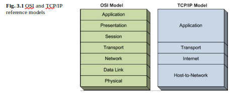
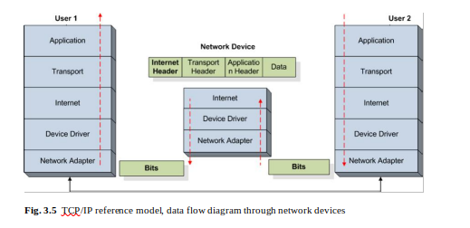

# **Chapter 3**

**Network Communications Protocols and Services**

[toc]

|                                                              |                                                              |
| ------------------------------------------------------------ | ------------------------------------------------------------ |
| Abstract As the previous chapter has introduced network topologies, types, com-ponents, and major communication technologies, this chapter completes the net-work architecture description by presenting network protocols and various services supported by the current networks. The hierarchical organization of network pro-tocols is detailed focusing on the most known reference models and the layered communication paradigm. Furthermore, the various protocol layers are detailed, es-pecially at transport and application layers which involve protocols and services mostly detailed in this book. Last, but not least, the principles of the most popu-lar network-based services are summarized, including electronic mail, Web, and the increasingly popular multimedia-based services. | Tóm tắt Như chương trước đã giới thiệu về cấu trúc liên kết mạng, các loại, cấu trúc liên kết và các công nghệ truyền thông chính, chương này hoàn thành mô tả kiến trúc công việc mạng bằng cách trình bày các giao thức mạng và các dịch vụ khác nhau được các mạng hiện tại hỗ trợ. Tổ chức phân cấp của mạng lưới pro-tocols được trình bày chi tiết, tập trung vào các mô hình tham chiếu được biết đến nhiều nhất và mô hình truyền thông phân lớp. Hơn nữa, các lớp giao thức khác nhau được trình bày chi tiết, đặc biệt là ở các lớp vận chuyển và ứng dụng liên quan đến các giao thức và dịch vụ hầu như được trình bày chi tiết trong cuốn sách này. Cuối cùng, nhưng không kém phần quan trọng, các nguyên tắc của các dịch vụ dựa trên mạng phổ biến nhất được tóm tắt, bao gồm thư điện tử, Web và các dịch vụ dựa trên đa phương tiện ngày càng phổ biến. |

### **3.1 Introduction**

|                                                              |                                                              |
| ------------------------------------------------------------ | ------------------------------------------------------------ |
| The previous chapter has introduced existing network topologies and communica-tion technologies used to enable data exchange between network-interconnected re-mote hosts. Although communication technologies and network infrastructures are at the basis for message exchange between nodes, in order to fully support data ex-change, a set of protocols has to govern the way messages are sent, routed, received, and interpreted by the communicating parties and the network devices. This chapter presents some of the most important communication protocols and discusses major network services. | Chương trước đã giới thiệu các cấu trúc liên kết mạng hiện có và các công nghệ truyền thông tin được sử dụng để cho phép trao đổi dữ liệu giữa các máy chủ lưu trữ mạng được kết nối với nhau. Mặc dù các công nghệ truyền thông và cơ sở hạ tầng mạng là cơ sở để trao đổi thông điệp giữa các nút, để hỗ trợ đầy đủ việc thay đổi dữ liệu, một tập hợp các giao thức phải chi phối cách các bên giao tiếp gửi, định tuyến, nhận và giải thích thông điệp và các thiết bị mạng. Chương này trình bày một số giao thức truyền thông quan trọng nhất và thảo luận về các dịch vụ mạng chính. |

### **3.2 Protocol Hierarchy**

#### ***3.2.1 Network Reference Models***

In order to reduce design complexity and allow for a better standardization process, network protocols are organized in layers (or levels), each layer providing a set of services to the layer immediately above and relying on services from the layer below.

Để giảm độ phức tạp của thiết kế và cho phép quá trình chuẩn hóa tốt hơn, các giao thức mạng được tổ chức theo các lớp (hoặc các cấp), mỗi lớp cung cấp một tập hợp các dịch vụ cho lớp ngay phía trên và dựa vào các dịch vụ từ lớp bên dưới.

**Fig. 3.1** OSI and TCP/IP reference models

 

|                                                              |                                                              |
| ------------------------------------------------------------ | ------------------------------------------------------------ |
| The layered network architecture is organized in reference models; among these the most well known are the ISO Open System Interconnection (OSI) reference model and the TCP/IP reference model.  The OSI model is a theoretical model, and the protocols associated with its layers are rarely used. However, the model itself is widely used to present the concepts used in networking.  As opposed to the OSI, the TCP/IP model is less used for theoretical purposes, but the protocols associated with it are widely used in practice.  Figure 3.1 graphically shows the layers included in each reference model.  The OSI reference model includes seven layers: Physical, Data Link, Network, Transport, Session, Presentation, and Application. There layers are briefly intro-duced next.      • The Physical layer is responsible for transmitting raw bits over a communication channel.      • The Data Link layer is in charge of several tasks such as reliability, flow control, and medium access control for point-to-point data communication.      • The Network layer is mainly in charge of routing packets through sub-nets.      • The Transport layer offers end-to-end data communication services to upper lay-ers.      • The Session layer allows users to establish sessions between them, each session offering services such as dialog control and synchronization.      • The Presentation layer is concerned with the syntax and semantics of the infor-mation (data) exchanged.      • The Application layer contains a variety of protocols specific to user applications.  Unlike OSI, the TCP/IP reference model has only four layers: Host-to-Network, Internet, Transport, and Application.      • The Host-to-Network layer corresponds to the Data Link and Physical layers from the OSI model, but the TCP/IP reference model does not detail this layer. How-ever, the protocols used at this layer are specific to the network technology used to interconnect the physical user devices and network devices.      • The Internet layer corresponds to the Network Layer of the OSI reference model and similar to it, it is in charge of routing data packets through the sub-nets to their destination. The widest used protocol residing at this layer is the Internet Protocol (IP).      • The Transport layer of the TCP/IP reference model corresponds with the same layer of the OSI model and offers similar services. The protocols residing at this layer are the Transmission Control Protocol (TCP) and User Datagram Protocol (UDP).      • The Application layer of the TCP/IP model is similar to the corresponding layer of the OSI model. Protocols residing at this layer include but are not limited to File Transport Protocol (FTP), electronic mail protocols (SMTP, IMAP, POP), Hypertext Transfer Protocol (HTTP), Domain Name System (DNS), Secure Shell (SSH), etc.  A more realistic reference model for TCP/IP is presented in Fig. 3.2. Although controversial, the host-to-network layer of the initial TCP/IP reference model has been split in two by some network specialists. These sub-layers are the Device Driver and Network Adapter sub-layers.  The Network Adapter layer corresponds to the physical layer of the OSI reference model and mainly consists of the hardware implementation of network interfaces. The Device Driver layer contains two sub-layers, namely the Logical Link Con-trol and the Medium Access Control. The Logical Link Control (LLC) offers the upper layers and the operating system access to the device driver. The Medium Access Control (MAC) is responsible for reporting and setting the device status, package outgoing data received from LLC in the format required by the network adapter, sending outgoing data at the appropriate time, receiving incoming data and unpacking it before verifying its integrity, and delivering it to the LLC sub-layer.  Figure 3.3 schematically presents the structure of the TCP/IP reference model and some of the network technologies and protocols involved. | Kiến trúc mạng phân lớp được tổ chức trong các mô hình tham chiếu; trong số này, được biết đến nhiều nhất là mô hình tham chiếu ISO Open System Interconnection (OSI) và mô hình tham chiếu TCP / IP.  Mô hình OSI là một mô hình lý thuyết và các giao thức liên kết với các lớp của nó hiếm khi được sử dụng. Tuy nhiên, bản thân mô hình được sử dụng rộng rãi để trình bày các khái niệm được sử dụng trong mạng.  Trái ngược với OSI, mô hình TCP / IP ít được sử dụng hơn cho các mục đích lý thuyết, nhưng các giao thức liên quan đến nó được sử dụng rộng rãi trong thực tế.  Hình 3.1 thể hiện đồ họa các lớp có trong mỗi mô hình tham chiếu.  Mô hình tham chiếu OSI bao gồm bảy lớp: Vật lý, Liên kết dữ liệu, Mạng, Truyền tải, Phiên, Trình bày và Ứng dụng. Có các lớp được giới thiệu ngắn gọn tiếp theo.      • Lớp vật lý chịu trách nhiệm truyền các bit thô qua kênh truyền thông.      • Lớp Liên kết Dữ liệu phụ trách một số nhiệm vụ như độ tin cậy, kiểm soát luồng và kiểm soát truy cập phương tiện để truyền dữ liệu điểm-điểm.      • Lớp Mạng chủ yếu phụ trách việc định tuyến các gói thông qua các mạng con.      • Tầng Giao vận cung cấp các dịch vụ truyền thông dữ liệu end-to-end cho các tầng lớp trên.      • Lớp Session cho phép người dùng thiết lập các phiên giữa chúng, mỗi phiên cung cấp các dịch vụ như điều khiển hộp thoại và đồng bộ hóa.      • Lớp Trình bày liên quan đến cú pháp và ngữ nghĩa của thông tin (dữ liệu) được trao đổi.      • Lớp Ứng dụng chứa nhiều giao thức dành riêng cho các ứng dụng của người dùng.  Không giống như OSI, mô hình tham chiếu TCP / IP chỉ có bốn lớp: Host-to-Network, Internet, Transport và Application.      • Lớp Host-to-Network tương ứng với lớp Liên kết dữ liệu và lớp Vật lý từ mô hình OSI, nhưng mô hình tham chiếu TCP / IP không nêu chi tiết lớp này. Tuy nhiên, các giao thức được sử dụng ở lớp này là dành riêng cho công nghệ mạng được sử dụng để kết nối thiết bị người dùng vật lý và thiết bị mạng.      • Lớp Internet tương ứng với Lớp mạng của mô hình tham chiếu OSI và tương tự như lớp này, nó chịu trách nhiệm định tuyến các gói dữ liệu qua các mạng con đến đích của chúng. Giao thức được sử dụng rộng rãi nhất nằm ở lớp này là Giao thức Internet (IP).      • Lớp truyền tải của mô hình tham chiếu TCP / IP tương ứng với lớp tương tự của mô hình OSI và cung cấp các dịch vụ tương tự. Các giao thức nằm ở lớp này là Giao thức điều khiển truyền (TCP) và Giao thức sơ đồ người dùng (UDP).      • Lớp Ứng dụng của mô hình TCP / IP tương tự như lớp tương ứng của mô hình OSI. Các giao thức nằm ở lớp này bao gồm nhưng không giới hạn ở Giao thức truyền tải tệp (FTP), giao thức thư điện tử (SMTP, IMAP, POP), Giao thức truyền siêu văn bản (HTTP), Hệ thống tên miền (DNS), Secure Shell (SSH), v.v. .  Mô hình tham chiếu thực tế hơn cho TCP / IP được trình bày trong Hình 3.2. Mặc dù còn nhiều tranh cãi, nhưng lớp host-to-network của mô hình tham chiếu TCP / IP ban đầu đã được một số chuyên gia mạng chia đôi. Các lớp con này là các lớp con Trình điều khiển thiết bị và Bộ điều hợp mạng.  Lớp Bộ điều hợp mạng tương ứng với lớp vật lý của mô hình tham chiếu OSI và chủ yếu bao gồm việc triển khai phần cứng của các giao diện mạng. Lớp Trình điều khiển thiết bị chứa hai lớp con, cụ thể là Con-đẩy Liên kết logic và Điều khiển truy cập phương tiện. Điều khiển Liên kết Hợp lý (LLC) cung cấp cho các lớp trên và quyền truy cập của hệ điều hành vào trình điều khiển thiết bị. Kiểm soát truy cập phương tiện (MAC) chịu trách nhiệm báo cáo và thiết lập trạng thái thiết bị, gói dữ liệu đi nhận được từ LLC ở định dạng theo yêu cầu của bộ điều hợp mạng, gửi dữ liệu đi vào thời điểm thích hợp, nhận dữ liệu đến và giải nén trước khi xác minh tính toàn vẹn của nó và phân phối nó đến lớp con LLC.  Hình 3.3 trình bày sơ đồ cấu trúc của mô hình tham chiếu TCP / IP và một số công nghệ và giao thức mạng liên quan. |

#### ***3.2.2 Layered Communication Paradigm***

| EN                                                           | Vi                                                           |
| ----------------------------------------------------------- | ------------------------------------------------------------ |
| As mentioned in the previous sections, the layers of any reference model, including the TCP/IP model, rely on the services provided by the layers above and provide a set of services to the upper layer.  For example, the application layer protocols such as FTP use transport layer pro-tocols such as TCP to carry the content of the files being transferred. The interaction between layers is done using dedicated interfaces which advertise the services pro-vided by the particular layer.  Figure 3.4 schematically presents the data flow through the TCP/IP protocol hi-erarchy.  To exemplify, we consider two users, User 1 and User 2, exchange files using FTP. We assume that User 2 has an FTP server and the file repositories and User 1 has an FTP client and requests a certain file to be retrieved.  Figure 3.4 illustrates the file transfer process. The content of the file represents the Data. It is handed over to the application layer FTP protocol which adds its spe-cific headers (Application Header). The FTP protocol may split the original file into chunks for transmission. FTP then hands over the data including the FTP headers to the transport protocol (i.e., TCP). The transport protocol splits the application data into packets, adds its own headers (transport layer headers) and hands over the pack-ets to the Internet Protocol (i.e., IP). The Internet Protocol further adds its specific headers and injects the packets in the network, where the packets are routed towards the destination. The packets are sent via the network by being handed over to the Host-to-Network layer. This layer further adds its headers and trailers and manages the transmission of the raw bits representing the data packets to the next neighbor machine. The next neighbor machine is usually a network device mainly the LAN router. At the router level, the TCP/IP reference model is deployed up to the Inter-net level. As it can be seen in Fig. 3.5, at the network device level, the raw bits are decoded up to the Internet protocol level where routing is performed. The Internet layer changes the headers accordingly and re-injects the packets in the network by sending them to the next hop on the path towards the destination. At the receiver side, as it is presented in Fig. 3.4, the raw bits are received and are delivered from the physical layer across the layers to the user application. It can be seen that each layer removes its own headers before sending the data to the immediate upper layer.  From an application network programming perspective, all the details concern-ing layers below the application layer are hidden. For example, as it can be seen in Fig. 3.6, applications can use Sockets for accessing the data transport services offered by the transport layer. In these circumstances, next we discuss application and transport layer issues, ignoring the lower layers. | Như đã đề cập trong các phần trước, các lớp của bất kỳ mô hình tham chiếu nào, bao gồm cả mô hình TCP / IP, đều dựa vào các dịch vụ được cung cấp bởi các lớp trên và cung cấp một tập hợp các dịch vụ cho lớp trên.  Ví dụ, các giao thức của lớp ứng dụng như FTP sử dụng các pro-tocol của lớp truyền tải như TCP để mang nội dung của các tệp đang được chuyển. Sự tương tác giữa các lớp được thực hiện bằng cách sử dụng các giao diện chuyên dụng để quảng cáo các dịch vụ được cung cấp bởi lớp cụ thể.  Hình 3.4 trình bày sơ đồ luồng dữ liệu thông qua bộ xóa cao giao thức TCP / IP.  Để làm ví dụ, chúng tôi xem xét hai người dùng, Người dùng 1 và Người dùng 2, trao đổi tệp bằng FTP. Chúng tôi giả định rằng Người dùng 2 có một máy chủ FTP và kho lưu trữ tệp và Người dùng 1 có một ứng dụng khách FTP và yêu cầu một tệp nhất định được truy xuất.  Hình 3.4 minh họa quá trình truyền tệp. Nội dung của tệp đại diện cho Dữ liệu. Nó được chuyển giao cho giao thức FTP của lớp ứng dụng, nó bổ sung thêm các tiêu đề cụ thể của nó (Application Header). Giao thức FTP có thể chia tệp gốc thành nhiều phần để truyền. Sau đó, FTP chuyển giao dữ liệu bao gồm các tiêu đề FTP cho giao thức truyền tải (tức là TCP). Giao thức truyền tải chia dữ liệu ứng dụng thành các gói, thêm tiêu đề riêng của nó (tiêu đề lớp truyền tải) và chuyển giao các gói cho Giao thức Internet (tức là IP). Giao thức Internet bổ sung thêm các tiêu đề cụ thể của nó và đưa các gói vào mạng, nơi các gói được định tuyến tới đích. Các gói được gửi qua mạng bằng cách chuyển giao cho lớp Host-to-Network. Lớp này bổ sung thêm các tiêu đề và đoạn giới thiệu của nó và quản lý việc truyền các bit thô đại diện cho các gói dữ liệu đến máy hàng xóm tiếp theo. Máy hàng xóm tiếp theo thường là thiết bị mạng chủ yếu là bộ định tuyến LAN. Ở cấp bộ định tuyến, mô hình tham chiếu TCP / IP được triển khai ở cấp Liên mạng. Như có thể thấy trong Hình 3.5, ở cấp độ thiết bị mạng, các bit thô được giải mã đến cấp độ giao thức Internet nơi thực hiện định tuyến. Lớp Internet thay đổi các tiêu đề cho phù hợp và tiêm lại các gói trong mạng bằng cách gửi chúng đến bước tiếp theo trên đường dẫn tới đích. Ở phía máy thu, như được trình bày trong Hình 3.4, các bit thô được nhận và được chuyển từ lớp vật lý qua các lớp tới ứng dụng người dùng. Có thể thấy rằng mỗi lớp loại bỏ các tiêu đề của chính nó trước khi gửi dữ liệu đến lớp trên ngay lập tức.  Từ góc độ lập trình mạng ứng dụng, tất cả các chi tiết liên quan đến các lớp bên dưới lớp ứng dụng đều bị ẩn. Ví dụ, như có thể thấy trong Hình 3.6, các ứng dụng có thể sử dụng Sockets để truy cập các dịch vụ truyền tải dữ liệu do lớp truyền tải cung cấp. Trong những trường hợp này, tiếp theo chúng ta thảo luận về các vấn đề ứng dụng và lớp truyền tải, bỏ qua các lớp bên dưới. |

#### ***3.2.3 Transport Layer***

Transport layer protocols provide end-to-end data transmission and optionally pro-vide functions such as congestion avoidance, reliability and flow control. Transport Control Protocol (TCP) [[1](#page64)] and User Datagram Protocol (UDP) [[2](#page65)] are two de-facto protocols employed at the TCP/IP transport layer. These two protocols are designed and widely deployed in wired network communication environments.

Các giao thức lớp truyền tải cung cấp truyền dữ liệu đầu cuối và các chức năng chuyên nghiệp tùy chọn như tránh tắc nghẽn, độ tin cậy và kiểm soát luồng. Giao thức điều khiển truyền tải (TCP) [1] và Giao thức sơ đồ người dùng (UDP) [2] là hai giao thức phi thực tế được sử dụng ở lớp truyền tải TCP / IP. Hai giao thức này được thiết kế và triển khai rộng rãi trong môi trường truyền thông mạng có dây.

##### **3.2.3.1 Transport Control Protocol**

|                                                              |                                                              |
| ------------------------------------------------------------ | ------------------------------------------------------------ |
| Transport Control Protocol (TCP) [1, 3] is a reliable, connection-oriented, conges-tion controlled byte stream data transfer protocol. A TCP packet consists of a 20 byte header followed by a payload as illustrated in Fig. 3.7.  The header includes a number of fields that enable the provision of key services. TCP uses 16 bit source and destination port number fields for multiplexing data tovarious sending and receiving processes. The 32 bit sequence number field identi-fies the byte in the stream that the first byte of data in the segment represents. This field enables the reordering of out-of-order packets. The 32 bit acknowledgment field contains the sequence number of the next data segment the receiver expects to receive. This allows the sender to identify packets that have not been received, yet. These two fields are essential for providing a reliable delivery service. The 4 bit data offset/header length field specifies the length of the header. The 6 bit field is reserved for future use. Next, there are 6 flag bits. URG (U) is used to determine if the value in the urgent pointer field is valid. If set, the urgent pointer contains a sequence number offset, which corresponds to a TCP segment that contains urgent data and it should be expedited to its destination. ACK indicates if the acknowledg-ment number field is significant. It is used to by the receiver to inform the server that the packets it received are in order and intact. PSH is used to minimize the amount of buffering used before passing the data in this packet to the receiving process. The RST flag used to reset the connection, while the SYN and FIN flags are used for establishing and closing the TCP connection. The 16 bit window size field speci-fies the number of bytes each end of the connection is willing to accept, beginning with the one specified by the acknowledgment number. This field enables connec-tion flow control. Finally, a checksum field covers the header and payload of the TCP segment.  Flow control is achieved by TCP using the window size field. This field identi-fies the number of bytes, starting with the byte acknowledged, that the receiver is willing to accept. If a receiver is busy or does not want to receive more data from the sender, this value can be set to 0. In addition to the flow control based on the window size, the current TCP standard (RFC 2581 [4]) uses a complex congestion control mechanism which involves four algorithms: Slow Start, Congestion Avoid-ance, Fast Retransmit, and Fast Recovery. The slow start algorithm employed by TCP tries to avoid congestion by starting the transmission at a low rate and fast in-creasing the rate until there is the first indication that the available bandwidth limit is being reached. Congestion avoidance further increases the rate gradually to a level acceptable given the existing bandwidth resources. Both slow start and congestion avoidance employ an Additive Increase Multiplicative Decrease (AIMD) approach, enabling the rate of transmitted data to increase incrementally, while the network is still capable of sustaining the current rate (i.e., no packet loss occurs). As soon as this rate exceeds the available network bandwidth (i.e., lost packets are detected), the sender dramatically reduces the data rate. Fast retransmit and fast recovery al-gorithms were introduced in order to speed up data delivery following loss and the consequent TCP drastic reduction in transmission rate.  TCP is used for a number of best effort applications, which rely on application-layer protocols such as the Hypertext Transfer Protocol (HTTP) for Web browsing and File Transfer Protocol (FTP) for file transfer. These applications are not time critical, but require guarantees that the integrity of the received data is maintained. For this reason TCP is not the preferred choice for streaming media. Streaming media requires video to be delivered in a timely manner and maintain relatively stable throughput, while also tolerate some loss. Some researchers proposed using TCP for streaming media more than 10 years ago [5], but did not receive great attention at the time. However, the latest developments in network technologies have made TCP to be considered again for streaming multimedia, including as part of commercial implementations such as Apple’s HTTP Live Streaming (HLS) [6] or the latest standard on Dynamic Adaptive Streaming over HTTP (DASH) [7]. | Giao thức điều khiển truyền tải (TCP) [1, 3] là một giao thức truyền dữ liệu luồng byte được kiểm soát theo định hướng kết nối, đáng tin cậy. Một gói TCP bao gồm một tiêu đề 20 byte theo sau là một trọng tải như được minh họa trong Hình 3.7.  Tiêu đề bao gồm một số trường cho phép cung cấp các dịch vụ chính. TCP sử dụng các trường số cổng đích và nguồn 16 bit để ghép kênh các quy trình gửi và nhận dữ liệu khác nhau. Trường số thứ tự 32 bit xác định byte trong luồng mà byte dữ liệu đầu tiên trong phân đoạn đại diện. Trường này cho phép sắp xếp lại các gói không có thứ tự. Trường báo nhận 32 bit chứa số thứ tự của đoạn dữ liệu tiếp theo mà bộ thu mong đợi nhận được. Điều này cho phép người gửi xác định các gói tin chưa được nhận. Hai lĩnh vực này rất cần thiết để cung cấp một dịch vụ giao hàng đáng tin cậy. Trường độ dài tiêu đề / bù đắp dữ liệu 4 bit chỉ định độ dài của tiêu đề. Trường 6 bit được dành để sử dụng trong tương lai. Tiếp theo, có 6 bit cờ. URG (U) được sử dụng để xác định xem giá trị trong trường con trỏ khẩn cấp có hợp lệ hay không. Nếu được đặt, con trỏ khẩn cấp chứa một phần bù số thứ tự, tương ứng với một phân đoạn TCP có chứa dữ liệu khẩn cấp và con trỏ đó sẽ được chuyển nhanh đến đích của nó. ACK cho biết trường số xác nhận có quan trọng hay không. Nó được người nhận sử dụng để thông báo cho máy chủ rằng các gói mà nó nhận được là theo thứ tự và nguyên vẹn. PSH được sử dụng để giảm thiểu số lượng bộ đệm được sử dụng trước khi chuyển dữ liệu trong gói này đến quá trình nhận. Cờ RST được sử dụng để thiết lập lại kết nối, trong khi cờ SYN và FIN được sử dụng để thiết lập và đóng kết nối TCP. Trường kích thước cửa sổ 16 bit xác định số lượng byte mà mỗi đầu của kết nối sẵn sàng chấp nhận, bắt đầu bằng byte được chỉ định bởi số xác nhận. Trường này cho phép kiểm soát luồng kết nối. Cuối cùng, một trường tổng kiểm tra bao gồm tiêu đề và trọng tải của phân đoạn TCP.  Kiểm soát luồng được thực hiện bởi TCP sử dụng trường kích thước cửa sổ. Trường này xác định số byte, bắt đầu bằng byte được thừa nhận, mà người nhận sẵn sàng chấp nhận. Nếu người nhận bận hoặc không muốn nhận thêm dữ liệu từ người gửi, giá trị này có thể được đặt thành 0. Ngoài điều khiển luồng dựa trên kích thước cửa sổ, tiêu chuẩn TCP hiện tại (RFC 2581 [4]) sử dụng cơ chế kiểm soát tắc nghẽn phức tạp bao gồm bốn thuật toán: Khởi động chậm, Tránh tắc nghẽn, Truyền lại nhanh và Phục hồi nhanh. Thuật toán khởi động chậm được sử dụng bởi TCP cố gắng tránh tắc nghẽn bằng cách bắt đầu truyền ở tốc độ thấp và tốc độ tăng nhanh cho đến khi có dấu hiệu đầu tiên cho thấy giới hạn băng thông khả dụng đang đạt đến. Việc tránh tắc nghẽn tiếp tục tăng tốc độ dần dần đến mức có thể chấp nhận được với tài nguyên băng thông hiện có. Cả khởi động chậm và tránh tắc nghẽn đều sử dụng phương pháp tiếp cận Giảm đa số tăng cộng (AIMD), cho phép tốc độ dữ liệu được truyền tăng dần, trong khi mạng vẫn có khả năng duy trì tốc độ hiện tại (tức là không xảy ra mất gói). Ngay khi tốc độ này vượt quá băng thông mạng khả dụng (tức là các gói bị mất được phát hiện), người gửi sẽ giảm đáng kể tốc độ dữ liệu. Truyền lại nhanh và nhanh chóng phục hồi nhanh đã được giới thiệu để tăng tốc độ phân phối dữ liệu sau khi bị mất và do đó TCP giảm đáng kể tốc độ truyền.  TCP được sử dụng cho một số ứng dụng nỗ lực cao nhất, dựa trên các giao thức tầng ứng dụng như Giao thức truyền siêu văn bản (HTTP) để duyệt web và Giao thức truyền tệp (FTP) để truyền tệp. Các ứng dụng này không quan trọng về thời gian, nhưng yêu cầu đảm bảo rằng tính toàn vẹn của dữ liệu nhận được được duy trì. Vì lý do này TCP không phải là lựa chọn ưu tiên cho phương tiện truyền trực tuyến. Truyền phát phương tiện yêu cầu video phải được phân phối kịp thời và duy trì thông lượng tương đối ổn định, đồng thời chịu được một số tổn thất. Một số nhà nghiên cứu đã đề xuất sử dụng TCP cho phương tiện truyền phát trực tuyến hơn 10 năm trước [5], nhưng không nhận được sự quan tâm lớn vào thời điểm đó. Tuy nhiên, những phát triển mới nhất trong công nghệ mạng đã khiến TCP được xem xét một lần nữa để phát trực tuyến đa phương tiện, bao gồm như một phần của việc triển khai thương mại như Truyền trực tiếp HTTP của Apple (HLS) [6] hoặc tiêu chuẩn mới nhất về Phát trực tiếp động thích ứng qua HTTP (DASH) [7]. |

##### **3.2.3.2 User Datagram Protocol**

|                                                              |                                                              |
| ------------------------------------------------------------ | ------------------------------------------------------------ |
| User Datagram Protocol (UDP) [2] is a connectionless transport protocol. It pro-vides the basic functionality required for applications to send encapsulated IP data-grams without having to establish a connection. A UDP datagram (see Fig. 3.8) consists of an 8 byte header followed by a payload.  The header consists of four 2 byte fields: source port, destination port, length, and checksum. The source and destination port fields provide required information to allow transport layer daemon processes to route packets to their correct destination application. This multiplexing/demultiplexing feature is the main benefit UDP has over raw IP datagrams. The 16-bit length field specifies the length of the datagram in bytes of the entire datagram (header and data). The field size sets a theoretical limit of 65,527 bytes for the data carried by a single UDP datagram. Finally, a 16-bit checksum field is used for error-checking of the header and data. UDP does not provide any reliability or congestion control features. As a result applications using this protocol must generally be willing to accept or deal with loss, duplication or out-of-order delivery and rely on network-based mechanisms to minimize potential of congestion collapse. The majority of applications using UDP often do not require reliability mechanisms and may even be hindered by them. Applications requiring high degrees of reliability should use a reliable protocol (e.g., TCP). These charac-teristics make UDP well suited for real-time multimedia streaming applications. | Giao thức Dữ liệu Người dùng (UDP) [2] là một giao thức truyền tải không kết nối. Nó cung cấp chức năng cơ bản cần thiết cho các ứng dụng để gửi gam dữ liệu IP đóng gói mà không cần phải thiết lập kết nối. Một sơ đồ dữ liệu UDP (xem Hình 3.8) bao gồm một tiêu đề 8 byte theo sau là một trọng tải.  Tiêu đề bao gồm bốn trường 2 byte: cổng nguồn, cổng đích, độ dài và tổng kiểm tra. Các trường cổng nguồn và cổng đích cung cấp thông tin cần thiết để cho phép các quy trình daemon của lớp truyền tải định tuyến các gói đến ứng dụng đích chính xác của chúng. Tính năng ghép kênh / phân kênh này là lợi ích chính mà UDP có trên các biểu đồ IP thô. Trường độ dài 16 bit chỉ định độ dài của sơ đồ tính bằng byte của toàn bộ dữ liệu (tiêu đề và dữ liệu). Kích thước trường đặt giới hạn lý thuyết là 65,527 byte cho dữ liệu được mang bởi một sơ đồ dữ liệu UDP. Cuối cùng, trường tổng kiểm tra 16 bit được sử dụng để kiểm tra lỗi của tiêu đề và dữ liệu. UDP không cung cấp bất kỳ tính năng kiểm soát tắc nghẽn hoặc độ tin cậy nào. Do đó, các ứng dụng sử dụng giao thức này thường phải sẵn sàng chấp nhận hoặc đối phó với việc mất mát, trùng lặp hoặc giao hàng không theo đơn đặt hàng và dựa trên các cơ chế dựa trên mạng để giảm thiểu khả năng xảy ra sự cố tắc nghẽn. Phần lớn các ứng dụng sử dụng UDP thường không yêu cầu cơ chế tin cậy và thậm chí có thể bị chúng cản trở. Các ứng dụng yêu cầu mức độ tin cậy cao nên sử dụng giao thức đáng tin cậy (ví dụ: TCP). Những đặc điểm này làm cho UDP rất phù hợp cho các ứng dụng truyền phát đa phương tiện thời gian thực. |

##### **3.2.3.3 TCP/IP and Wireless Networks**

|                                                              |                                                              |
| ------------------------------------------------------------ | ------------------------------------------------------------ |
| As opposed to wired communications where packets not acknowledged by recipient within the expected deadline are supposed to be lost due to network congestion and buffer overflow, packet loss in wireless communications may be caused by interfer-ence, noisy channel, etc., which does not necessarily imply congestion.  UDP is a datagram-oriented protocol that provides no delivery guarantee to upper layers, and does not provide any support mechanism for congestion detection or reliability control. This is why UDP is not suitable for use for services requiring transport reliability such as e-mail or file transfer applications.  Several studies [8–10] on the performance evaluation of these two protocols have shown that there are various performance issues when using them for data transport over wireless communication networks.  Several variants of TCP have been proposed, each making improvements in terms of energy consumption, network throughput, and reliability.  TCP Tahoe [4, 11] mainly contributes in the design of slow start, congestion avoidance, and fast retransmission, and is the first protocol to include congestion control and thus is energy efficient for bursty error which happens quite often in wireless sensor networks. TCP Reno [12] implements the three functions of Tahoe and adds additional fast recovery mechanism. TCP New-Reno [13] modifies the fast recovery scheme. The fast recovery function detects packet loss and initiates retrans-mission without the timeout signal required by traditional retransmission policies. In this case, it provides shorter delay and better quality for multimedia streaming applications. SACK [14] uses selective ACK instead of cumulative ACK to indicate successful transmission of specific packet, thus the sender is able to figure out which packets are lost and save the energy for redundant retransmission; and simulation re-sults show that incorporating SACK in TCP achieves better performance in terms of packet delay and throughput [15]. SACK is supposed to be energy efficient as it decreases the number of unnecessary retransmissions; however, the study in [16] points out that the energy gain is neutralized by the extra overhead. Vegas [17] mod-ifies the congestion control scheme and adapts the transmission rate at the sender side according to the observed Round Trip Time (RTT), and WestwoodNR [18] dif-ferentiates the causes of packet loss, i.e., traffic congestion or error-prone wireless channel, and adapts the congestion window size at the sender side accordingly. | Trái ngược với truyền thông có dây trong đó các gói không được người nhận thừa nhận trong thời hạn dự kiến được cho là bị mất do tắc nghẽn mạng và tràn bộ đệm, mất gói trong truyền thông không dây có thể do gián đoạn, kênh nhiễu, v.v., điều này không nhất thiết phải bao hàm sự tắc nghẽn.  UDP là một giao thức hướng datagram không cung cấp đảm bảo phân phối đến các lớp trên và không cung cấp bất kỳ cơ chế hỗ trợ nào để phát hiện tắc nghẽn hoặc kiểm soát độ tin cậy. Đây là lý do tại sao UDP không thích hợp để sử dụng cho các dịch vụ yêu cầu độ tin cậy của quá trình truyền tải như e-mail hoặc ứng dụng truyền tệp.  Một số nghiên cứu [8–10] về đánh giá hiệu suất của hai giao thức này đã chỉ ra rằng có nhiều vấn đề về hiệu suất khi sử dụng chúng để truyền dữ liệu qua mạng truyền thông không dây.  Một số biến thể của TCP đã được đề xuất, mỗi biến thể đều cải tiến về tiêu thụ năng lượng, thông lượng mạng và độ tin cậy.  TCP Tahoe [4, 11] chủ yếu đóng góp vào việc thiết kế khởi động chậm, tránh tắc nghẽn và truyền lại nhanh, và là giao thức đầu tiên bao gồm kiểm soát tắc nghẽn và do đó hiệu quả năng lượng đối với lỗi bursty thường xảy ra trong mạng cảm biến không dây. TCP Reno [12] thực hiện ba chức năng của Tahoe và bổ sung thêm cơ chế khôi phục nhanh. TCP New-Reno [13] sửa đổi sơ đồ khôi phục nhanh. Chức năng khôi phục nhanh chóng phát hiện mất gói và bắt đầu truyền lại mà không có tín hiệu thời gian chờ theo yêu cầu của chính sách truyền lại truyền thống. Trong trường hợp này, nó cung cấp độ trễ ngắn hơn và chất lượng tốt hơn cho các ứng dụng phát trực tuyến đa phương tiện. SACK [14] sử dụng ACK chọn lọc thay vì ACK tích lũy để chỉ ra việc truyền thành công gói tin cụ thể, do đó người gửi có thể tìm ra gói nào bị mất và tiết kiệm năng lượng cho việc truyền lại dự phòng; và kết quả mô phỏng lại cho thấy việc kết hợp SACK trong TCP đạt được hiệu suất tốt hơn về độ trễ và thông lượng gói [15]. SACK được cho là tiết kiệm năng lượng vì nó giảm số lần truyền lại không cần thiết; tuy nhiên, nghiên cứu trong [16] chỉ ra rằng năng lượng tăng được trung hòa bởi chi phí phụ. Vegas [17] mod-ifies lược đồ kiểm soát tắc nghẽn và điều chỉnh tốc độ truyền ở phía người gửi theo Thời gian khứ hồi được quan sát (RTT) và WestwoodNR [18] phân tích nguyên nhân mất gói, tức là tắc nghẽn giao thông hoặc kênh không dây dễ xảy ra lỗi và điều chỉnh kích thước cửa sổ tắc nghẽn ở phía người gửi cho phù hợp. |

#### ***3.2.4 Application Layer***

The application layer provides most of the functionality required by the user in terms of its direct interaction with the network-based services. The lower layers, including the transport layer, provide data transport services to the application layer. Although the transport layer protocols support data exchange services, their functionality is still too basic for the applications layer. As a consequence various protocols have been developed and deployed at the application layer in order to support the re-quirements of the highly diverse user applications. Some of these protocols will be discussed in this section.

Lớp ứng dụng cung cấp hầu hết các chức năng theo yêu cầu của người dùng về sự tương tác trực tiếp của nó với các dịch vụ dựa trên mạng. Các lớp thấp hơn, bao gồm cả lớp truyền tải, cung cấp các dịch vụ vận chuyển dữ liệu đến lớp ứng dụng. Mặc dù các giao thức của lớp truyền tải hỗ trợ các dịch vụ trao đổi dữ liệu, nhưng chức năng của chúng vẫn còn quá cơ bản đối với lớp ứng dụng. Do đó, các giao thức khác nhau đã được phát triển và triển khai ở lớp ứng dụng để hỗ trợ các yêu cầu lại của các ứng dụng người dùng đa dạng. Một số giao thức này sẽ được thảo luận trong phần này.

##### **3.2.4.1 The Domain Name System**

|                                                              |                                                              |
| ------------------------------------------------------------ | ------------------------------------------------------------ |
| In order to initiate a TCP connection or to send UDP datagrams to a host in the network, one needs to know the host’s IP address. The main disadvantages of ad-dressing a host by its IP address include the less user-friendly format of IP addresses (i.e., numerical form) and the possibility that a host will have its address changed by the network administrator.  To solve this issue, textual names (i.e., domain names) have been introduced to decouple the name of a host from its IP address. Consequently, user applications will address a specific host by its name and not its IP address. However, the underling network still uses IP addresses to exchange and route data packets.  The Domain Name System, best known as DNS, is a distributed system storing records about domain names and host machines. A standard DNS resource record contains the fields presented in Fig. 3.9, which are briefly introduced next.  The Domain Name represents the domain the record refers to and is the main query parameter when a DNS server is interrogated for particular records.  The Time to Live parameter is an indicator of how stable the record is expected to be. This is mainly relevant for cached records which may soon become outdated.  Class is usually “IN” for Internet information. Other codes can be used for non-Internet information.  The Type denotes the king of recorder, among other one of the most important is “A” which represents the IP address.  The Value can be a number, a domain name, or an ASCII string.  The following is an example of a DNS record specifying the IP of the host to which the domain pel.eeng.dcu.ie refers to. The time to live for this record is 86400 seconds which represents 24 hours. This is a stable record. For less stable records, the time to live field may be set to 60 seconds.  pel.eeng.dcu.ie 86400 IN A 10.10.105.189  Theoretically, a single server could store the DNS records for the whole Internet. In reality, this would quickly lead to this server being overloaded by a huge amount of requests and eventually fail. Moreover, having one single server delivering DNS service poses significant reliability problems risking to bring the whole Internet ac-tivity to a halt.  As a consequence, the DNS space is organized in a tree-like structure as illus-trated in Fig. 3.10.  The top-level contains generic domains such as .com, .edu, .net, etc., and country domains such as .us, .fr, .ie, .de, etc. Each of the top-level domains is the root of a tree of sub-domains. A leaf domain is a domain that does not have any sub-domains and may represent a host or a organization with hundreds of hosts.  The domain name tree is organized in zones and each of these zones is served by a primary name server and several secondary ones.  There are two types of queries supported by named servers. To exemplify, we consider the host in Fig. 3.10, running a client application willing to initiate a TCP connection with a server running on the host represented by the domain name pel.eeng.dcu.ie. The client application will call a resolver procedure passing the do-main name as a parameter. The resolver will use UDP to send local name server a request for the IP corresponding to pel.eeng.dcu.ie. Assuming this domain has never been accessed from the host machine before, the local name server will not have any records of it.  Depending on the type of query (recursive or non-recursive) the local name server will forward the query to the top-level name server (i.e., ie) or will reply with the address of the top-level name server.  For the rest of the example will assume the query is recursive. The local name server forwards the query to the .ie name server. The top-level server does not have records of the leaf domains but has records of the next level sub-domains. Conse-quently, it forwards the request to dcu domain server which further forwards the request to eeng name server. The eeng name server retrieves the authoritative record from its database and forwards it to the originator of the query which further returns the record towards the local name server of the client host. The local name server sends the record to the resolver of client application. The authoritative record comes from the server that manages the domain (i.e., eeng name server) is always up to date. In the context of the presented example, the client host’s local name server caches the record for quick future name resolution (the cached record will be kept for as long as the Time to Live parameter specifies, in order to avoid stalled data) | Để bắt đầu kết nối TCP hoặc gửi sơ đồ UDP đến một máy chủ trong mạng, người ta cần biết địa chỉ IP của máy chủ. Những nhược điểm chính của việc tạo quảng cáo cho một máy chủ lưu trữ theo địa chỉ IP của nó bao gồm định dạng địa chỉ IP ít thân thiện với người dùng hơn (tức là dạng số) và khả năng máy chủ lưu trữ sẽ bị quản trị viên mạng thay đổi địa chỉ.  Để giải quyết vấn đề này, tên văn bản (tức là tên miền) đã được giới thiệu để tách tên của máy chủ lưu trữ khỏi địa chỉ IP của nó. Do đó, các ứng dụng người dùng sẽ địa chỉ một máy chủ cụ thể bằng tên của nó chứ không phải địa chỉ IP của nó. Tuy nhiên, mạng bên dưới vẫn sử dụng địa chỉ IP để trao đổi và định tuyến các gói dữ liệu.  Hệ thống tên miền, hay được gọi là DNS, là một hệ thống phân tán lưu trữ các bản ghi về tên miền và máy chủ. Bản ghi tài nguyên DNS tiêu chuẩn chứa các trường được trình bày trong Hình 3.9, được giới thiệu ngắn gọn tiếp theo.  Tên miền đại diện cho miền mà bản ghi đề cập đến và là tham số truy vấn chính khi máy chủ DNS được thẩm vấn cho các bản ghi cụ thể.  Thông số Thời gian tồn tại là một chỉ báo về mức độ ổn định của bản ghi. Điều này chủ yếu liên quan đến các bản ghi đã lưu trong bộ nhớ cache có thể sớm trở nên lỗi thời.  Lớp thường là "IN" cho thông tin Internet. Các mã khác có thể được sử dụng cho thông tin không phải Internet.  Loại biểu thị vua của đầu ghi, một trong những loại quan trọng nhất là “A” đại diện cho địa chỉ IP.  Giá trị có thể là một số, một tên miền hoặc một chuỗi ASCII.  Sau đây là ví dụ về bản ghi DNS chỉ định IP của máy chủ lưu trữ mà miền pel.eeng.dcu.ie tham chiếu đến. Thời gian tồn tại của kỷ lục này là 86400 giây, tương ứng với 24 giờ. Đây là một kỷ lục ổn định. Đối với các bản ghi kém ổn định, thời gian tồn tại trường có thể được đặt thành 60 giây.  pel.eeng.dcu.ie 86400 TRONG A 10.10.105.189  Về mặt lý thuyết, một máy chủ duy nhất có thể lưu trữ các bản ghi DNS cho toàn bộ Internet. Trên thực tế, điều này sẽ nhanh chóng dẫn đến việc máy chủ này bị quá tải bởi một lượng lớn yêu cầu và cuối cùng là thất bại. Hơn nữa, việc có một máy chủ duy nhất cung cấp dịch vụ DNS gây ra các vấn đề đáng kể về độ tin cậy có nguy cơ khiến toàn bộ hoạt động Internet bị đình trệ.  Do đó, không gian DNS được tổ chức theo cấu trúc dạng cây như được đánh dấu trong Hình 3.10.  Cấp cao nhất chứa các miền chung chung như .com, .edu, .net, v.v. và các miền quốc gia như .us, .fr, .ie, .de, v.v. Mỗi miền cấp cao nhất là gốc của một cây gồm các miền con. Miền lá là miền không có bất kỳ miền phụ nào và có thể đại diện cho một máy chủ lưu trữ hoặc một tổ chức có hàng trăm máy chủ.  Cây tên miền được tổ chức theo các vùng và mỗi vùng này được phục vụ bởi một máy chủ định danh chính và một số máy chủ phụ.  Có hai loại truy vấn được hỗ trợ bởi các máy chủ được đặt tên. Để làm ví dụ, chúng tôi xem xét máy chủ lưu trữ trong Hình 3.10, đang chạy một ứng dụng khách sẵn sàng khởi tạo kết nối TCP với máy chủ chạy trên máy chủ lưu trữ được đại diện bởi tên miền pel.eeng.dcu.ie. Ứng dụng khách sẽ gọi một thủ tục trình phân giải chuyển tên do-main làm tham số. Trình phân giải sẽ sử dụng UDP để gửi cho máy chủ định danh cục bộ một yêu cầu đối với IP tương ứng với pel.eeng.dcu.ie. Giả sử miền này chưa từng được truy cập từ máy chủ trước đây, máy chủ định danh cục bộ sẽ không có bất kỳ bản ghi nào về nó.  Tùy thuộc vào loại truy vấn (đệ quy hoặc không đệ quy), máy chủ định danh cục bộ sẽ chuyển tiếp truy vấn đến máy chủ định danh cấp cao nhất (tức là) hoặc sẽ trả lời bằng địa chỉ của máy chủ định danh cấp cao nhất.  Đối với phần còn lại của ví dụ sẽ giả sử truy vấn là đệ quy. Máy chủ định danh cục bộ chuyển tiếp truy vấn tới máy chủ định danh .ie. Máy chủ cấp cao nhất không có bản ghi của các miền lá nhưng có các bản ghi của các miền con cấp tiếp theo. Do đó, nó chuyển tiếp yêu cầu đến máy chủ miền dcu, máy chủ này sẽ chuyển tiếp yêu cầu tới máy chủ định danh eeng. Máy chủ định danh eeng truy xuất bản ghi có thẩm quyền từ cơ sở dữ liệu của nó và chuyển tiếp nó đến người khởi tạo truy vấn, tiếp tục trả về bản ghi về phía máy chủ tên cục bộ của máy khách. Máy chủ định danh cục bộ gửi bản ghi tới trình phân giải của ứng dụng khách. Bản ghi có thẩm quyền đến từ máy chủ quản lý miền (tức là máy chủ định danh eeng) luôn được cập nhật. Trong ngữ cảnh của ví dụ được trình bày, máy chủ định danh cục bộ của máy khách lưu trữ bản ghi để phân giải tên nhanh chóng trong tương lai (bản ghi đã lưu trong bộ nhớ cache sẽ được lưu giữ miễn là thông số Thời gian tồn tại chỉ định, để tránh dữ liệu bị dừng). |

##### **3.2.4.2 File Transfer Protocol**

|                                                              |                                                              |
| ------------------------------------------------------------ | ------------------------------------------------------------ |
| File transfers account for large amounts of data exchange over the Internet. File transfers involve clients transferring file content in a reliable manner and efficiently to and from servers, but also data exchange between peers in peer-to-peer settings. In general, file transfers are performed using the File Transfer Protocol (FTP).  FTP was developed in 1985 and is still widely used today. The protocol has been first defined in RFC 959, but then several extensions have been proposed to enhance flexibility and security (RFC 1579, RFC 2228) [19–21]. FTP works on top of TCP and in general uses port 21; however, the administrator may choose to use different ports.  The client connects to the server and sends commands, and the server responds with command status messages. In general, each session involves at least one file transfer. The basic principle of file transfers using FTP is outlined in Fig. 3.11.  FTP involves two connections: control and data connections. FTP commands and replies are exchanged via the control connection, while data is exchanged over the data connection. Control connection must be working when the data is transferred. In practice, a single connection is used for both data and control.  Commands can be grouped in three categories.      • Access control commands include:  – USER—indicates the user;  – PASS—indicates the password;  – CWD—change directory;  – CDUP—change directory to parent;  – QUIT—logout.   • Transfer parameter commands include:  – PORT—publish local data port;  – PASV—server passive (listen);  – TYPE—indicate data representation (A-ASCII, E-EBCDIC, I-Image, L-Local);  – MODE—indicate transfer mode (S-Stream, B-Block, C-Compressed);  – STRU—establish file structure (F-FILE, R-RECORD, P-PAGE).      • Service commands include:  – RETR—retrieve file;  – STOR—send and store the file remotely;  – APPE—send file and append;  – DELE—delete the file;  – MKD—make a new directory;  – RMD—remove a directory;  – PWD—print working directory;  – LIST—list files.  Every command must generate at least one reply from the server. This enables the synchronization of requests sent by clients and actions performed by the server and also allows the clients to know the server status. In general, the reply is a single line; however, multiple lines are also accepted. The reply must contain a three digit status code which enables machines to assess server status and a text message which describes the server status in human language.  There are several issues when using FTP for file transfers. Security is an impor-tant issue for many companies that have installed firewalls. Firewalls prevent unau-thorized users from getting access to the networks. However, firewalls may also inadvertently prevent valid users from accessing some resources. When FTP is in-volved the network administrators must design rules for classes of FTP connections which may be a costly and error prone process.  Another issue is standardization. There are many FTP client applications with different interpretations of the FTP protocol. Consequently, FTP server administra-tors must know how to support all of these different client classes.  An alternative to FTP is Web-based file transfer. A Web-based file transfer client runs within the Web browser. There is no need for any software to install, license to purchase or software to maintain. Additionally, there is no need to set-up firewall rules for each user class. | Truyền tệp chiếm một lượng lớn dữ liệu trao đổi qua Internet. Truyền tệp liên quan đến việc khách hàng chuyển nội dung tệp theo cách đáng tin cậy và hiệu quả đến và từ máy chủ, nhưng cũng trao đổi dữ liệu giữa các đồng nghiệp trong cài đặt ngang hàng. Nói chung, truyền tệp được thực hiện bằng Giao thức truyền tệp (FTP).  FTP được phát triển vào năm 1985 và vẫn được sử dụng rộng rãi cho đến ngày nay. Giao thức lần đầu tiên được định nghĩa trong RFC 959, nhưng sau đó một số phần mở rộng đã được đề xuất để tăng cường tính linh hoạt và bảo mật (RFC 1579, RFC 2228) [19–21]. FTP hoạt động trên nền TCP và nói chung sử dụng cổng 21; tuy nhiên, quản trị viên có thể chọn sử dụng các cổng khác nhau.  Máy khách kết nối với máy chủ và gửi lệnh, máy chủ phản hồi bằng các thông báo trạng thái lệnh. Nói chung, mỗi phiên liên quan đến ít nhất một lần chuyển tệp. Nguyên tắc cơ bản của việc truyền tệp bằng FTP được trình bày trong Hình 3.11.  FTP liên quan đến hai kết nối: điều khiển và kết nối dữ liệu. Các lệnh và câu trả lời FTP được trao đổi thông qua kết nối điều khiển, trong khi dữ liệu được trao đổi qua kết nối dữ liệu. Kết nối điều khiển phải hoạt động khi dữ liệu được truyền. Trong thực tế, một kết nối duy nhất được sử dụng cho cả dữ liệu và điều khiển.  Các lệnh có thể được nhóm thành ba loại.      • Các lệnh kiểm soát truy cập bao gồm:  - USER — cho biết người dùng;  - PASS — cho biết mật khẩu;  - CWD - thay đổi thư mục;  - CDUP — thay đổi thư mục thành cha mẹ;  - QUIT — đăng xuất.   • Các lệnh tham số truyền bao gồm:  - PORT — xuất bản cổng dữ liệu cục bộ;  - PASV - máy chủ thụ động (lắng nghe);  - TYPE — biểu thị dữ liệu (A-ASCII, E-EBCDIC, I-Image, L-Local);  - MODE — chỉ ra chế độ truyền (S-Stream, B-Block, C-Compression);  - STRU — thiết lập cấu trúc tệp (F-FILE, R-RECORD, P-PAGE).      • Các lệnh dịch vụ bao gồm:  - RETR — truy xuất tệp;  - LƯU TRỮ — gửi và lưu trữ tệp từ xa;  - APPE — gửi tệp và nối thêm;  - DELE — xóa tệp;  - MKD — tạo một thư mục mới;  - RMD — xóa một thư mục;  - PWD — in thư mục làm việc;  - LIST — liệt kê các tệp.  Mỗi lệnh phải tạo ra ít nhất một câu trả lời từ máy chủ. Điều này cho phép đồng bộ hóa các yêu cầu do máy khách gửi và các hành động do máy chủ thực hiện và cũng cho phép máy khách biết trạng thái máy chủ. Nói chung, câu trả lời là một dòng duy nhất; tuy nhiên, nhiều dòng cũng được chấp nhận. Thư trả lời phải chứa mã trạng thái ba chữ số cho phép máy đánh giá trạng thái máy chủ và tin nhắn văn bản mô tả trạng thái máy chủ bằng ngôn ngữ của con người.  Có một số vấn đề khi sử dụng FTP để truyền tệp. Bảo mật là một vấn đề quan trọng đối với nhiều công ty đã cài đặt tường lửa. Tường lửa ngăn người dùng trái phép truy cập vào mạng. Tuy nhiên, tường lửa cũng có thể vô tình ngăn người dùng hợp lệ truy cập một số tài nguyên. Khi FTP được kích hoạt, quản trị viên mạng phải thiết kế các quy tắc cho các lớp kết nối FTP, đây có thể là một quá trình tốn kém và dễ xảy ra lỗi.  Một vấn đề khác là tiêu chuẩn hóa. Có nhiều ứng dụng FTP client với các cách hiểu khác nhau về giao thức FTP. Do đó, các quản trị viên máy chủ FTP phải biết cách hỗ trợ tất cả các lớp máy khách khác nhau này.  Một thay thế cho FTP là truyền tệp dựa trên Web. Ứng dụng khách truyền tệp dựa trên Web chạy trong trình duyệt Web. Không cần bất kỳ phần mềm nào để cài đặt, giấy phép mua hoặc phần mềm để duy trì. Ngoài ra, không cần thiết lập các quy tắc tường lửa cho mỗi lớp người dùng. |

### **3.3 Services**

#### ***3.3.1 Electronic Mail***

|                                                              |                                                              |
| ------------------------------------------------------------ | ------------------------------------------------------------ |
| Nowadays, the e-mail service is one of the most used means of electronic com-munications. It involves users sending messages to other users via the network. In practice, client machines enable messages to be written and sent to local e-mail hosts (e-mail servers), which communicate with remote clients’ e-mail hosts. Re-mote clients enable the contact with the remote e-mail servers for the messages to be retrieved and then read by the remote users.  The e-mail system is composed of a User Agent (UA) and a Message Transfer Agent (MTA). The UA allows users to send and retrieve messages and may also provide a graphical user interface. The MTA transfers the messages from the source to the destination.  The e-mail system requires several services to be provided by the two agent com-ponents: UA and MTA. Composition is provided by UA and refers to the creation of messages and reply messages. Transfer is ensured by MTA and refers to delivering the messages from source to destination. Reporting, also provided by MTA, involves informing the sender about the status of the messages sent. Displaying is provided by UA through the user interface and involves displaying the message so that it can be accessed by the user. Depending on the type of content, sometimes the messages need to be converted before displaying. Often another program is invoked, such as plug-in (embedded in the mail client application) or application (independent from the mail client application). Disposition, managed by the UA, refers to what the remote user does with the message (e.g., save, delete, etc.). Figure 3.12 shows the basic principle of the e-mail service.  The e-mail message structure involves an envelope, a header, and a body, as outlined in Fig. 3.13 and is formalized in RFC 822 and RFC 2822. The envelope encapsulates the message and contains all info required to transport the message such as destination address, priority, and security level. The header contains the control information required to display the message (e.g., date, subject). The body represents the content useful to the human user.  Multipurpose Internet Mail Extensions (MIME) is a standard (RFC 1341, RFC 2045-2049) that extends the format (RFC 822) of the e-mail messages to sup-port extra features and encoding rules for non-ASCII messages. These features in-clude characters with accents (e.g., in French, German, etc.), text in non-Latin al-phabets (e.g., Cyrilic, Hebrew, etc.), text in non-alphabetic languages (e.g., Chinese, Japanese), non-text data (e.g., multimedia, images, audio).  MIME defines five new message headers. The new headers include:      • MIME-Version—Indicates MIME version;      • Content-Description—String describing the content;      • Content-Id—Unique identifier;      • Content-Transfer-Encoding—How body is wrapped for transmission (e.g., 7-bit ASCII, 8-bit codes, base64 binary, etc.);      • Content-Type—Type and format of content, RFC 2045 defines 7 types, including Text (Plain, Enriched), Image(Gif, Jpeg), Audio (Basic), Video (Mpeg) Applica-tion, Message (RFC 822, Partial, External-body), Multipart.  Messages not including MIME-Version header are assumed to be in English plain text.  Simple Mail Transfer Protocol (SMTP), standardized in RFC 821, allows mes-sages to be sent from UA to MTA. SMTP works on top of TCP and in general uses port 25.  The client initiates the TCP connection with the server and waits for the server to state it is ready. After the server confirms it is ready, the communication sequence commences. The client sends commands and the server responds with command status messages. Status messages include ASCII encoded numeric codes and details in text. The order of the commands is very important for the success of the message sending operation.  The SMTP commands include:      • HELO—identifies client;      • MAIL FROM:—starts a mail transfer session and identifies the mail sender;      • RCPT TO:—identifies one recipient; there may be multiple RCPT TO: com-mands;      • DATA—sender ready to transmit a series of lines of text, each ending with CR&LF. A line containing only a period “.” indicates the end of the data;      • QUIT—request to finish the session and close the connection.  Extended SMTP (ESMTP) was defined in RFC 2821. EHLO is the new com-mand for identifying the client. Only ESMTP servers accept extended hellos. An SMTP server rejects this command, thus the client will know what type of server it communicates with. Other set of commands and parameters are defined, too.  Post-Office Protocol version 3 (POP3), standardized in RFC 1939, allows mes-sages to be accessed by the client software (UA) on the e-mail server (MTA).  POP3 works on top of TCP and in general uses port 110. The protocol message sequence includes the following stages. After the client connects to the server, it waits for the server to state it is ready. Once the server confirms its availability, the client starts sending commands, which determine the server to perform actions and respond with status messages.  POP3 requires sequential passing through three states: authorization, transaction, and update.  During the authorization phase the client sends username and password details to the server. The following commands are involved:      • USER username—identifies the username;      • PASS password—indicates the password.  During the transaction phase the client retrieves the list of messages or a par-ticular one. The client may mark for deletion some of the messages. The following commands are involved:      • LIST—lists e-mails received in order;      • RETR no—retrieves message number no;      • DELE no—marks for deletion message number no.  During the update phase, the QUIT command is sent (QUIT starts the update), and the server finishes deleting all the messages marked for deletion, then it sends a disconnect message and disconnects the client.  POP3 allows the client to download the messages locally (on the client machine) and manipulate them offline.  Internet Message Access Protocol (IMAP), standardized in RFC 2060, is also used to access the e-mail messages on the server.  IMAP works on top of TCP and in general listens at port 143. The protocol mes-sage sequence includes the following stages. After the client connects to the server, it waits for the server to state it is ready. After the server confirms its status, the client sends commands and the server responds with status messages, after performing the required actions.  IMAP assumes that the server keeps all messages and the client accesses them online. IMAP enables the user to use multiple mailboxes and permits e-mail access from multiple locations.  Specific commands are defined by IMAP for searching messages, reading mes-sages or part of them, creating, manipulating multiple mailboxes, addressing an e-mail by attributes (e.g., from source), etc.  Table 3.1 summarizes the main differences between IMAP and POP3. | Ngày nay, dịch vụ e-mail là một trong những phương tiện truyền thông điện tử được sử dụng nhiều nhất. Nó liên quan đến việc người dùng gửi tin nhắn cho người dùng khác thông qua mạng. Trên thực tế, các máy khách cho phép viết và gửi thư đến máy chủ e-mail cục bộ (máy chủ e-mail), máy chủ này giao tiếp với máy chủ e-mail của máy khách từ xa. Các máy khách re-mote cho phép liên lạc với các máy chủ e-mail từ xa để các thư được truy xuất và sau đó được người dùng từ xa đọc.  Hệ thống e-mail bao gồm Tác nhân Người dùng (UA) và Tác nhân Chuyển Thư (MTA). UA cho phép người dùng gửi và truy xuất tin nhắn và cũng có thể cung cấp giao diện người dùng đồ họa. MTA chuyển các thông điệp từ nguồn đến đích.  Hệ thống e-mail yêu cầu một số dịch vụ được cung cấp bởi hai công ty đại diện: UA và MTA. Thành phần được cung cấp bởi UA và đề cập đến việc tạo ra các tin nhắn và tin nhắn trả lời. Việc chuyển giao được đảm bảo bởi MTA và đề cập đến việc chuyển các thông điệp từ nguồn đến đích. Báo cáo, cũng do MTA cung cấp, liên quan đến việc thông báo cho người gửi về trạng thái của các thư đã gửi. Việc hiển thị được cung cấp bởi UA thông qua giao diện người dùng và bao gồm việc hiển thị thông báo để người dùng có thể truy cập thông báo đó. Tùy thuộc vào loại nội dung, đôi khi các thông báo cần được chuyển đổi trước khi hiển thị. Thường thì một chương trình khác được gọi, chẳng hạn như trình cắm thêm (được nhúng trong ứng dụng thư khách) hoặc ứng dụng (độc lập với ứng dụng thư khách). Việc xử lý, do UA quản lý, đề cập đến những gì người dùng từ xa thực hiện với tin nhắn (ví dụ: lưu, xóa, v.v.). Hình 3.12 cho thấy nguyên tắc cơ bản của dịch vụ e-mail.  Cấu trúc thư e-mail bao gồm một phong bì, một tiêu đề và một nội dung, như được phác thảo trong Hình 3.13 và được chính thức hóa trong RFC 822 và RFC 2822. Phong bì này bao gồm thư và chứa tất cả thông tin cần thiết để vận chuyển thư như đích địa chỉ, mức độ ưu tiên và mức độ bảo mật. Tiêu đề chứa thông tin kiểm soát cần thiết để hiển thị thông báo (ví dụ: ngày, chủ đề). Phần thân đại diện cho nội dung hữu ích cho người dùng.  Tiện ích mở rộng thư Internet đa năng (MIME) là một tiêu chuẩn (RFC 1341, RFC 2045-2049) mở rộng định dạng (RFC 822) của thư e-mail thành các tính năng bổ sung hỗ trợ cổng và quy tắc mã hóa cho thư không phải ASCII. Các ký tự in-clude có dấu (ví dụ: bằng tiếng Pháp, tiếng Đức, v.v.), văn bản bằng al-phabets không phải Latinh (ví dụ: Cyrilic, Hebrew, v.v.), văn bản bằng các ngôn ngữ không phải chữ cái (ví dụ: tiếng Trung, Tiếng Nhật), dữ liệu phi văn bản (ví dụ: đa phương tiện, hình ảnh, âm thanh).  MIME xác định năm tiêu đề thư mới. Các tiêu đề mới bao gồm:      • Phiên bản MIME — Cho biết phiên bản MIME;      • Nội dung-Mô tả — Chuỗi mô tả nội dung;      • Content-Id — Định danh duy nhất;      • Nội dung-Truyền-Mã hoá — Cách nội dung được bao bọc để truyền (ví dụ: mã ASCII 7-bit, 8-bit, nhị phân base64, v.v.);      • Content-Type — Loại và định dạng của nội dung, RFC 2045 xác định 7 loại, bao gồm Văn bản (Thông thường, Phong phú), Hình ảnh (Gif, Jpeg), Âm thanh (Cơ bản), Video (Mpeg) Áp dụng, Tin nhắn (RFC 822, Một phần, Bên ngoài thân), Phần nhân.  Thư không bao gồm tiêu đề MIME-Phiên bản được coi là bằng văn bản thuần túy tiếng Anh.  Giao thức truyền thư đơn giản (SMTP), được tiêu chuẩn hóa trong RFC 821, cho phép gửi các trung gian từ UA đến MTA. SMTP hoạt động trên TCP và nói chung sử dụng cổng 25.  Máy khách khởi tạo kết nối TCP với máy chủ và đợi máy chủ cho biết nó đã sẵn sàng. Sau khi máy chủ xác nhận rằng nó đã sẵn sàng, chuỗi giao tiếp bắt đầu. Máy khách gửi lệnh và máy chủ phản hồi bằng các thông báo trạng thái lệnh. Thông báo trạng thái bao gồm các mã số được mã hóa ASCII và các chi tiết trong văn bản. Thứ tự của các lệnh là rất quan trọng cho sự thành công của hoạt động gửi tin nhắn.  Các lệnh SMTP bao gồm:      • HELO — xác định khách hàng;      • MAIL FROM: —bắt đầu phiên chuyển thư và xác định người gửi thư;      • RCPT TO: —chỉ định một người nhận; có thể có nhiều RCPT TO: com-mands;      • DỮ LIỆU — người gửi sẵn sàng truyền một loạt các dòng văn bản, mỗi dòng kết thúc bằng CR&LF. Một dòng chỉ chứa một dấu chấm “.” cho biết phần cuối của dữ liệu;      • QUIT — yêu cầu kết thúc phiên và đóng kết nối.  SMTP mở rộng (ESMTP) được định nghĩa trong RFC 2821. EHLO là ủy quyền mới để xác định khách hàng. Chỉ các máy chủ ESMTP chấp nhận hellos mở rộng. Máy chủ SMTP từ chối lệnh này, do đó máy khách sẽ biết nó giao tiếp với loại máy chủ nào. Tập hợp các lệnh và tham số khác cũng được xác định.  Giao thức Post-Office phiên bản 3 (POP3), được tiêu chuẩn hóa trong RFC 1939, cho phép phần mềm khách hàng (UA) (UA) trên máy chủ e-mail (MTA) truy cập. POP3 hoạt động trên nền TCP và nói chung sử dụng cổng 110. Chuỗi thông báo giao thức bao gồm các giai đoạn sau. Sau khi máy khách kết nối với máy chủ, nó sẽ đợi máy chủ trạng thái là nó đã sẵn sàng. Sau khi máy chủ xác nhận tính khả dụng của nó, máy khách bắt đầu gửi các lệnh, lệnh này xác định máy chủ thực hiện các hành động và phản hồi bằng các thông báo trạng thái.  POP3 yêu cầu tuần tự chuyển qua ba trạng thái: ủy quyền, giao dịch và cập nhật.  Trong giai đoạn ủy quyền, máy khách gửi chi tiết tên người dùng và mật khẩu đến máy chủ. Các lệnh sau có liên quan:      • Tên người dùng USER — xác định tên người dùng;      • Mật khẩu PASS — cho biết mật khẩu.  Trong giai đoạn giao dịch, khách hàng truy xuất danh sách các tin nhắn hoặc một danh sách các tin nhắn. Khách hàng có thể đánh dấu để xóa một số tin nhắn. Các lệnh sau có liên quan:      • LIST — liệt kê các e-mail nhận được theo thứ tự;      • RETR no — truy xuất số tin nhắn;      • DELE no — đánh dấu để xóa tin nhắn số không.  Trong giai đoạn cập nhật, lệnh QUIT được gửi (QUIT bắt đầu cập nhật), và máy chủ kết thúc việc xóa tất cả các thông báo được đánh dấu để xóa, sau đó nó sẽ gửi một thông báo ngắt kết nối và ngắt kết nối máy khách.  POP3 cho phép máy khách tải xuống cục bộ các thông báo (trên máy khách) và thao tác ngoại tuyến.  Giao thức Truy cập Thư Internet (IMAP), được tiêu chuẩn hóa trong RFC 2060, cũng được sử dụng để truy cập các thư e-mail trên máy chủ.  IMAP hoạt động trên nền TCP và nói chung lắng nghe ở cổng 143. Trình tự mes-sage giao thức bao gồm các giai đoạn sau. Sau khi máy khách kết nối với máy chủ, nó sẽ đợi máy chủ trạng thái là nó đã sẵn sàng. Sau khi máy chủ xác nhận trạng thái của nó, máy khách sẽ gửi lệnh và máy chủ phản hồi bằng các thông báo trạng thái, sau khi thực hiện các hành động cần thiết.  IMAP giả định rằng máy chủ lưu giữ tất cả các thư và máy khách truy cập chúng trực tuyến. IMAP cho phép người dùng sử dụng nhiều hộp thư và cho phép truy cập e-mail từ nhiều vị trí.  Các lệnh cụ thể được IMAP xác định để tìm kiếm thư, đọc các trung gian hoặc một phần của chúng, tạo, thao tác nhiều hộp thư, định địa chỉ e-mail theo các thuộc tính (ví dụ: từ nguồn), v.v.  Bảng 3.1 tóm tắt những khác biệt chính giữa IMAP và POP3. |

#### ***3.3.2 The World Wide Web***

|                                                              |                                                              |
| ------------------------------------------------------------ | ------------------------------------------------------------ |
| The World Wide Web or the Web, as it is widely known, represents a framework allowing client machines to access linked documents spread over millions of servers all over the Internet.  Figure 3.14 show the principle of accessing web documents over the Internet.  The web documents or web pages, or just pages, consist of a collection of text, images, and lately video content. A web page may also contain links to other web pages. These links are called hyperlinks and can be attached to most of the elements of a web page but mostly to text and images.  The web pages are displayed on the client machine by an application called a browser. Internet Explorer, Firefox, and Chrome are among the most popular.  Web content transfer accounts for most data transfers over the Internet. It involves communications between Web clients (browsers) and Web servers where clients request a piece of Web content from servers and the servers respond delivering it (Fig. 3.14). In general, a series of response requests are part of a web communication session.  The web pages are stored or generated by a web server and are delivered to the client on request. The protocol used by the web client (browser) to interact with a web-server is Hypertext Transfer Protocol (HTTP). HTTP is standardized in RFC 1945 and RFC 2616, and works in general on top of TCP. HTTP uses in general port 80, but other ports can be used as well. There may be one (HTTP v.1.0) or multiple simultaneous connections (HTTP v. 1.1) initiated by the client to the server. Client sends commands and server responds with command status messages. In general, each session involves at least one request response.  Web pages or documents can be classified into three categories: Static, Active, and Dynamic.  Static documents are identically delivered at every request and to any user. These documents are modified by replacing the original file on the server. These documents are created using languages such as HTML, XML, XHTML, CSS, XSL, and are easy to create. Fast to retrieve, these documents do not require much processing on the server or client. Being static, these types of documents can be cached on the client’s machine or in nearby servers for faster delivery.  Despite the performance advantages, static documents are difficult to maintain consistent and up to date, offer little user personalization and are not suitable to create large sites.  Active documents are static documents containing executable code which is exe-cuted at the client, basically by the browser. Most common executable code executed at the client side is Javascript and Java Applets.  Among the advantages are user interactivity, limited user personalization, data display customization, cache friendly, and distributed resource requirements (the code runs on the client machine hence no server resource is required).  Among the disadvantages is the fact that the user runs unknown code which may pose security issues. Also, running code on the client machine may lead to increased delays depending on the performance of the machine used.  Dynamic documents are generated on the fly by the server, at client request. This type of document enables user personalization, supports database access, data display customization and can use time and date sensitive code.  Among the disadvantages of using dynamic documents are their complexity, high resource requirements on the server side and the fact that they are not cache friendly.  Among the most popular technologies for dynamic documents processing are Hypertext Processor (PHP), Java Servlets, and Java Server Pages (JSP). | World Wide Web hay Web, như được biết đến rộng rãi, đại diện cho một khuôn khổ cho phép các máy khách truy cập vào các tài liệu được liên kết trải rộng trên hàng triệu máy chủ trên Internet.  Hình 3.14 trình bày nguyên tắc truy cập tài liệu web qua Internet.  Các tài liệu web hoặc trang web, hoặc chỉ các trang, bao gồm một bộ sưu tập văn bản, hình ảnh và nội dung video gần đây. Một trang web cũng có thể chứa các liên kết đến các trang web khác. Các liên kết này được gọi là siêu liên kết và có thể được gắn với hầu hết các thành phần của trang web nhưng chủ yếu là văn bản và hình ảnh.  Các trang web được hiển thị trên máy khách bởi một ứng dụng gọi là trình duyệt. Internet Explorer, Firefox và Chrome là những ứng dụng phổ biến nhất.  Truyền nội dung web chiếm hầu hết các chuyển dữ liệu qua Internet. Nó liên quan đến giao tiếp giữa các máy khách Web (trình duyệt) và máy chủ Web nơi các máy khách yêu cầu một phần nội dung Web từ máy chủ và các máy chủ phản hồi việc phân phối nó (Hình 3.14). Nói chung, một loạt các yêu cầu phản hồi là một phần của phiên giao tiếp trên web.  Các trang web được lưu trữ hoặc tạo bởi một máy chủ web và được chuyển đến khách hàng theo yêu cầu. Giao thức được máy khách web (trình duyệt) sử dụng để tương tác với máy chủ web là Giao thức truyền siêu văn bản (HTTP). HTTP được chuẩn hóa trong RFC 1945 và RFC 2616, nói chung hoạt động trên TCP. HTTP sử dụng chung cổng 80, nhưng các cổng khác cũng có thể được sử dụng. Có thể có một (HTTP v.1.0) hoặc nhiều kết nối đồng thời (HTTP v. 1.1) được khởi tạo bởi máy khách tới máy chủ. Máy khách gửi lệnh và máy chủ phản hồi bằng các thông báo trạng thái lệnh. Nói chung, mỗi phiên liên quan đến ít nhất một phản hồi yêu cầu.  Các trang web hoặc tài liệu có thể được phân thành ba loại: Tĩnh, Hoạt động và Động.  Tài liệu tĩnh được phân phối giống nhau theo mọi yêu cầu và cho bất kỳ người dùng nào. Các tài liệu này được sửa đổi bằng cách thay thế tệp gốc trên máy chủ. Các tài liệu này được tạo bằng các ngôn ngữ như HTML, XML, XHTML, CSS, XSL và rất dễ tạo. Truy xuất nhanh, những tài liệu này không yêu cầu xử lý nhiều trên máy chủ hoặc máy khách. Ở dạng tĩnh, những loại tài liệu này có thể được lưu vào bộ nhớ cache trên máy của khách hàng hoặc trong các máy chủ lân cận để phân phối nhanh hơn.  Mặc dù có lợi thế về hiệu suất, các tài liệu tĩnh khó duy trì nhất quán và cập nhật, cung cấp ít cá nhân hóa cho người dùng và không thích hợp để tạo các trang web lớn.  Tài liệu hoạt động là tài liệu tĩnh chứa mã thực thi được cắt bằng exe tại máy khách, về cơ bản bởi trình duyệt. Hầu hết mã thực thi phổ biến được thực thi ở phía máy khách là Javascript và Java Applet.  Trong số các ưu điểm là tính tương tác của người dùng, tính cá nhân hóa người dùng hạn chế, tùy chỉnh hiển thị dữ liệu, thân thiện với bộ nhớ cache và các yêu cầu về tài nguyên phân tán (mã chạy trên máy khách do đó không cần tài nguyên máy chủ).  Trong số những bất lợi là thực tế là người dùng chạy mã không xác định có thể gây ra các vấn đề bảo mật. Ngoài ra, việc chạy mã trên máy khách có thể làm tăng độ trễ tùy thuộc vào hiệu suất của máy được sử dụng.  Các tài liệu động được máy chủ tạo nhanh theo yêu cầu của khách hàng. Loại tài liệu này cho phép cá nhân hóa người dùng, hỗ trợ truy cập cơ sở dữ liệu, tùy chỉnh hiển thị dữ liệu và có thể sử dụng mã nhạy cảm ngày giờ.  Trong số những nhược điểm của việc sử dụng tài liệu động là độ phức tạp của chúng, yêu cầu tài nguyên cao ở phía máy chủ và thực tế là chúng không thân thiện với bộ nhớ cache.  Trong số các công nghệ phổ biến nhất để xử lý tài liệu động là Bộ xử lý siêu văn bản (PHP), Java Servlet và Java Server Pages (JSP). |

#### ***3.3.3 Multimedia-Based Services***

|                                                              |                                                              |
| ------------------------------------------------------------ | ------------------------------------------------------------ |
| Multimedia represents content of different forms including text, images, audio, video, and animations. Multimedia content is increasingly popular nowadays and accounts for a high share of the data traffic transported over the Internet.  Even the web documents discussed in the previous section contain at least some images and text, which turns them into multimedia content.  However, multimedia applications include a wide range of scenarios from IP Television-to-media streaming to hand-held devices to delivering web documents including images and embedded video or animations.  At its basics, a multimedia application involves various types of content trans-ferred over the network between a media server (can be a web server) and a media client, as presented in Fig. 3.15.  As mentioned before, multimedia includes various forms of content, each type have different requirements in terms of network bandwidth and timely delivery.  Text, usually requires low bandwidth and no real-time constraints. Text is usu-ally required for subtitles, annotations, and meta-data as well as standard content in web document. Audio requires relatively low bandwidth and has real-time con-straints. Still images require higher bandwidths (depending on the size and encoding of the image) and no real-time constraints. Animation consists of a set of still im-ages displayed successively and require higher bandwidth (depending on the size and encoding of the image) and no real-time constraints.  One of the most prevailing form of content involved by multimedia applications is video content. Video content consists of a sequence of still images named frames displayed in a predefined order and at precise timing to create the illusion of mo-tion. It requires high bandwidth and has real-time constraints. The raw frames of a video clip would require a huge amount of data storage, even for today standards, and would be impractical to transfer over the network. To exemplify, a 120 minute video in standard VGA (640×480) resolution at 25 frames per second requires about 154 gigabytes of storage.  In order to reduce the amount of data and make video storage and streaming effective, compression techniques have to be used. Consequently, during video en-coding, compression algorithms are employed to reduce the amount of data required to store and transport the video data.  As a consequence, streaming video content from a server to a client involves three main steps: compression, encapsulation, and transport. The process is illustrated in Fig. 3.16.  Video compression relies on a good understanding of the human psycho-visual perception system which allows for the exploitation of redundancies in the video signals. Compression can be lossless or lossy, depending of the possibility to recover the original image identically or not.  Video compression standards have been developed by the Moving Picture Ex-perts Group (MPEG) and International Telecommunication Union (ITU).  MPEG compression standards include:      • MPEG-1—Combined audio–video signal, average bit-rate of 1 Mbps in Standard input format (SIF), 352 × 288 pixels at 25 frames/s or 352 × 240 pixels at 29.97 frames/s;      • MPEG-2—Compression of standard definition (SD) and high definition (HD) in-terlaced video signals. Very high bitrates (up to 20 Mbps) and high picture quality;     • MPEG-3—Addressed HDTV compression, was discontinued;      • MPEG-4—Consists of two distinct compression algorithms: MPEG-4 Part 2 (Vi-sual) and MPEG-4 Part 10 (AVC).  ITU compression standards include the H.26x family:      • ITU-T R. H.261—Teleconferencing and videophone applications, ISDN lines as the transport network infrastructure. Bitrates range from 40 Kbps to 2 Mbps in multiplies of 64 Kbps;      • ITU-T R. H.262—It is identical with the MPEG-2 standard;      • ITU-T R. H.263—Similar to H.261, provides better performance and flexibility. Low bit-rate (below 64 Kbps), however, this target has been relaxed;      • ITU-T R. H.264—Identical with MPEG-4 (AVC). Has become a key technology for multimedia applications. H.264 provides good video quality while substan-tially reducing the bit rates and latency.  Proprietary compression solutions include:      • VC-1 SMPTE 421M—Standardized by the Society of Motion Picture and Televi-sion Engineers (SMPTE). Video codec specification in the next generation optical media formats, such as HD-DVD and Blu-ray. It is developed by Microsoft and was originally known as the Microsoft Windows Media 9;      • Audio Video Coding Standard (AVS)—Audio Video coding Standard Workgroup of China. AVS Part 2 designed for HDTV. AVS Part7 (AVS-P7) for low complex-ity, low picture resolution applications for the mobile environment;     • Apple QuickTime—Developed by Apple;      • Real Media—Developed by Progressive Networks. | Đa phương tiện thể hiện nội dung ở các dạng khác nhau bao gồm văn bản, hình ảnh, âm thanh, video và hình ảnh động. Nội dung đa phương tiện ngày càng phổ biến hiện nay và chiếm tỷ trọng cao trong lưu lượng dữ liệu được truyền qua Internet.  Ngay cả các tài liệu web được thảo luận trong phần trước cũng chứa ít nhất một số hình ảnh và văn bản, biến chúng thành nội dung đa phương tiện.  Tuy nhiên, các ứng dụng đa phương tiện bao gồm một loạt các kịch bản từ truyền phát Truyền hình IP đến phương tiện truyền thông đến các thiết bị cầm tay để cung cấp các tài liệu web bao gồm hình ảnh và video hoặc hoạt ảnh nhúng.  Về cơ bản, một ứng dụng đa phương tiện liên quan đến nhiều loại nội dung khác nhau được truyền qua mạng giữa máy chủ đa phương tiện (có thể là máy chủ web) và máy khách đa phương tiện, như được trình bày trong Hình 3.15.  Như đã đề cập trước đây, đa phương tiện bao gồm nhiều dạng nội dung khác nhau, mỗi dạng có yêu cầu khác nhau về băng thông mạng và khả năng cung cấp kịp thời.  Văn bản, thường yêu cầu băng thông thấp và không có ràng buộc thời gian thực. Văn bản là bắt buộc đối với phụ đề, chú thích và siêu dữ liệu cũng như nội dung tiêu chuẩn trong tài liệu web. Âm thanh yêu cầu băng thông tương đối thấp và có thời gian thực. Ảnh tĩnh yêu cầu băng thông cao hơn (tùy thuộc vào kích thước và mã hóa của ảnh) và không có ràng buộc về thời gian thực. Hoạt ảnh bao gồm một tập hợp các độ tuổi tĩnh được hiển thị liên tiếp và yêu cầu băng thông cao hơn (tùy thuộc vào kích thước và mã hóa của hình ảnh) và không có ràng buộc về thời gian thực.  Một trong những dạng nội dung phổ biến nhất mà các ứng dụng đa phương tiện tham gia là nội dung video. Nội dung video bao gồm một chuỗi các hình ảnh tĩnh có tên là các khung hình được hiển thị theo thứ tự được xác định trước và vào thời điểm chính xác để tạo ra ảo giác về ánh sáng. Nó yêu cầu băng thông cao và có những hạn chế về thời gian thực. Các khung hình thô của một video clip sẽ yêu cầu một lượng lớn dung lượng lưu trữ dữ liệu, ngay cả đối với các tiêu chuẩn ngày nay, và sẽ không thực tế khi truyền qua mạng. Để làm ví dụ, một video dài 120 phút ở độ phân giải VGA (640 × 480) tiêu chuẩn với tốc độ 25 khung hình / giây cần khoảng 154 gigabyte dung lượng lưu trữ.  Để giảm lượng dữ liệu và làm cho hiệu quả lưu trữ và phát trực tuyến video, các kỹ thuật nén phải được sử dụng. Do đó, trong quá trình mã hóa video, các thuật toán nén được sử dụng để giảm lượng dữ liệu cần thiết để lưu trữ và vận chuyển dữ liệu video.  Do đó, truyền trực tuyến nội dung video từ máy chủ đến máy khách bao gồm ba bước chính: nén, đóng gói và truyền tải. Quá trình này được minh họa trong Hình 3.16.  Nén video dựa trên sự hiểu biết tốt về hệ thống nhận thức tâm lý - hình ảnh của con người, hệ thống này cho phép khai thác các điểm dư thừa trong tín hiệu video. Nén có thể không mất dữ liệu hoặc mất dữ liệu, tùy thuộc vào khả năng khôi phục ảnh gốc giống hệt nhau hay không.  Các tiêu chuẩn nén video đã được phát triển bởi Moving Picture Ex-perts Group (MPEG) và International Telecom Union (ITU).  Các tiêu chuẩn nén MPEG bao gồm:      • MPEG-1 — Tín hiệu âm thanh-video kết hợp, tốc độ bit trung bình 1 Mbps ở định dạng đầu vào Chuẩn (SIF), 352 × 288 pixel ở 25 khung hình / giây hoặc 352 × 240 pixel ở 29,97 khung hình / giây;      • MPEG-2 — Nén tín hiệu video xen kẽ độ nét tiêu chuẩn (SD) và độ nét cao (HD). Tốc độ bit rất cao (lên đến 20 Mbps) và chất lượng hình ảnh cao;     • MPEG-3 — Tính năng nén HDTV đã được nén, đã bị ngừng;      • MPEG-4 — Bao gồm hai thuật toán nén riêng biệt: MPEG-4 Phần 2 (Vi-sual) và MPEG-4 Phần 10 (AVC).  Các tiêu chuẩn nén ITU bao gồm họ H.26x:      • ITU-T R. H.261 — Các ứng dụng hội nghị từ xa và điện thoại video, đường ISDN làm cơ sở hạ tầng mạng truyền thông. Tốc độ bit từ 40 Kbps đến 2 Mbps nhân 64 Kbps;      • ITU-T R. H.262 — Nó giống với tiêu chuẩn MPEG-2;      • ITU-T R. H.263 — Tương tự như H.261, cung cấp hiệu suất tốt hơn và tính linh hoạt. Tuy nhiên, tốc độ bit thấp (dưới 64 Kbps), mục tiêu này đã được nới lỏng;      • ITU-T R. H.264 — Giống hệt với MPEG-4 (AVC). Đã trở thành một công nghệ chủ chốt cho các ứng dụng đa phương tiện. H.264 cung cấp chất lượng video tốt trong khi giảm đáng kể tốc độ bit và độ trễ.  Các giải pháp nén độc quyền bao gồm:      • VC-1 SMPTE 421M — Được tiêu chuẩn hóa bởi Hiệp hội Kỹ sư Điện ảnh và Truyền hình Điện ảnh (SMPTE). Thông số kỹ thuật codec video trong các định dạng phương tiện quang học thế hệ tiếp theo, chẳng hạn như HD-DVD và Blu-ray. Nó được phát triển bởi Microsoft và ban đầu được gọi là Microsoft Windows Media 9;      • Tiêu chuẩn mã hóa video âm thanh (AVS) —Nhóm làm việc tiêu chuẩn mã hóa video âm thanh của Trung Quốc. AVS Phần 2 được thiết kế cho HDTV. AVS Part7 (AVS-P7) dành cho các ứng dụng có độ phân giải hình ảnh thấp, phức tạp thấp cho môi trường di động;     • Apple QuickTime — Do Apple phát triển;      • Phương tiện truyền thông thực — Được phát triển bởi Mạng lưới tiến bộ. |
| Compression converts data to be stored efficiently. Encapsulation wraps the com-pressed data in a container which specifies how the data should be stored, trans-ported, and displayed. Encapsulated multimedia content includes video and audio streams, meta-data, subtitles, and synchronization information. Multimedia con-tainer formats include audio container formats and flexible container formats.  Audio container formats include:      • Audio Interchange File Format (AIFF) (Mac OS);      • Waveform Audio File Format (WAV) (Windows);      • MPEG-1 or MPEG-2 Audio Layer III (MP3).  Flexible containers include audio, video and other types of data:      • 3GP—3G Mobile phones (Third Generation Partnership Project);      • AVI—Audio Video Interleave (Microsoft Windows container);      • FLV—Internet video delivery with Flash Player (Adobe Systems);      • MOV—QuickTime File Format (Apple Inc.);      • MPEG-TS—MPEG-2 transport stream for digital broadcasting and for trans-portation over unreliable media;      • MP4—MPEG-4 Part 14, audio and video container for MPEG-4.  To exemplify we present the MPEG-2 encapsulation process.  The original video frames are first compressed by the MPEG-2 video compressor. The result is split in access units. An access unit represents the fundamental unit of encoding; for video this is usually an encoded frame. The process is shown in Fig. 3.17.  The compressed content stored in access units is further split into a Packetized Elementary Stream.  The format of the packets is presented in Fig. 3.18.  The payload contains an integral number of access units. The header consists of a packet start code prefix (3 bytes), stream ID (1 byte), PES packet length (2 bytes), optional PES header (variable length), and stuffing bytes.  The optional PES header includes:      • Data Alignment Indicator—The payload starts with video or audio;      • Copyright Information—Copyright protected;      • Presentation Time Stamp (PTS)—synchronizes a set of elementary streams and controls the playback rate;      • Elementary Stream Clock Reference (ESCR);      • Elementary Stream Rate—the ES encoding rate;      • CRC—Monitors errors in the previous PES packet.  Multimedia content delivery or transport may use one of three major techniques:  broadcast, unicast, or multicast content delivery.  Broadcasting is cost-effective in terms of bandwidth and resource utilization.  However, video-on-demand-like services decrease broadcasting popularity.  Unicast supports video-on-demand services as well as broadcast services. Net-work resources are used only when necessary and support content adaptation for each user separately.  Multicast is beneficial for group content delivery in applications such as video conferencing. However, the management of multicast groups is difficult and com-plex.  The process of streaming the packetized elementary streams is presented in Fig. 3.19. The packetized elementary stream is further split into transport packets, each consisting of a header and a payload.  The transport packets have fixed sizes of 188 bytes and a payload of 184 bytes.  The header of 4 bytes consists of:      • Synchronization byte—0x47 (0100 0111);      • Three flag bits—Transport error, Payload Start Indicator, Priority;      • Packet Identifier (PID)—13 bits;      • Scrambling control—2 bits, used for payload encryption.      • Adaption Control (2 bits):  – 01—No adaptation field, payload only;  – 10—Adaptation field only, no payload; – 11—Adaptation field followed by payload;  – 00—RESERVED.      • Continuity Counter (4 bits).  Multimedia content can be distributed over any transport protocol such as TCP and UDP. For real-time multimedia streaming, where a certain level of packet loss is acceptable, UDP is preferred over TCP. TCP’s congestion control and reliability may affect the real-time delivery of transport stream packets. In the context of real-time streaming of video or audio data, a packet arriving late is as good as a lost packet.  Congestion represents a major issue especially in the context of bandwidth-hungry multimedia applications. Adaptive multimedia streaming applications al-ter both the encoding and transmission process parameters in order to reduce the amount of data required to describe the content and consequently to be delivered in order to match the available network capacity.  Protocols specific to real-time data delivery were also developed.  Real-time Transport Protocol (RTP) is used for delivering multimedia data over the IP networks. RTP uses transport layer protocols such as UDP and is considered an application layer protocol which delivers multimedia data itself. | Nén chuyển đổi dữ liệu được lưu trữ hiệu quả. Tính năng đóng gói bao bọc dữ liệu được ép lại trong một vùng chứa chỉ định cách dữ liệu sẽ được lưu trữ, chuyển tải và hiển thị. Nội dung đa phương tiện được đóng gói bao gồm các luồng video và âm thanh, siêu dữ liệu, phụ đề và thông tin đồng bộ hóa. Các định dạng kết nối đa phương tiện bao gồm các định dạng vùng chứa âm thanh và các định dạng vùng chứa linh hoạt.  Các định dạng vùng chứa âm thanh bao gồm:      • Định dạng tệp trao đổi âm thanh (AIFF) (Mac OS);      • Định dạng tệp âm thanh dạng sóng (WAV) (Windows);      • MPEG-1 hoặc MPEG-2 Audio Layer III (MP3).  Vùng chứa linh hoạt bao gồm âm thanh, video và các loại dữ liệu khác:      • 3GP — Điện thoại di động 3G (Dự án Đối tác Thế hệ Thứ ba);      • AVI — Audio Video Interleave (Bộ chứa Microsoft Windows);      • FLV — Phân phối video qua Internet với Flash Player (Hệ thống Adobe);      • MOV — Định dạng tệp QuickTime (Apple Inc.);      • MPEG-TS — Luồng truyền tải MPEG-2 để phát sóng kỹ thuật số và truyền tải qua các phương tiện không đáng tin cậy;      • MP4 — MPEG-4 Part 14, bộ chứa âm thanh và video cho MPEG-4.  Để minh họa, chúng tôi trình bày quy trình đóng gói MPEG-2.  Các khung video gốc lần đầu tiên được nén bằng máy nén video MPEG-2. Kết quả là chia thành các đơn vị truy cập. Một đơn vị truy cập đại diện cho đơn vị cơ bản của mã hóa; đối với video, đây thường là một khung được mã hóa. Quá trình này được thể hiện trong Hình 3.17.  Nội dung nén được lưu trữ trong các đơn vị truy cập được chia nhỏ thành Luồng sơ cấp theo nhịp độ.  Định dạng của các gói được trình bày trong Hình 3.18.  Tải trọng chứa một số lượng đơn vị truy cập tích hợp. Tiêu đề bao gồm tiền tố mã bắt đầu gói (3 byte), ID luồng (1 byte), độ dài gói PES (2 byte), tiêu đề PES tùy chọn (độ dài thay đổi) và byte nhồi.  Tiêu đề PES tùy chọn bao gồm:      • Chỉ báo Căn chỉnh Dữ liệu — Tải trọng bắt đầu với video hoặc âm thanh;      • Thông tin Bản quyền — Bản quyền được bảo vệ;      • Dấu thời gian trình chiếu (PTS) —đồng bộ hóa một tập hợp các luồng cơ bản và kiểm soát tốc độ phát lại;      • Tham chiếu đồng hồ dòng sơ cấp (ESCR);      • Tốc độ dòng cơ bản — tốc độ mã hóa ES;      • CRC — Theo dõi lỗi trong gói PES trước đó.  Việc phân phối hoặc vận chuyển nội dung đa phương tiện có thể sử dụng một trong ba kỹ thuật chính:  truyền phát, unicast hoặc phân phối nội dung đa hướng.  Phát sóng có hiệu quả về chi phí về băng thông và sử dụng tài nguyên.  Tuy nhiên, các dịch vụ như video theo yêu cầu làm giảm mức độ phổ biến của việc phát sóng.  Unicast hỗ trợ các dịch vụ video theo yêu cầu cũng như các dịch vụ phát sóng. Tài nguyên công việc mạng chỉ được sử dụng khi cần thiết và hỗ trợ điều chỉnh nội dung cho từng người dùng riêng biệt.  Multicast có lợi cho việc phân phối nội dung nhóm trong các ứng dụng như hội nghị truyền hình. Tuy nhiên, việc quản lý các nhóm multicast gặp nhiều khó khăn và khó khăn.  Quá trình phát các luồng cơ bản theo nhịp độ được trình bày trong Hình 3.19. Luồng cơ bản được tạo nhịp độ được chia nhỏ hơn nữa thành các gói truyền tải, mỗi gói bao gồm một tiêu đề và một trọng tải.  Các gói truyền tải có kích thước cố định là 188 byte và trọng tải là 184 byte.  Tiêu đề của 4 byte bao gồm:      • Đồng bộ hóa byte — 0x47 (0100 0111);      • Ba bit cờ — Lỗi vận chuyển, Chỉ báo Bắt đầu Tải trọng, Mức độ ưu tiên;      • Định danh gói (PID) —13 bit;      • Kiểm soát xáo trộn — 2 bit, được sử dụng để mã hóa trọng tải.      • Điều khiển thích ứng (2 bit):  - 01 — Không có lĩnh vực chuyển thể, chỉ tải trọng;  - 10 — Chỉ lĩnh vực thích ứng, không có trọng tải; - 11 — Lĩnh vực thích ứng theo sau là tải trọng;  - 00 — ĐÃ ĐẶT CHỖ.      • Bộ đếm liên tục (4 bit).  Nội dung đa phương tiện có thể được phân phối qua bất kỳ giao thức truyền tải nào như TCP và UDP. Đối với truyền phát đa phương tiện theo thời gian thực, trong đó mức độ mất gói nhất định có thể chấp nhận được, UDP được ưu tiên hơn TCP. Kiểm soát tắc nghẽn và độ tin cậy của TCP có thể ảnh hưởng đến việc phân phối các gói luồng truyền tải trong thời gian thực. Trong bối cảnh truyền dữ liệu video hoặc âm thanh theo thời gian thực, một gói tin đến muộn cũng giống như một gói tin bị mất.  Sự tắc nghẽn là một vấn đề lớn, đặc biệt là trong bối cảnh các ứng dụng đa phương tiện ngốn băng thông. Các ứng dụng phát trực tuyến đa phương tiện thích ứng phù hợp với cả tham số quá trình mã hóa và truyền tải nhằm giảm lượng dữ liệu cần thiết để mô tả nội dung và do đó được phân phối để phù hợp với dung lượng mạng có sẵn.  Các giao thức cụ thể để cung cấp dữ liệu thời gian thực cũng được phát triển.  Giao thức truyền tải thời gian thực (RTP) được sử dụng để cung cấp dữ liệu đa phương tiện qua mạng IP. RTP sử dụng các giao thức lớp truyền tải như UDP và được coi là giao thức lớp ứng dụng tự cung cấp dữ liệu đa phương tiện. |
| Real-time Transport Control Protocol (RTCP) controls data delivery over RTP. RTP and RTCP use different port numbers (even and odd). RTCP delivers control packets carrying information such as throughput, loss, and jitter, information which is not used by RTP, but it is usable by the application directly (bit-rate adaptation). In this context, RTP cannot guarantee the Quality of Service (QoS) at all.  Real Time Streaming Protocol (RTSP) enables a client to have the features of a VCR, such as play, stop, and pause. It is used in conjunction with RTP for delivering multimedia data. | Giao thức kiểm soát truyền tải thời gian thực (RTCP) kiểm soát việc phân phối dữ liệu qua RTP. RTP và RTCP sử dụng các số cổng khác nhau (chẵn và lẻ). RTCP cung cấp các gói điều khiển mang thông tin như thông lượng, mất mát và rung, thông tin không được sử dụng bởi RTP, nhưng nó có thể được sử dụng trực tiếp bởi ứng dụng (thích ứng tốc độ bit). Trong bối cảnh này, RTP không thể đảm bảo Chất lượng Dịch vụ (QoS).  Giao thức truyền phát thời gian thực (RTSP) cho phép máy khách có các tính năng của VCR, chẳng hạn như phát, dừng và tạm dừng. Nó được sử dụng cùng với RTP để cung cấp dữ liệu đa phương tiện. |

### **3.4 Conclusions**

|                                                              |                                                              |
| ------------------------------------------------------------ | ------------------------------------------------------------ |
| This chapter has presented the network protocol stacks for the theoretical ISO OSI reference model and the practical TCP/IP model, and has described the layer-based hierarchical data delivery paradigm. As network programming mostly concerns ap-plication and transport layers, most relevant protocols at these layers were presented. | Chương này đã trình bày các ngăn xếp giao thức mạng cho mô hình tham chiếu ISO OSI lý thuyết và mô hình TCP / IP thực tế, đồng thời mô tả mô hình phân phối dữ liệu phân cấp dựa trên lớp. Vì lập trình mạng chủ yếu liên quan đến các lớp vận chuyển và ap-plication, hầu hết các giao thức có liên quan ở các lớp này đã được trình bày. |

