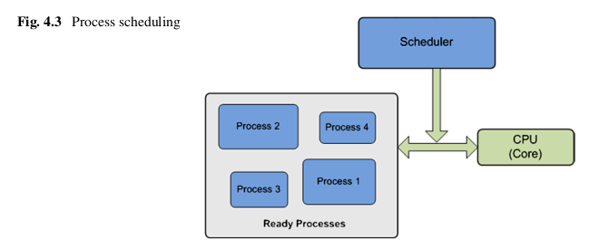

[Toc]

### Chapter 4 Basic Network Programming(67)


|                                                              |                                                              |
| ------------------------------------------------------------ | ------------------------------------------------------------ |
| Abstract This chapter introduces some of the basic principles used for develop-ing network-based applications. Multi-programming and multi-tasking paradigms are introduced as two of the basic concepts of programming. Threads and pro-cesses are discussed, emphasizing multi-threaded application development in Java. Inter-thread and inter-process communication techniques and paradigms are also presented, as some of the basic mechanisms for network applications communica-tion. | Tóm tắt Chương này giới thiệu một số nguyên tắc cơ bản được sử dụng để phát triển các ứng dụng dựa trên mạng. Mô hình đa lập trình và đa tác vụ được giới thiệu như là hai trong số các khái niệm cơ bản của lập trình. Các chủ đề và quy trình được thảo luận, nhấn mạnh đến việc phát triển ứng dụng đa luồng trong Java. Các kỹ thuật và mô hình giao tiếp liên luồng và liên quá trình cũng được trình bày, như một số cơ chế cơ bản cho các ứng dụng mạng. |


### 4.1 Introduction

|                                                              |                                                              |
| ------------------------------------------------------------ | ------------------------------------------------------------ |
| Network application programming uses high level programming languages and in-volves a set of principles and techniques. Implementation requires access to vari-ous APIs and support from different application development environments. This chapter introduces some of the basic principles used for developing network-based applications using Java programming language. However, the basic concepts and techniques remain the same regardless of the programming language employed and represent the basis for building data communication-based applications.<br/><br/>This chapter discusses the concept of multi-programming, which involves multi-tasking, and presents how it is implemented in standard operating systems. Multi-programming is a very important technique to both achieve computation parallelism and exploit the multi-core architectures of most of the current processors. The chap-ter also describes some basic aspects of the multi-programming paradigm includ-ing processes, threads, inter-thread communication and synchronization, and inter-process communications. | Lập trình ứng dụng mạng sử dụng các ngôn ngữ lập trình cấp cao và trong tập hợp các nguyên tắc và kỹ thuật. Việc triển khai yêu cầu quyền truy cập vào các API khác nhau và hỗ trợ từ các môi trường phát triển ứng dụng khác nhau. Chương này giới thiệu một số nguyên tắc cơ bản được sử dụng để phát triển các ứng dụng dựa trên mạng sử dụng ngôn ngữ lập trình Java. Tuy nhiên, các khái niệm và kỹ thuật cơ bản vẫn giống nhau bất kể ngôn ngữ lập trình được sử dụng và đại diện cho cơ sở để xây dựng các ứng dụng dựa trên giao tiếp dữ liệu.<br/><br/>Chương này thảo luận về khái niệm đa lập trình, liên quan đến đa tác vụ và trình bày cách nó được thực hiện trong các hệ điều hành tiêu chuẩn. Đa lập trình là một kỹ thuật rất quan trọng để vừa đạt được tính song song vừa khai thác được kiến trúc đa lõi của hầu hết các bộ vi xử lý hiện nay. Chương-ter cũng mô tả một số khía cạnh cơ bản của mô hình đa lập trình bao gồm các quy trình, luồng, giao tiếp và đồng bộ hóa giữa các luồng và giao tiếp giữa các quá trình. |


### 4.2 Multi-programming and Multi-tasking


|                                                              |                                                              |
| ------------------------------------------------------------ | ------------------------------------------------------------ |
| Originally, uni-programming was the solution of choice for technical reasons. It involves only one user program running on any computer at a time. This was a feasible solution for the early computers which were, in fact, processing machines dedicated to performing a single critical task such as bulk data processing, statistical data analysis, or enterprise resource planning.<br/><br/>The development of personal computers, and the related diversification in ap-plication types determined a definite trend towards widening of user process-ing requirements. This has lead to uni-programming becoming deprecated. Multi-programming has emerged as a processor allocation paradigm where multiple user programs run on the same computer at the same time.<br/><br/>The main problem with multi-programming is the limited number of CPUs (of-ten a single one) the host machine has. Current CPU architectures involve multiple processing units (cores), which increase the parallel processing capacity of the ma-chine. However, the number of independent processing cores still does not match the number of user programs running at the same time. This is an obvious situa-tion which requires an allocation solution such as all the programs to be able to access the CPU. However, the more user programs run simultaneously on the same machine, the higher the pressure put on the allocation of CPU time.<br/><br/>In this context, the solution to the multi-programming problem is represented by the multi-tasking paradigm. Multi-tasking creates the illusion of concurrency (par-allel execution of user programs) by allocating chunks of processor time to each of the running applications sequentially. Originally, each application has been associ-ated with sequential tasks and a single process to run them. However, application development and deployment has moved forward and further benefits from the al-ready described processing parallelism by assigning the same application’s tasks to multiple processes which can individually request CPU time.<br/><br/>This software approach to achieve parallel processing requires that the operating systems perform fast switching of CPU between different processes. As a conse-quence, at any given time a single process only runs on any one processing unit (core). Consequently, the number of processes which run in parallel on a machine is equal to the existing number of processing units on that machine. However, the fast switching between processes creates the illusion (from user perspective) of all processes running in parallel.<br/><br/>Figure 4.1 graphically presents an illustration of the multi-tasking concept. In this figure, three distinct processes are allocated processor time by a single core CPU in a round-robin manner. | Ban đầu, lập trình đơn là giải pháp được lựa chọn vì lý do kỹ thuật. Nó chỉ liên quan đến một chương trình người dùng chạy trên bất kỳ máy tính nào tại một thời điểm. Đây là một giải pháp khả thi cho các máy tính ban đầu, trên thực tế, là các máy xử lý dành riêng để thực hiện một nhiệm vụ quan trọng như xử lý dữ liệu hàng loạt, phân tích dữ liệu thống kê hoặc lập kế hoạch tài nguyên doanh nghiệp.<br/><br/>Sự phát triển của máy tính cá nhân và sự đa dạng hóa liên quan trong các loại ap-plication đã xác định một xu hướng nhất định đối với việc mở rộng các yêu cầu xử lý của người dùng. Điều này dẫn đến lập trình đơn trở nên không còn được dùng nữa. Đa lập trình đã nổi lên như một mô hình phân bổ bộ xử lý trong đó nhiều chương trình người dùng chạy trên cùng một máy tính cùng một lúc.<br/><br/>Vấn đề chính của đa lập trình là số lượng CPU hạn chế (trong số mười một CPU duy nhất) mà máy chủ có. Các kiến trúc CPU hiện tại liên quan đến nhiều đơn vị xử lý (lõi), giúp tăng khả năng xử lý song song của ma-chine. Tuy nhiên, số lượng lõi xử lý độc lập vẫn không khớp với số lượng chương trình người dùng đang chạy cùng lúc. Đây là một tình huống hiển nhiên đòi hỏi một giải pháp phân bổ chẳng hạn như tất cả các chương trình để có thể truy cập vào CPU. Tuy nhiên, càng nhiều chương trình người dùng chạy đồng thời trên cùng một máy thì áp lực phân bổ thời gian của CPU càng cao.<br/><br/>Trong bối cảnh này, giải pháp cho vấn đề đa lập trình được thể hiện bằng mô hình đa tác vụ. Đa tác vụ tạo ra ảo giác về sự đồng thời (thực thi theo quy luật của các chương trình người dùng) bằng cách phân bổ các phần thời gian của bộ xử lý cho từng ứng dụng đang chạy một cách tuần tự. Ban đầu, mỗi ứng dụng đã được liên kết với các tác vụ tuần tự và một quy trình duy nhất để chạy chúng. Tuy nhiên, việc triển khai và phát triển ứng dụng đã tiến lên và thu được nhiều lợi ích hơn nữa từ tính năng song song xử lý được mô tả sẵn sàng bằng cách gán các nhiệm vụ của cùng một ứng dụng cho nhiều quy trình có thể yêu cầu riêng thời gian CPU.<br/><br/>Cách tiếp cận phần mềm này để đạt được quá trình xử lý song song đòi hỏi hệ điều hành phải thực hiện chuyển đổi nhanh chóng CPU giữa các quá trình khác nhau. Như một điều kiện thuận lợi, tại bất kỳ thời điểm nào một quy trình chỉ chạy trên bất kỳ một đơn vị xử lý nào (lõi). Do đó, số lượng quy trình chạy song song trên một máy bằng số đơn vị xử lý hiện có trên máy đó. Tuy nhiên, việc chuyển đổi nhanh giữa các quy trình tạo ra ảo giác (từ góc độ người dùng) về tất cả các quy trình đang chạy song song.<br/><br/>Hình 4.1 trình bày bằng đồ thị một minh họa về khái niệm đa tác vụ. Trong hình này, ba quy trình riêng biệt được phân bổ thời gian xử lý bởi một CPU lõi đơn theo cách thức vòng tròn. |


### 4.3 Processes




|                                                              |                                                              |
| ------------------------------------------------------------ | ------------------------------------------------------------ |
| A process is a running program sequence along with all the resources that its code can affect (also known as process context). The process context includes the pro-cess state, an image of the executable machine code corresponding to the program, allocated memory, descriptors of resources used by the process such as file descrip-tors or handlers, security attributes such as process owner and process permissions, and last, but not least, processor state like content of registers and physical memory addressing.<br/><br/>The process state represents the status of the process with respect to processor time usage. A process may be in one of three states:<br/><br/>    • Running—The process is using the CPU (it has been allocated processor time and the processes machine code is physically executed by the processor).<br/><br/>    • Blocked—The process is unable to run until some external event occurs (e.g., data is received from the network). CPU could be free during this period if none of the existing processes is in position to run.<br/><br/>    • Ready (Runnable)—The process is ready to run (does not have to wait for any event to occur), but it is temporarily stopped by the operating system to let other processes run on the same CPU.<br/><br/>Figure 4.2 graphically presents the state transitions occurring during the lifetime of a process. Depending on the operating system’s scheduling algorithm and the particularities of the process (user application), the status of the process will period-ically oscillate between the three states described in the figure.<br/><br/>Figure 4.2 illustrates all possible state transitions which may occur in the follow-ing situations:<br/><br/>    • Transition 1—Occurs when a process cannot continue, as it is waiting for some external event. For example, when a process initiates a connection to the server, the process will be blocked until the server replies.<br/><br/>    • Transition 2—Caused by the process scheduler when it decides to temporarily stop the execution of the current process and give another process the chance to run. The process is interrupted and its state is saved in order to resume operation from the same point it was interrupted without any disruption.<br/><br/>    • Transition 3—Caused by the process scheduler when it decides to give a ready process the chance to run. Transitions 2 and 3 are basically creating the illusion of processing parallelism.<br/><br/>    • Transition 4—Occurs when the external event that the blocked process was wait-ing for (such as the arrival of some input messages) occurs. This transition is usually triggered by a processor interruption signal generated by the correspond-ing I/O peripheral or a network interface.<br/><br/>When multiple processes are in the READY state, the operating system must de-cide which one of them to run first. It employs a scheduling algorithm to determine the processes which will be allocated processor time and in what order. Schedul-ing algorithms, as graphically depicted in Fig. 4.3, also determine when to stop one process and give CPU time to another process. Scheduling algorithms may do this voluntary (“non-preemptive scheduling”) or forced (“preemptive scheduling”).<br/><br/>Non-preemptive scheduling involves the processes giving up processor time will-ingly to allow other processes to run. This usually happens when the currently run-ning process has to switch to the BLOCKED state, while waiting for external event. When preemptive scheduling is used, the currently running process is forced into the READY state to allow other processes to run. Preemptive scheduling can be performed according to a scheduling policy.<br/><br/>There are various scheduling policies including:<br/><br/>    • Priority scheduling—processes with higher priority will be allocated processor time more often. Process priority is an important feature when critical applica-tions are running on the host machine. Moreover, when less important tasks or less time-critical applications run (e.g., operating system updates), they may be allocated lower priority in order to minimize the impact on other running appli-cations.<br/><br/>    • First come–first served—the first process in the queue of READY process will be allocated processor time. This treats all the process equally, and there is no method to prioritize critical processes.<br/><br/>    • Shortest job first—the process requiring less processor time will be given prior-ity. This leaves longer processes with lower priority and may jeopardize to some extent their operation if many light processes are running at the same time.<br/><br/>    • Shortest remaining job first—the processes requiring the shortest time to com-plete will be given the highest priority. This approach involves giving priority to processes which are about to finish their operation, leading to a faster de-congestion of the process queue.<br/><br/>    • Round-robin—equal processor time slices are assigned to all processes. | Quy trình là một chuỗi chương trình đang chạy cùng với tất cả các tài nguyên mà mã của nó có thể ảnh hưởng đến (còn được gọi là ngữ cảnh quy trình). Bối cảnh quy trình bao gồm trạng thái pro-cess, hình ảnh mã máy thực thi tương ứng với chương trình, bộ nhớ được cấp phát, bộ mô tả tài nguyên được quy trình sử dụng như trình mô tả hoặc trình xử lý tệp, các thuộc tính bảo mật như chủ sở hữu quy trình và quyền quy trình và cuối cùng, nhưng không kém phần quan trọng, trạng thái của bộ xử lý như nội dung của các thanh ghi và địa chỉ bộ nhớ vật lý.<br/><br/>Trạng thái quá trình biểu thị trạng thái của quá trình liên quan đến việc sử dụng thời gian của bộ xử lý. Một quy trình có thể ở một trong ba trạng thái:<br/><br/>    • Đang chạy — Quá trình đang sử dụng CPU (nó đã được phân bổ thời gian cho bộ xử lý và mã máy của quá trình được thực thi vật lý bởi bộ xử lý).<br/><br/>    • Bị chặn — Quá trình không thể chạy cho đến khi một số sự kiện bên ngoài xảy ra (ví dụ: dữ liệu được nhận từ mạng). CPU có thể trống trong thời gian này nếu không có quy trình hiện có nào sẵn sàng chạy.<br/><br/>    • Sẵn sàng (Runnable) —Quá trình sẵn sàng chạy (không phải đợi bất kỳ sự kiện nào xảy ra), nhưng nó tạm thời bị hệ điều hành dừng lại để cho các tiến trình khác chạy trên cùng một CPU.<br/><br/>Hình 4.2 trình bày bằng đồ thị các chuyển đổi trạng thái xảy ra trong thời gian tồn tại của một quá trình. Tùy thuộc vào thuật toán lập lịch của hệ điều hành và các đặc điểm của quy trình (ứng dụng của người dùng), trạng thái của quy trình sẽ dao động theo chu kỳ giữa ba trạng thái được mô tả trong hình.<br/><br/>Hình 4.2 minh họa tất cả các chuyển đổi trạng thái có thể xảy ra trong các tình huống tiếp theo:<br/><br/>    • Chuyển đổi 1 — Xảy ra khi một quá trình không thể tiếp tục, vì nó đang chờ một số sự kiện bên ngoài. Ví dụ: khi một tiến trình khởi tạo kết nối đến máy chủ, tiến trình sẽ bị chặn cho đến khi máy chủ trả lời.<br/><br/>    • Quá trình chuyển đổi 2 — Do bộ lập lịch trình gây ra khi nó quyết định tạm thời dừng việc thực hiện quá trình hiện tại và cho một quá trình khác có cơ hội chạy. Quá trình bị gián đoạn và trạng thái của nó được lưu lại để tiếp tục hoạt động từ cùng thời điểm mà nó bị gián đoạn mà không bị gián đoạn.<br/><br/>    • Chuyển đổi 3 — Do bộ lập lịch trình gây ra khi nó quyết định cho một quá trình sẵn sàng có cơ hội chạy. Chuyển tiếp 2 và 3 về cơ bản tạo ra ảo giác xử lý song song.<br/><br/>    • Chuyển tiếp 4 — Xảy ra khi sự kiện bên ngoài mà tiến trình bị chặn đang chờ (chẳng hạn như sự xuất hiện của một số thông báo đầu vào) xảy ra. Quá trình chuyển đổi này thường được kích hoạt bởi tín hiệu ngắt của bộ xử lý được tạo ra bởi thiết bị ngoại vi I / O tương ứng hoặc giao diện mạng.<br/><br/>Khi nhiều tiến trình ở trạng thái SN SÀNG, hệ điều hành phải loại bỏ quy trình nào trong số chúng sẽ chạy trước. Nó sử dụng một thuật toán lập lịch để xác định các quá trình sẽ được phân bổ thời gian xử lý và theo thứ tự. Các thuật toán lập lịch biểu, như được mô tả bằng đồ thị trong Hình 4.3, cũng xác định thời điểm dừng một quá trình và cho CPU thời gian cho một quá trình khác. Các thuật toán lập lịch có thể thực hiện điều này tự nguyện (“lập lịch không ưu tiên”) hoặc bắt buộc (“lập lịch trước”).<br/><br/>Lập lịch không ưu tiên liên quan đến các quá trình sẽ từ bỏ thời gian xử lý để cho phép các quá trình khác chạy. Điều này thường xảy ra khi quy trình đang chạy hiện tại phải chuyển sang trạng thái BỊ CHẶN, trong khi chờ đợi sự kiện bên ngoài. Khi lập lịch trước được sử dụng, quy trình hiện đang chạy bị buộc ở trạng thái SN SÀNG để cho phép các quy trình khác chạy. Lập lịch trước có thể được thực hiện theo chính sách lập lịch.<br/><br/>Có nhiều chính sách lập lịch trình khác nhau bao gồm:<br/><br/>    • Lập lịch ưu tiên — các quy trình có mức ưu tiên cao hơn sẽ được phân bổ thời gian xử lý thường xuyên hơn. Ưu tiên quy trình là một tính năng quan trọng khi các ứng dụng quan trọng đang chạy trên máy chủ. Hơn nữa, khi các tác vụ ít quan trọng hơn hoặc các ứng dụng ít tốn thời gian hơn chạy (ví dụ: cập nhật hệ điều hành), chúng có thể được phân bổ mức độ ưu tiên thấp hơn để giảm thiểu tác động đến các ứng dụng đang chạy khác.<br/><br/>    • Đến trước được phục vụ trước — quy trình đầu tiên trong hàng đợi của quy trình READY sẽ được phân bổ thời gian xử lý. Điều này đối xử với tất cả các quá trình như nhau và không có phương pháp nào để ưu tiên các quá trình quan trọng.<br/><br/>    • Công việc ngắn nhất trước - quy trình đòi hỏi ít thời gian xử lý hơn sẽ được đưa ra trước. Điều này khiến các quy trình dài hơn có mức ưu tiên thấp hơn và có thể gây nguy hiểm cho hoạt động của chúng ở một mức độ nào đó nếu nhiều quy trình nhẹ đang chạy cùng một lúc.<br/><br/>    • Công việc còn lại ngắn nhất trước — các quy trình yêu cầu thời gian ngắn nhất để hoàn thành sẽ được ưu tiên cao nhất. Cách tiếp cận này liên quan đến việc ưu tiên cho các quy trình sắp kết thúc hoạt động của chúng, dẫn đến việc xử lý hàng đợi quy trình nhanh hơn.<br/><br/>    • Round-robin — các lát thời gian của bộ xử lý bằng nhau được gán cho tất cả các quá trình. |


### 4.4 Threads

|                                                              |                                                              |
| ------------------------------------------------------------ | ------------------------------------------------------------ |
| A thread is a sequence of a program that performs certain tasks and executes within a process. Often threads are seen as lightweight processes, as they have their own stack, but share memory and data as well as descriptors of resources with other threads within the same process.<br/><br/>Similar to processes, threads may be allocated different priorities depending on their role within the application process. Thread priority can be associated to the thread during its creation and can be changed during the operation of the thread.<br/><br/>Threads can run in preemptive mode (operating system interrupts thread execu-tion at regular intervals to give processing time to other threads) or in cooperative mode (a thread can access the CPU for as long as it needs).<br/><br/>Threads and their scheduling to access the processor time is illustrated in Fig. 4.4. | Luồng là một chuỗi chương trình thực hiện các tác vụ nhất định và thực thi trong một quy trình. Thường thì các luồng được coi là các quy trình nhẹ, vì chúng có ngăn xếp riêng, nhưng chia sẻ bộ nhớ và dữ liệu cũng như các bộ mô tả tài nguyên với các luồng khác trong cùng một quy trình.<br/><br/>Tương tự như các quy trình, các luồng có thể được phân bổ các ưu tiên khác nhau tùy thuộc vào vai trò của chúng trong quy trình ứng dụng. Ưu tiên của luồng có thể được liên kết với luồng trong quá trình tạo và có thể thay đổi trong quá trình hoạt động của luồng.<br/><br/>Các luồng có thể chạy ở chế độ ưu tiên (hệ điều hành ngắt quá trình thực thi của luồng theo các khoảng thời gian đều đặn để cung cấp thời gian xử lý cho các luồng khác) hoặc ở chế độ hợp tác (một luồng có thể truy cập CPU miễn là nó cần).<br/><br/>Các luồng và lập lịch của chúng để truy cập thời gian của bộ xử lý được minh họa trong Hình 4.4. |


### 4.5 Multi-threading


|                                                              |                                                              |
| ------------------------------------------------------------ | ------------------------------------------------------------ |
| Multi-threading provides another level of parallelism for task execution, with less overhead. When multiple threads exist, different tasks can be performed in paral-lel using common data and resources. Thread context switching is less complex and faster than process context switching, making multi-treading an efficient way to em-ulate parallelism. Thread switching efficiency is mainly determined by the fact that threads own less resources than processes which need to be saved prior to switch-ing the context (they share resources such as memory and descriptors with other threads).<br/><br/>In general, a process consists of many threads, each running at the same time within the process context and performing a unique task. An example of multi-threading is graphically presented in Fig. 4.5. In this example, a word processor application (process) may use multiple threads, each performing a particular task. The graphical user interface (GUI) is running a separate thread, the data processing module has its own thread as well as the module dealing with saving data on the disk.<br/><br/>Despite the evident benefits multi-threading brings, in terms of application de-sign, the number of threads should be kept to the minimum, in order not to overload the system with non-necessary context switches. Additionally, threads should be employed when there are clear benefits from using parallel processing only, as in-volving multi-threading in a highly sequential series of tasks only adds complexity to otherwise a simple solution.<br/><br/>Thread priorities have to be managed according to the application purpose and requirements. A thread which manages time-critical tasks should be given higher priority than the other threads. Such an example is the graphical user interface (GUI) which should be allocated a dedicated thread with a higher priority than other threads in order to keep the interaction with the user within the corresponding real-time requirements. | Đa luồng cung cấp một mức độ song song khác để thực thi tác vụ, với ít chi phí hơn. Khi nhiều luồng tồn tại, các tác vụ khác nhau có thể được thực hiện trong paral-lel bằng cách sử dụng dữ liệu và tài nguyên chung. Chuyển đổi ngữ cảnh luồng ít phức tạp hơn và nhanh hơn so với chuyển đổi ngữ cảnh quy trình, làm cho đa tác vụ trở thành một cách hiệu quả để phân loại song song. Hiệu quả chuyển đổi luồng chủ yếu được xác định bởi thực tế là các luồng sở hữu ít tài nguyên hơn các quy trình cần được lưu trước khi chuyển đổi ngữ cảnh (chúng chia sẻ tài nguyên như bộ nhớ và bộ mô tả với các luồng khác).<br/><br/>Nói chung, một tiến trình bao gồm nhiều luồng, mỗi luồng chạy đồng thời trong ngữ cảnh tiến trình và thực hiện một tác vụ duy nhất. Một ví dụ về đa luồng được trình bày bằng đồ thị trong Hình 4.5. Trong ví dụ này, một ứng dụng xử lý văn bản (quy trình) có thể sử dụng nhiều luồng, mỗi luồng thực hiện một tác vụ cụ thể. Giao diện người dùng đồ họa (GUI) đang chạy một luồng riêng, mô-đun xử lý dữ liệu có luồng riêng cũng như mô-đun xử lý việc lưu dữ liệu trên đĩa.<br/><br/>Mặc dù có những lợi ích rõ ràng mà đa luồng mang lại, về mặt khử ký hiệu ứng dụng, số lượng luồng nên được giữ ở mức tối thiểu, để không làm hệ thống quá tải với các công tắc ngữ cảnh không cần thiết. Ngoài ra, các luồng nên được sử dụng khi có những lợi ích rõ ràng từ việc chỉ sử dụng xử lý song song, vì đa luồng nội bộ trong một chuỗi nhiệm vụ có trình tự cao chỉ làm tăng thêm độ phức tạp cho một giải pháp đơn giản.<br/><br/>Các ưu tiên của luồng phải được quản lý theo mục đích và yêu cầu của ứng dụng. Một luồng quản lý các tác vụ quan trọng về thời gian nên được ưu tiên cao hơn các luồng khác. Ví dụ như vậy là giao diện người dùng đồ họa (GUI) nên được cấp phát một luồng chuyên dụng có mức độ ưu tiên cao hơn các luồng khác để giữ cho tương tác với người dùng trong các yêu cầu thời gian thực tương ứng. |


### 4.6 Multi-threading in Java

|                                                              |                                                              |
| ------------------------------------------------------------ | ------------------------------------------------------------ |
| Java provides built-in support for multi-threaded programming. It offers two meth-ods for using threads within an application. A thread can be created by extending the Thread class, or by implementing the Runnable interface. Both are equally ef-ficient in terms of using the threads, but the latter is sometimes preferred as it both provides a clearer separation between the behavior of the thread and the thread itself and enables better reuse.<br/><br/>Next these two approaches are shown in a hands-on manner by providing the step-by-step solution design and implementation when trying to perform parallel activities within the same application. | Java cung cấp hỗ trợ tích hợp cho lập trình đa luồng. Nó cung cấp hai meth-ods để sử dụng các luồng trong một ứng dụng. Một luồng có thể được tạo bằng cách mở rộng lớp Thread hoặc bằng cách triển khai giao diện Runnable. Cả hai đều đủ tiện nghi như nhau về cách sử dụng các luồng, nhưng cách sau đôi khi được ưu tiên hơn vì nó vừa cung cấp sự tách biệt rõ ràng hơn giữa hoạt động của luồng và chính luồng đó vừa cho phép tái sử dụng tốt hơn.<br/><br/>Tiếp theo, hai cách tiếp cận này được thể hiện theo cách thực hành bằng cách cung cấp thiết kế và triển khai giải pháp từng bước khi cố gắng thực hiện các hoạt động song song trong cùng một ứng dụng. |


#### 4.6.1 Extending Thread Class


|                                                              |                                                              |
| ------------------------------------------------------------ | ------------------------------------------------------------ |
| This example will both count and repeatedly display Hello! messages, while availing from processing parallelism.<br/>Step 1—Divide application work in tasks and allocate each of them to a thread:<br/>Step 2—CountThread extends the Thread class:<br/>Step 3—HelloThread extends the Thread class:<br/>Step 4—Instantiate the two thread classes and start their execution:<br/><br/>Note that when dividing application work in tasks with the aim to have them associated with threads for parallel execution, each task has to be able to execute independently from the other tasks because otherwise the execution concurrency provides no benefit to the overall application. The run() method of the Thread class is overridden here to perform the core activity of the tasks. The run() method is invoked by the start() method, when the thread is started. The two threads execute loops in which counting and/or printing occurs. After each iteration, a call to the sleep() method determines the threads to suspend their execution. As a result the threads will be in the BLOCKED state until the sleep duration of time indicated when sleep() was called elapses and the threads return to the READY state. This al-lows the scheduler to perform its scheduling activity and have the threads interleave their execution. However, no activity is performed before the two thread classes are instantiated and their start() methods are called. This is done in the main() method of the main thread application class ThreadHelloCount. | Ví dụ này sẽ vừa đếm và liên tục hiển thị Xin chào! thông báo, trong khi xử lý song song.<br/>Bước 1 — Phân chia công việc ứng dụng thành các nhiệm vụ và phân bổ từng công việc trong số chúng vào một chuỗi:<br/>Bước 2 — CountThread mở rộng lớp Thread:<br/>Bước 3 — HelloThread mở rộng lớp Thread:<br/>Bước 4 — Khởi tạo hai lớp luồng và bắt đầu thực thi chúng:<br/><br/>Lưu ý rằng khi phân chia công việc ứng dụng trong các tác vụ với mục đích để chúng được liên kết với các luồng để thực thi song song, mỗi tác vụ phải có thể thực thi độc lập với các tác vụ khác vì nếu không thì việc thực thi đồng thời không mang lại lợi ích gì cho ứng dụng tổng thể. Phương thức run () của lớp Thread được ghi đè ở đây để thực hiện hoạt động cốt lõi của các tác vụ. Phương thức run () được gọi bởi phương thức start (), khi luồng được bắt đầu. Hai luồng thực hiện các vòng lặp trong đó việc đếm và / hoặc in xảy ra. Sau mỗi lần lặp, một lệnh gọi đến phương thức sleep () sẽ xác định các luồng để tạm dừng việc thực thi của chúng. Do đó, các luồng sẽ ở trạng thái CHẶN cho đến khi khoảng thời gian ngủ được chỉ ra khi sleep () được gọi là trôi qua và các luồng trở lại trạng thái SN SÀNG. Điều này hạ thấp trình lập lịch để thực hiện hoạt động lập lịch của nó và có các luồng xen kẽ việc thực thi của chúng. Tuy nhiên, không có hoạt động nào được thực hiện trước khi hai lớp luồng được khởi tạo và phương thức start () của chúng được gọi. Điều này được thực hiện trong phương thức main () của lớp ứng dụng luồng chính ThreadHelloCount. |


#### 4.6.2 Implementing Runnable Interface


|                                                              |                                                              |
| ------------------------------------------------------------ | ------------------------------------------------------------ |
| Next is an example of multi-threading using implementations of the Runnable in-terface to create threads. The example will perform in parallel repeat printing of the current date and repeat display of a user message.<br/><br/>Step 1—Divide application work in tasks and allocate each of them to a class:<br/>Step 2—DateRunnable implements the Runnable interface:<br/>Step 3—MsgRunnable implements the Runnable interface:<br/>Step 4—Instantiate the two runnable classes, create threads, and start their execu-tion:<br/><br/>The same comments stand regarding the division of application work in indepen-dent tasks for thread-based parallel execution in order to avail from any performance benefits. In this example, the run() method of the Runnable interface is implemented in a runnable class in order to execute the tasks when invoked. The runnable class needs to be instantiated, then associated with a thread before the thread execution start will determine the run() method to be invoked (by the Thread’s start() method). The two runnable classes execute loops in which the current date or a user message is printed. After each iteration, a call to the Thread’s sleep() method determines execu-tion suspension for the period of time indicated as a parameter in the sleep() method call. When this period elapses, the associated threads return to the READY state and are eligible for execution scheduling by the scheduler. However, thread executions start only after the two runnable classes get instantiated, two thread classes are cre-ated and associated with the corresponding runnable instances and the two thread start() methods are called. This is done in the main() method of the main thread application class RunnableMsgDate.<br/><br/>There are several important methods of the Thread class which are used for deal-ing with threads:<br/>    • void start()—Causes the thread to start its execution (JVM calls thread’s run() method);<br/><br/>    • void run()—Executes thread’s task. If the thread was constructed from another Runnable object, it calls automatically that object’s run() method;<br/><br/>    • void setName(String name) and String getName()—Change and retrieve the name of the Thread when called;<br/><br/>    • int getPriority() and void setPriority(int)—Get and set thread’s priority. The pos-sible values are between 1 and 10;<br/><br/>    • static void sleep(long) and static void sleep(long, long)—Cause the thread to cease execution for the specified number of milliseconds and milliseconds + nanosec-onds, respectively.<br/><br/>    • static void yield()—Causes the thread to temporarily pause and allows other threads to execute;<br/><br/>    • void join(long millisec)—It is usually invoked by the parent thread causing it to block until the child thread terminates or the specified number of milliseconds pass.<br/><br/>    • boolean isAlive()—Return true if the thread is alive.<br/><br/>The only method of the Runnable interface is void run() and it requires imple-mentation as can be seen in the example already presented. | Tiếp theo là một ví dụ về đa luồng bằng cách sử dụng các triển khai của Runnable in-terface để tạo luồng. Ví dụ này sẽ thực hiện in lặp lại song song ngày hiện tại và hiển thị lặp lại thông báo của người dùng.<br/><br/>Bước 1 — Phân chia công việc ứng dụng thành các nhiệm vụ và phân bổ từng công việc đó cho một lớp:<br/>Bước 2 — DateRunnable triển khai giao diện Runnable:<br/>Bước 3 — MsgRunnable triển khai giao diện Runnable:<br/>Bước 4 — Khởi tạo hai lớp có thể chạy, tạo các luồng và bắt đầu thực thi của chúng:<br/><br/>Các nhận xét tương tự có liên quan đến việc phân chia công việc ứng dụng trong các tác vụ sâu để thực thi song song dựa trên luồng để tận dụng bất kỳ lợi ích hiệu suất nào. Trong ví dụ này, phương thức run () của giao diện Runnable được triển khai trong một lớp runnable để thực thi các tác vụ khi được gọi. Lớp runnable cần được khởi tạo, sau đó được liên kết với một luồng trước khi bắt đầu thực thi luồng sẽ xác định phương thức run () được gọi (bằng phương thức start () của Thread). Hai lớp có thể chạy được thực thi các vòng lặp trong đó ngày hiện tại hoặc thông báo người dùng được in. Sau mỗi lần lặp, một lệnh gọi đến phương thức Sleep () của Thread sẽ xác định việc tạm ngưng thực thi trong khoảng thời gian được chỉ định dưới dạng tham số trong lệnh gọi phương thức sleep (). Khi khoảng thời gian này trôi qua, các luồng liên quan sẽ trở lại trạng thái SN SÀNG và đủ điều kiện để bộ lập lịch thực hiện. Tuy nhiên, việc thực thi luồng chỉ bắt đầu sau khi hai lớp có thể chạy được khởi tạo, hai lớp luồng được tạo và liên kết với các thể hiện có thể chạy tương ứng và hai phương thức start () luồng được gọi. Điều này được thực hiện trong phương thức main () của lớp ứng dụng luồng chính RunnableMsgDate.<br/><br/>Có một số phương thức quan trọng của lớp Thread được sử dụng để xử lý các luồng:<br/>    • void start () - Khiến luồng bắt đầu thực thi (JVM gọi phương thức run () của luồng);<br/><br/>    • void run () - Thực thi nhiệm vụ của luồng. Nếu luồng được xây dựng từ một đối tượng Runnable khác, nó sẽ tự động gọi phương thức run () của đối tượng đó;<br/><br/>    • void setName (String name) and String getName () - Thay đổi và truy xuất tên của Thread khi được gọi;<br/><br/>    • int getPosystem () và void setPosystem (int) —Nhận và đặt mức độ ưu tiên của luồng. Các giá trị pos-sible là từ 1 đến 10;<br/><br/>    • static void sleep (long) and static void sleep (long, long) —Do luồng ngừng thực thi đối với số mili giây và mili giây + nanosec-onds được chỉ định, tương ứng.<br/><br/>    • static void output () - Làm cho luồng tạm dừng và cho phép các luồng khác thực thi;<br/><br/>    • void join (long millisec) —Thường được gọi bởi luồng cha khiến nó bị chặn cho đến khi luồng con kết thúc hoặc vượt qua số mili giây được chỉ định.<br/><br/>    • boolean isAlive () - Trả về true nếu luồng còn sống.<br/><br/>Phương thức duy nhất của giao diện Runnable là void run () và nó yêu cầu imple-mentation như có thể thấy trong ví dụ đã trình bày. |


### 4.7 Inter-thread and Inter-process Communication

#### 4.7.1 Inter-thread Communication


|                                                              |                                                              |
| ------------------------------------------------------------ | ------------------------------------------------------------ |
| The inter-thread communication focuses on exchanging data between different threads. As threads execute on the same machine and they share the process data space, inter-thread communication is mostly performed using common data vari-ables. The principle of inter-thread communication is graphically presented in Fig. 4.6.<br/><br/>As multiple threads executing in parallel may access and modify the same data variables, the results may not be predictable. In order to solve this issue, only one thread is allowed to modify the data at a time (inter-thread synchronization is re-quired). There are various mechanisms available to enable inter-thread communica-tion and they are presented in details in [1], including:<br/><br/>    • Shared memory;<br/><br/>    • Semaphores;<br/><br/>    • Message passing;<br/><br/>    • The inter-thread communication focuses on exchanging data between different threads. As threads execute on the same machine and they share the process data space, inter-thread communication is mostly performed using common data vari-ables. The principle of inter-thread communication is graphically presented in Fig. 4.6.<br/>    • <br/>    • As multiple threads executing in parallel may access and modify the same data variables, the results may not be predictable. In order to solve this issue, only one thread is allowed to modify the data at a time (inter-thread synchronization is re-quired). There are various mechanisms available to enable inter-thread communica-tion and they are presented in details in [1], including:<br/>    • <br/>    • Shared memory;<br/>    • <br/>    • Semaphores;<br/>    • <br/>    • Message passing; | Giao tiếp giữa các luồng tập trung vào việc trao đổi dữ liệu giữa các luồng khác nhau. Khi các luồng thực thi trên cùng một máy và chúng chia sẻ không gian dữ liệu quy trình, giao tiếp giữa các luồng chủ yếu được thực hiện bằng cách sử dụng các biến thể dữ liệu chung. Nguyên tắc giao tiếp giữa các luồng được trình bày bằng đồ thị trong Hình 4.6.<br/><br/>Vì nhiều luồng thực thi song song có thể truy cập và sửa đổi các biến dữ liệu giống nhau, kết quả có thể không đoán trước được. Để giải quyết vấn đề này, chỉ một luồng được phép sửa đổi dữ liệu tại một thời điểm (đồng bộ hóa giữa các luồng được yêu cầu lại). Có nhiều cơ chế khác nhau có sẵn để kích hoạt truyền thông liên luồng và chúng được trình bày chi tiết trong [1], bao gồm:<br/><br/>    • Bộ nhớ dùng chung;<br/><br/>    • Semaphores;<br/><br/>    • Thông qua;<br/><br/>    • Giao tiếp giữa các luồng tập trung vào việc trao đổi dữ liệu giữa các luồng khác nhau. Khi các luồng thực thi trên cùng một máy và chúng chia sẻ không gian dữ liệu quy trình, giao tiếp giữa các luồng chủ yếu được thực hiện bằng cách sử dụng các biến thể dữ liệu chung. Nguyên tắc giao tiếp giữa các luồng được trình bày bằng đồ thị trong Hình 4.6.<br/>    •<br/>    • Vì nhiều luồng thực thi song song có thể truy cập và sửa đổi các biến dữ liệu giống nhau, kết quả có thể không đoán trước được. Để giải quyết vấn đề này, chỉ một luồng được phép sửa đổi dữ liệu tại một thời điểm (đồng bộ hóa giữa các luồng được yêu cầu lại). Có nhiều cơ chế khác nhau có sẵn để kích hoạt truyền thông liên luồng và chúng được trình bày chi tiết trong [1], bao gồm:<br/>    •<br/>    • Bộ nhớ dùng chung;<br/>    •<br/>    • Semaphores;<br/>    •<br/>    • Thông qua; |


#### 4.7.2 Producer–Consumer Problem

```java
    • Step 1—Divide the problem and solution in producer, consumer, and shared queue classes:

/*class implementing the shared queue*/ class SynchQueue;

/*class extending Thread dealing with the producer*/ class Producer extends Thread;

/*class extending Thread dealing with the consumer*/ class Consumer extends Thread;

    • Step 2—Design the shared queue class:

/*class implementing the shared queue*/ class SynchQueue {
/*indicate the location of queue’s front and back.*/ /*the consumer reads from the front*/

/*the producer writes to the back.*/ private int front = 0, back = 0;
    /*indicates the number of items in the queue.*/ private int noItems = 0;
/*queue buffer*/
private int[] tabItems;
/*maximum number of items in the queue.*/ private int maxnoItems;
    /*SynchQueue constructor.*/ public SynchQueue (int maxsize)

{

maxnoItems = maxsize;

tabItems = new int[maxnoItems];

}

/*returns the number of items in the queue.*/ public int queueSize() { return noItems; }

/*method used to insert elements in the queue.*/ public synchronized void insert (int item)

{
/*check for space availability.*/ while (noItems == maxnoItems)

{

try

{
/*waits for consumers to free space.*/ wait();

}

catch(InterruptedException ex) {};

}
/*insert the item at the back.*/ tabItems[back] = item;
/*move the back index one step.*/
back = (back + 1) \% maxnoItems;
/*increment the number of items.*/
noItems += 1;
/*notify all threads waiting*/
/*for the object that it is free.*/ notifyAll();

}

/*method used to remove objects from the queue.*/ public synchronized int remove()

{

int item;
/*wait if the queue is empty.*/ while (noItems == 0)

{

try

{

wait();
    }

catch(InterruptedException ex)

{

};

}
/*retrieve the item at the front.*/ item = tabItems[front];
/*move the from index one step.*/ front = (front + 1) \% maxnoItems; /*decrease the number of items.*/ noItems -= 1;

/*notify all threads waiting*/ /*as space has been freed.*/ notifyAll();

return item;

}

}

    • Step 3—Design the consumer class extending Thread:

/*the consumer thread class.*/ class Consumer extends Thread

{
/*the queue member.*/
private SynchQueue synQue;

/*constructor takes the queue as a parameter.*/ public Consumer(SynchQueue que)

{

synQue = que;

}
/*run() method performs the consumer task.*/ public void run()

{

int item = 0;

do

{
/*retrieve an item from the queue.*/ item = synQue.remove();
/*print the thread name and the item.*/ System.out.println

("Consumer:" + this + " value:" + item);

}

while (item != -1);
/*iterate until the value of*/
/*the item retrieved is -1.*/
}

}

    • Step 4—Design the producer class extending Thread:

/*the producer thread class.*/ class Producer extends Thread

{
/*the queue member.*/
private SynchQueue synQue;
/*min and max values for the items.*/ private int minItem, maxItem;

/*constructor taking the queue and */
/*min and max no item values as parameters.*/ public Producer(SynchQueue que, int min, int no)

{

synQue = que;

minItem = min; maxItem = min + no;

}

/*run() method performs the producer task.*/ public void run()

{
/*loop used to generate items.*/
for (int item = minItem; item <= maxItem; item ++)

{
/*print the item and thread name.*/ System.out.println

("Producer:" + this + " value:" + item); /*insert the item in the queue.*/ synQue.insert(item);

}

}

}

    • Step 5—Design the producer-consumer class:

/*Creates a number of producers (noProd)*/
/*and consumers (noCons) and one synchronized queue.*/ /*Starts them and eventually terminates the process*/ /*by inserting 1 items in the queue noCons times.*/ class MultiProdCons

{

public static void main(String[] args)

{


/*number of consumers and producers.*/ int noCons = 3, noProds = 4;

/*create the 5 element queue.*/ SynchQueue sque = new SynchQueue(5);

/*create the consumers and producers.*/ Consumer[] cons = new Consumer[noCons]; Producer[] prods = new Producer[noProds];

/*start the consumers.*/
for (int i = 0; i < noCons; i += 1 )

{cons[i] = new Consumer(sque);

cons[i].start();

}

/*start the producers.*/
for (int i = 0; i < noProds; i += 1 )
{prods[i] = new Producer(sque, i*100, 50);
prods[i].start();

}

/*wait for the producers to finish.*/ for (int i = 0; i < noProds; i += 1 )

{try { prods[i].join(); }

catch(InterruptedException ex) {};

}

/*insert -1 in the queue for*/
/*each consumer to terminate.*/
for (int i = 0; i < noCons; i += 1 )

{

sque.insert( -1 );

}

/*wait for the consumers to terminate.*/ for (int i = 0; i < noCons; i += 1 )

{try { cons[i].join(); } catch(InterruptedException ex) {};
}

System.out.println( "successful completion" );

}

}
```


|                                                              |                                                              |
| ------------------------------------------------------------ | ------------------------------------------------------------ |
| A basic thread synchronization scenario is the producer–consumer problem, as pre-sented in Fig. 4.7. Some threads store items in a queue (producers), while other threads collect items from the queue (consumers) and use them. The queue is a shared memory space and needs to be protected from access by the multiple pro-ducer and consumer threads. Next this mechanism will be described in the context of the solution.<br/><br/>An example of inter-thread communication synchronization based on the produ-cer–consumer problem.<br/><br/> Step 1—Divide the problem and solution in producer, consumer, and shared queue classes:<br/>Step 2—Design the shared queue class:<br/>Step 3—Design the consumer class extending Thread:<br/> Step 4—Design the producer class extending Thread:<br/>Step 5—Design the producer-consumer class:<br/><br/>The key aspect in the solution to the producer–consumer problem is the synchro-nized use of the queue. Java has a very strong mechanism which labels a code se-quence with the keyword synchronized and prevents multiple threads from execut-ing the code in parallel, protecting the integrity of the shared variables and memory space. When any thread is executing the synchronized method, all other threads that invoke any of the synchronized methods for the same object suspend their execu-tion (enter the BLOCKED state) until the first thread finishes the execution of the synchronized method. Once this happens, another thread is allowed to execute the synchronized code in an exclusive manner, and so on.<br/><br/>The second aspect worth mentioning is the mechanism introduced to prevent con-sumer threads from using processing resources while there are no items to be re-trieved from the queue (the queue is empty) and producers from executing when there is no space in the queue to place their products (the queue is full). When the queue is empty, calls to the wait() method send the consumer threads attempting to fetch items to the BLOCKED state. Similarly, calls to the wait() method send the producers attempting to generate items to the BLOCKED state when the queue is full. However, an item produced and placed in the queue or an item retrieved from the queue by a consumer determines calls to notifyall() enabling threads to exit from their BLOCKED state and enter READY state, waiting for the scheduler to give them processor time and resume execution. In this way, both processing concurrency and efficiency is achieved. | Một kịch bản đồng bộ hóa luồng cơ bản là vấn đề người sản xuất và người tiêu dùng, như được gửi trước trong Hình 4.7. Một số luồng lưu trữ các mặt hàng trong một hàng đợi (nhà sản xuất), trong khi các luồng khác thu thập các mặt hàng từ hàng đợi (người tiêu dùng) và sử dụng chúng. Hàng đợi là một không gian bộ nhớ dùng chung và cần được bảo vệ khỏi sự truy cập của nhiều luồng chuyên gia và người tiêu dùng. Tiếp theo cơ chế này sẽ được mô tả trong bối cảnh của giải pháp.<br/><br/>Một ví dụ về đồng bộ hóa giao tiếp giữa các luồng dựa trên vấn đề sản phẩm - người tiêu dùng.<br/><br/> Bước 1 — Phân chia vấn đề và giải pháp trong các lớp hàng đợi nhà sản xuất, người tiêu dùng và được chia sẻ:<br/>Bước 2 — Thiết kế lớp hàng đợi được chia sẻ:<br/>Bước 3 — Thiết kế chuỗi mở rộng lớp người tiêu dùng:<br/> Bước 4 — Thiết kế lớp nhà sản xuất mở rộng Luồng:<br/>Bước 5 — Thiết kế lớp nhà sản xuất-người tiêu dùng:<br/><br/>Khía cạnh quan trọng trong giải pháp cho vấn đề người sản xuất - người tiêu dùng là việc sử dụng hàng đợi được đồng bộ hóa. Java có một cơ chế rất mạnh gắn nhãn một dãy mã với từ khóa được đồng bộ hóa và ngăn nhiều luồng thực thi mã song song, bảo vệ tính toàn vẹn của các biến được chia sẻ và không gian bộ nhớ. Khi bất kỳ luồng nào đang thực thi phương thức được đồng bộ hóa, tất cả các luồng khác gọi bất kỳ phương thức đồng bộ nào cho cùng một đối tượng sẽ tạm dừng việc thực thi của chúng (nhập trạng thái BLOCKED) cho đến khi luồng đầu tiên kết thúc việc thực thi phương thức được đồng bộ hóa. Khi điều này xảy ra, một luồng khác được phép thực thi mã được đồng bộ hóa theo cách độc quyền, v.v.<br/><br/>Khía cạnh thứ hai đáng nói đến là cơ chế được giới thiệu để ngăn các luồng con-sumer sử dụng tài nguyên xử lý trong khi không có mục nào được khởi tạo lại từ hàng đợi (hàng đợi trống) và các nhà sản xuất không thực thi khi không có khoảng trống trong hàng đợi. để đặt sản phẩm của họ (hàng đợi đã đầy). Khi hàng đợi trống, các lệnh gọi đến phương thức wait () sẽ gửi các luồng tiêu dùng đang cố gắng tìm nạp các mục về trạng thái ĐÃ CHẶN. Tương tự như vậy, các lệnh gọi đến phương thức wait () sẽ gửi các nhà sản xuất đang cố gắng tạo các mặt hàng đến trạng thái CHẶN khi hàng đợi đã đầy. Tuy nhiên, một mặt hàng được sản xuất và đặt trong hàng đợi hoặc một mặt hàng được người tiêu dùng truy xuất từ hàng đợi sẽ xác định các lệnh gọi để thông báo () cho phép các chuỗi thoát khỏi trạng thái ĐÃ CHẶN và chuyển sang trạng thái SN SÀNG, chờ người lập lịch cho họ thời gian xử lý và tiếp tục chấp hành. Bằng cách này, cả hai quá trình xử lý đồng thời và hiệu quả đều đạt được. |


#### 4.7.3 Inter-process Communication

|                                                              |                                                              |
| ------------------------------------------------------------ | ------------------------------------------------------------ |
| nter-process communication focuses on exchanging data between different pro-cesses. Communicating processes can run on the same machine or on different ma-chines. Communication between processes that run on the same machine is similar to inter-thread communication. However, as the processes do not share the same data space, there is a need for the processes to share some memory with each other first. Communication between processes that run on different machines involves commu-nication via networks (networking).<br/><br/>These inter-communicating processes must run on machines that are inter-connected via a network (wired or wireless), and the data is exchanged using pro-tocols, organized hierarchically in a protocol stack.<br/><br/>The principle of inter-process communication when the processes are running on the same machine or on separate machines is presented in Fig. 4.8. | Giao tiếp trong quá trình tập trung vào việc trao đổi dữ liệu giữa các chuyên gia khác nhau. Các quy trình giao tiếp có thể chạy trên cùng một máy hoặc trên các máy ma-chines khác nhau. Giao tiếp giữa các tiến trình chạy trên cùng một máy tương tự như giao tiếp giữa các luồng. Tuy nhiên, vì các quá trình không chia sẻ cùng một không gian dữ liệu, nên trước tiên, các quá trình cần phải chia sẻ một số bộ nhớ với nhau. Giao tiếp giữa các quy trình chạy trên các máy khác nhau liên quan đến giao tiếp qua mạng (mạng).<br/><br/>Các quy trình liên lạc này phải chạy trên các máy được kết nối với nhau qua mạng (có dây hoặc không dây) và dữ liệu được trao đổi bằng cách sử dụng pro-tocol, được tổ chức phân cấp trong một ngăn xếp giao thức.<br/><br/>Nguyên tắc giao tiếp giữa các quá trình khi các quá trình đang chạy trên cùng một máy hoặc trên các máy riêng biệt được trình bày trong Hình 4.8. |


### 4.8 Conclusions


|                                                              |                                                              |
| ------------------------------------------------------------ | ------------------------------------------------------------ |
| This chapter has discussed multi-programming and multi-tasking as very important aspects of the current computational complexityand diversity of applications by mak-ing use of computation parallelism and exploiting the multi-core architectures of many existing processors. The chapter has also discussed processes, threads, inter-thread communication and synchronization, and inter-process communication, and has provided examples described step-by-step which help the readers understand the major issues encountered. | Chương này đã thảo luận về đa lập trình và đa tác vụ là những khía cạnh rất quan trọng của sự phức tạp tính toán hiện tại và tính đa dạng của các ứng dụng bằng cách sử dụng song song tính toán mak-ing và khai thác kiến trúc đa lõi của nhiều bộ xử lý hiện có. Chương này cũng đã thảo luận về các quy trình, luồng, giao tiếp và đồng bộ giữa các luồng và giao tiếp giữa các quy trình, đồng thời cung cấp các ví dụ được mô tả từng bước giúp người đọc hiểu được các vấn đề chính gặp phải. |

